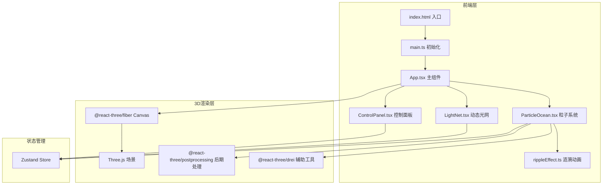

## 1. 架构设计



## 2. 技术说明
- 前端：React@18 + TypeScript + Three.js + @react-three/fiber + @react-three/drei + @react-three/postprocessing + Zustand + Tailwind CSS
- 初始化工具：vite-init (react-ts模板)
- 后端：无
- 数据库：无

## 3. 路由定义
| 路由 | 用途 |
|------|------|
| / | 主页面，全屏3D粒子海洋场景+控制面板 |

## 4. 文件结构
```
├── index.html                  # 入口HTML
├── vite.config.ts              # Vite配置
├── tsconfig.json               # TypeScript配置
├── package.json                # 依赖和脚本
├── src/
│   ├── main.ts                 # 入口，初始化React根组件
│   ├── App.tsx                 # React主组件，整合控制面板和3D场景
│   ├── store.ts                # Zustand状态管理
│   ├── components/
│   │   ├── ParticleOcean.tsx   # 核心粒子系统
│   │   ├── ControlPanel.tsx    # 毛玻璃控制面板
│   │   ├── LightNet.tsx        # 粒子间连线逻辑
│   │   └── rippleEffect.ts    # 点击涟漪动画
│   └── index.css               # 全局样式
```

## 5. 核心技术方案

### 5.1 粒子系统
- 使用Three.js `BufferGeometry` + `Points` 渲染粒子
- 粒子位置存储在Float32Array中，每帧通过自定义更新逻辑修改
- 粒子颜色通过 `BufferAttribute` 设置渐变
- 使用自定义ShaderMaterial或PointsMaterial实现发光效果

### 5.2 潮汐流动
- 鼠标位置通过Raycaster投射到3D平面
- 粒子根据与鼠标的距离和方向计算受力
- 力场模型：径向引力 + 切向旋转力 = 漩涡效果
- 潮汐强度通过Zustand store全局控制

### 5.3 动态光网
- 每帧遍历粒子位置，计算临近粒子对（距离阈值内）
- 使用 `LineSegments` + `BufferGeometry` 渲染连线
- 连线透明度与粒子距离成反比
- 性能优化：空间哈希网格加速邻近查询

### 5.4 涟漪效果
- 点击时记录点击位置和时间戳
- 涟漪以环形向外扩展，影响范围内粒子产生径向推力
- 使用自定义着色器实现环形光晕视觉效果
- 涟漪强度随时间衰减，粒子逐渐恢复

### 5.5 后期处理
- 使用 `@react-three/postprocessing` 添加Bloom效果
- Bloom增强粒子发光感，参数可调

### 5.6 状态管理
- Zustand store存储：粒子密度、潮汐强度、颜色主题、涟漪列表
- 组件通过store订阅和更新状态
