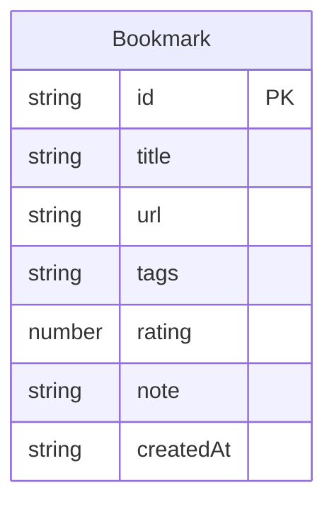

## 1. 架构设计

```mermaid
flowchart TB
    subgraph "前端层"
        "React 18" --> "App.tsx Context"
        "App.tsx Context" --> "HomePage.tsx"
        "HomePage.tsx" --> "BookmarkGrid.tsx"
        "BookmarkGrid.tsx" --> "BookmarkCard.tsx"
        "BookmarkCard.tsx" --> "VitalityGraph.tsx"
        "HomePage.tsx" --> "筛选面板"
        "api.ts" --> "FastAPI 后端"
    end
    subgraph "后端层"
        "FastAPI" --> "路由层"
        "路由层" --> "业务逻辑"
        "业务逻辑" --> "数据存储"
    end
    subgraph "数据层"
        "JSON文件存储"
    end
    "前端层" -->|"HTTP REST"| "后端层"
    "后端层" -->|"读写"| "数据层"
```

## 2. 技术说明

- 前端：React@18 + TypeScript + TailwindCSS@3 + Vite
- 3D渲染：Three.js（VitalityGraph 粒子系统）
- 初始化工具：Vite
- 后端：Python FastAPI
- 数据库：JSON文件存储（轻量级，无需数据库服务）
- 状态管理：React Context + useReducer

## 3. 路由定义

| 路由 | 用途 |
|------|------|
| `/` | 主页，展示书签网格、筛选面板、搜索栏 |

## 4. API定义

### 数据类型

```typescript
interface Bookmark {
  id: string;
  title: string;
  url: string;
  tags: string[];
  rating: number;
  note: string;
  createdAt: string;
}

interface BookmarkFilter {
  tags?: string[];
  minRating?: number;
  maxRating?: number;
  search?: string;
  sortBy?: 'rating' | 'createdAt';
  sortOrder?: 'asc' | 'desc';
}
```

### API端点

| 方法 | 路径 | 请求体 | 响应 | 描述 |
|------|------|--------|------|------|
| GET | `/api/bookmarks` | Query: tags, minRating, maxRating, search, sortBy, sortOrder | `Bookmark[]` | 获取书签列表，支持筛选排序 |
| POST | `/api/bookmarks` | `Omit<Bookmark, 'id' | 'createdAt'>` | `Bookmark` | 添加新书签 |
| PUT | `/api/bookmarks/:id` | `Partial<Bookmark>` | `Bookmark` | 更新书签 |
| DELETE | `/api/bookmarks/:id` | - | `{ success: boolean }` | 删除书签 |

## 5. 服务器架构

```mermaid
flowchart LR
    "main.py" --> "router.py"
    "router.py" --> "service.py"
    "service.py" --> "storage.py"
    "storage.py" --> "bookmarks.json"
```

- `main.py`：FastAPI应用入口，配置CORS和路由
- `router.py`：定义API端点，参数校验
- `service.py`：业务逻辑，筛选排序
- `storage.py`：JSON文件读写

## 6. 数据模型

### 6.1 数据模型定义



### 6.2 标签颜色映射

| 标签类别 | 颜色 | 色值 |
|----------|------|------|
| 技术 | 电光蓝 | `#00d4ff` |
| 设计 | 霓虹紫 | `#b44aff` |
| 资讯 | 霓虹青 | `#00ffc8` |
| 工具 | 霓虹绿 | `#44ff88` |
| 其他 | 霓虹粉 | `#ff44aa` |

### 6.3 评分与粒子参数映射

| 评分 | 旋转速度 | 颜色饱和度 | 粒子大小 |
|------|----------|------------|----------|
| 1 | 0.5 rad/s | 40% | 0.08 |
| 2 | 1.0 rad/s | 55% | 0.10 |
| 3 | 1.5 rad/s | 70% | 0.12 |
| 4 | 2.2 rad/s | 85% | 0.14 |
| 5 | 3.0 rad/s | 100% | 0.16 |
