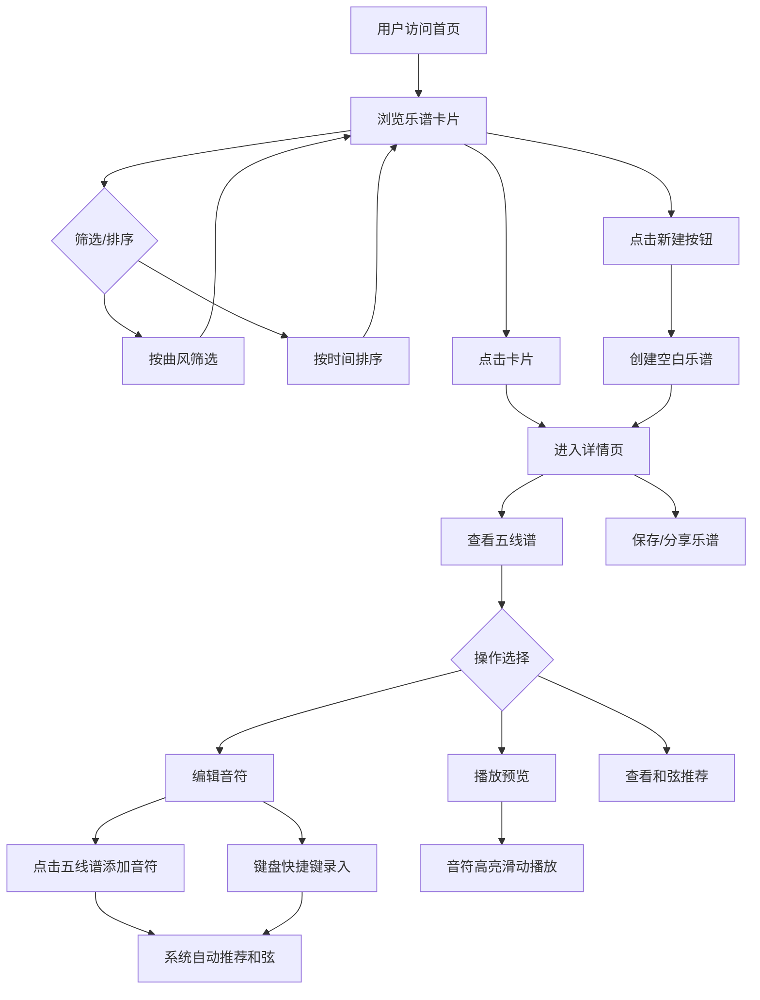

## 1. 产品概述

「乐谱工坊」是一款面向音乐爱好者和创作者的全栈Web应用，用户可以创建、编辑和分享乐谱片段，支持五线谱交互式音符输入和键盘快捷录入，并能实时播放预览旋律，系统根据音符组合自动推荐和弦。
- 目标用户：音乐爱好者、学生、独立音乐人、作曲初学者
- 核心价值：降低乐谱创作门槛，提供直觉化的五线谱编辑体验，让音乐创作触手可及

## 2. 核心功能

### 2.1 用户角色

| 角色 | 注册方式 | 核心权限 |
|------|----------|----------|
| 普通用户 | 无需注册 | 浏览、创建、编辑、播放和分享乐谱 |

### 2.2 功能模块

1. **首页**：乐谱卡片网格展示、曲风筛选、时间排序、搜索
2. **详情页**：完整五线谱查看、编辑、播放控制、和弦推荐

### 2.3 页面详情

| 页面名称 | 模块名称 | 功能描述 |
|----------|----------|----------|
| 首页 | 筛选栏 | 按曲风（古典、流行、爵士、摇滚、民谣）筛选，按创建时间排序（最新/最早） |
| 首页 | 卡片网格 | 以卡片形式展示乐谱缩略图，显示标题、曲风标签、创建时间、音符数量 |
| 首页 | 新建按钮 | 复古圆形徽章风格按钮，点击创建新乐谱 |
| 详情页 | 五线谱编辑器 | 可视化五线谱，点击谱面添加音符，支持拖拽调整位置，键盘快捷键录入 |
| 详情页 | 播放控制 | 播放/暂停/停止按钮，进度条，速度调节，音符高亮滑动效果 |
| 详情页 | 和弦推荐 | 根据当前音符组合，自动推荐匹配和弦并显示 |
| 详情页 | 乐谱信息 | 标题编辑、曲风选择、保存/分享按钮 |

## 3. 核心流程

用户打开首页浏览乐谱卡片 → 通过曲风/时间筛选找到感兴趣的乐谱 → 点击卡片进入详情页 → 查看完整五线谱 → 点击播放预览旋律 → 编辑音符（点击五线谱或键盘输入）→ 系统自动推荐和弦 → 保存或分享乐谱

## 4. 用户界面设计

### 4.1 设计风格

- 主色调：暖黄 (#F5A623) 和淡橙 (#E8834A)
- 辅助色：深棕 (#5D4037)、米白 (#FFF8F0)
- 背景渐变：米白 (#FFF8F0) 到浅棕 (#F5E6D3)
- 按钮风格：复古圆形徽章，悬停微光脉冲，点击音符弹性弹出动画
- 卡片风格：圆角毛玻璃面板（backdrop-blur），细木纹边框（#C9A96E）
- 字体：标题使用装饰性衬线字体（Playfair Display），正文使用圆润无衬线字体（Nunito）
- 图标风格：圆润线条音符图标，搭配复古装饰元素
- 五线谱风格：圆润黑色音符符号，播放时音符高亮滑动，伴舒缓渐入淡出效果

### 4.2 页面设计概述

| 页面名称 | 模块名称 | UI元素 |
|----------|----------|--------|
| 首页 | 顶部导航栏 | 暖黄渐变背景，应用名称装饰字体，新建按钮为复古圆形徽章带微光脉冲 |
| 首页 | 筛选栏 | 圆角胶囊形筛选按钮组，选中态暖黄高亮，排序下拉选择器 |
| 首页 | 卡片网格 | 3列响应式网格（桌面）→ 2列（平板）→ 1列（手机），圆角毛玻璃卡片，细木纹边框，悬停微上浮+阴影加深 |
| 首页 | 卡片内容 | 五线谱缩略图预览区，标题（装饰字体），曲风标签（胶囊形），时间戳，音符数量 |
| 详情页 | 五线谱编辑器 | 大面积五线谱画布，左侧音符选择面板，点击谱面添加音符，拖拽调整，键盘提示浮层 |
| 详情页 | 播放控制栏 | 底部固定栏，复古圆形播放/暂停/停止按钮，进度条（暖黄填充），速度滑块 |
| 详情页 | 和弦推荐面板 | 右侧/底部面板，卡片式和弦展示，点击可应用到五线谱 |
| 详情页 | 顶部操作栏 | 标题编辑输入框，曲风选择器，保存按钮（暖黄圆角），分享按钮（淡橙圆角） |

### 4.3 响应式适配

- 桌面端（≥1024px）：3列卡片网格，详情页左右布局（编辑器+和弦面板）
- 平板端（768px-1023px）：2列卡片网格，详情页上下布局
- 手机端（<768px）：1列卡片网格，详情页全屏编辑器，和弦面板折叠为底部抽屉
- 触摸优化：音符添加区域加大触摸热区，播放按钮增大至48px

### 4.4 动效规范

- 页面切换：淡入淡出 300ms
- 卡片悬停：上浮 4px + 阴影加深，过渡 200ms ease-out
- 按钮悬停：微光脉冲（box-shadow 扩散动画），周期 1.5s
- 按钮点击：音符图标弹性弹出（scale 1→1.2→0.9→1），400ms
- 音符添加：缩放弹入动画，300ms
- 播放高亮：当前音符暖黄高亮，滑动过渡 200ms，已播放音符淡橙
- 和弦推荐：滑入动画，300ms
- 帧率目标：稳定 60fps
