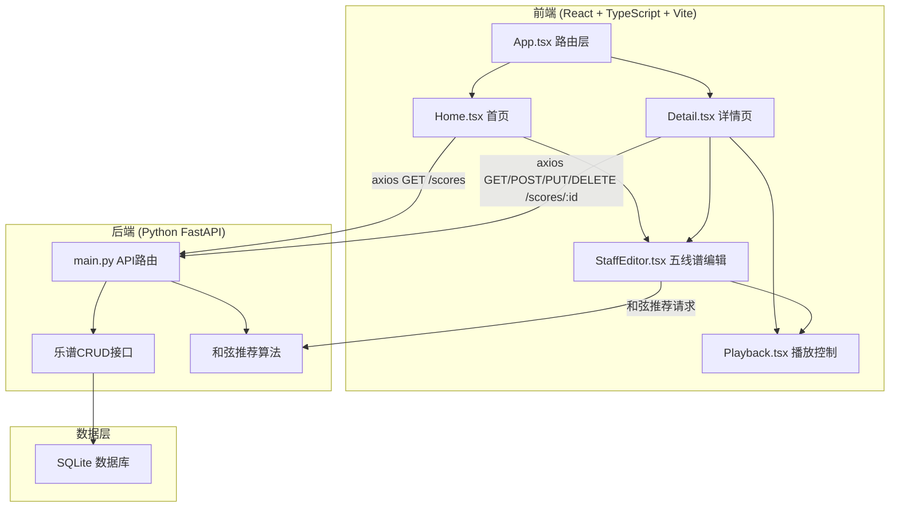
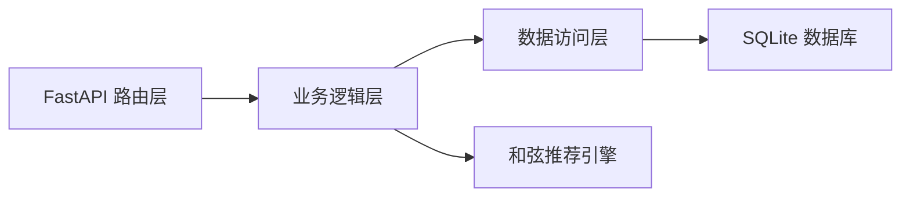
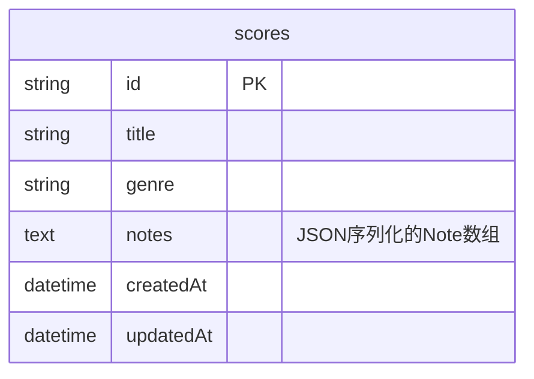

## 1. 架构设计



## 2. 技术说明

- 前端：React@18 + TypeScript + Vite
- 初始化工具：vite-init (react-ts 模板)
- 样式：Tailwind CSS@3 + 自定义CSS动画
- 状态管理：Zustand
- 路由：react-router-dom
- HTTP客户端：axios
- 后端：Python FastAPI
- 数据库：SQLite（轻量级，无需额外服务）
- 音频：Web Audio API（浏览器原生，无需额外依赖）

## 3. 路由定义

| 路由 | 用途 |
|------|------|
| / | 首页，乐谱卡片网格展示，筛选排序 |
| /score/:id | 乐谱详情页，查看/编辑五线谱，播放控制 |

## 4. API 定义

### 4.1 数据类型

```typescript
interface Score {
  id: string;
  title: string;
  genre: "classical" | "pop" | "jazz" | "rock" | "folk";
  notes: Note[];
  createdAt: string;
  updatedAt: string;
}

interface Note {
  pitch: string;       // e.g. "C4", "D#5"
  duration: number;    // in beats, e.g. 1 = quarter note
  position: number;    // horizontal position (0-32)
}

interface ChordSuggestion {
  name: string;        // e.g. "C Major"
  notes: string[];     // e.g. ["C4", "E4", "G4"]
  confidence: number;  // 0-1
}
```

### 4.2 接口定义

| 方法 | 路径 | 请求体 | 响应 | 描述 |
|------|------|--------|------|------|
| GET | /api/scores | - | Score[] | 获取所有乐谱，支持 ?genre=&sort= 查询参数 |
| GET | /api/scores/:id | - | Score | 获取单个乐谱详情 |
| POST | /api/scores | { title, genre, notes } | Score | 创建新乐谱 |
| PUT | /api/scores/:id | { title?, genre?, notes? } | Score | 更新乐谱 |
| DELETE | /api/scores/:id | - | { ok: true } | 删除乐谱 |
| POST | /api/chords/suggest | { notes: Note[] } | ChordSuggestion[] | 根据音符推荐和弦 |

## 5. 服务端架构图



## 6. 数据模型

### 6.1 数据模型定义



### 6.2 数据定义语言

```sql
CREATE TABLE IF NOT EXISTS scores (
    id TEXT PRIMARY KEY,
    title TEXT NOT NULL DEFAULT '未命名乐谱',
    genre TEXT NOT NULL DEFAULT 'pop',
    notes TEXT NOT NULL DEFAULT '[]',
    createdAt TEXT NOT NULL DEFAULT (datetime('now')),
    updatedAt TEXT NOT NULL DEFAULT (datetime('now'))
);

CREATE INDEX IF NOT EXISTS idx_scores_genre ON scores(genre);
CREATE INDEX IF NOT EXISTS idx_scores_createdAt ON scores(createdAt);
```

## 7. 前端文件结构

```
src/
  App.tsx              -- 主组件和路由
  components/
    StaffEditor.tsx    -- 五线谱编辑组件
    Playback.tsx       -- 播放控制组件
  pages/
    Home.tsx           -- 首页卡片网格展示
    Detail.tsx         -- 乐谱详情和编辑页
backend/
  main.py             -- FastAPI后端接口
```
