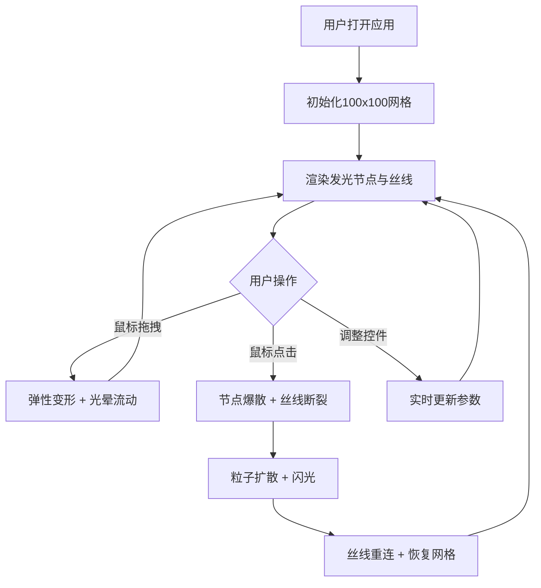

## 1. 产品概述

「流光织网」是一款基于浏览器的交互式视觉艺术应用，模拟由发光丝线编织的动态网格，用户可通过鼠标拖拽和点击来扭曲、切割和重组网格，创造不断变化的流动图案。
- 目标用户：视觉艺术爱好者、创意设计师、交互体验探索者
- 核心价值：提供一种沉浸式的光与网格交互体验，将物理弹性模拟与粒子特效融合，带来独特的视觉创作乐趣

## 2. 核心功能

### 2.1 功能模块

1. **主画布页面**：100×100发光网格、弹性变形交互、爆散粒子效果、控制面板

### 2.2 页面详情

| 页面名称 | 模块名称 | 功能描述 |
|----------|----------|----------|
| 主画布页面 | 动态网格 | 生成100×100网格，每个交叉点为发光节点，节点间由半透明丝线连接，丝线随节点移动产生弹性弯曲效果 |
| 主画布页面 | 拖拽变形 | 鼠标拖拽时，被拖拽节点带动周围节点产生弹性变形，丝线扭曲并有光晕流动 |
| 主画布页面 | 爆散重组 | 鼠标点击时，点击处节点爆散成粒子向外扩散，丝线断裂后逐渐重新连接恢复原网格 |
| 主画布页面 | 控制面板 | 弹性系数滑块、节点大小滑块、丝线颜色选择器、重置网格按钮，所有控件有平滑悬停和点击反馈 |

## 3. 核心流程

用户打开应用后，看到一个深空蓝到纯黑渐变背景上的100×100发光网格。用户可以用鼠标拖拽节点产生弹性变形，或点击节点触发爆散效果。通过右侧控制面板调整弹性系数、节点大小、丝线颜色等参数，或重置网格恢复初始状态。

## 4. 用户界面设计

### 4.1 设计风格

- 主色调：深空蓝(#0a0e27)到纯黑(#000000)渐变背景
- 节点色：暖白(#fff5e6)到冷蓝(#4fc3f7)渐变发光球
- 丝线色：4种预设（极光：绿紫渐变、星夜：蓝金渐变、熔岩：红橙渐变、深海：青蓝渐变）
- 控制面板：半透明毛玻璃效果，微发光边框
- 滑块：渐变轨道 + 圆形手柄
- 整体风格：深邃宇宙感，发光丝线编织的奇幻网格

### 4.2 页面设计概述

| 页面名称 | 模块名称 | UI元素 |
|----------|----------|--------|
| 主画布页面 | 画布区域 | 全屏Canvas，深空渐变背景，发光节点+半透明丝线 |
| 主画布页面 | 控制面板 | 右侧半透明毛玻璃面板，发光边框，渐变滑块，圆形手柄，颜色预设按钮，重置按钮 |

### 4.3 响应式设计

- 桌面优先设计，画布自适应窗口大小
- 控制面板固定在右侧，画布占主体空间
- 窗口缩放时重新计算网格间距

### 4.4 交互细节

- 拖拽：影响半径内节点产生弹性变形，光晕沿丝线流动
- 点击：节点爆散成粒子，闪光效果，周围丝线断裂后逐渐重连
- 控制面板：悬停时控件发光增强，点击时手柄缩放反馈
- 整体帧率保持60fps
