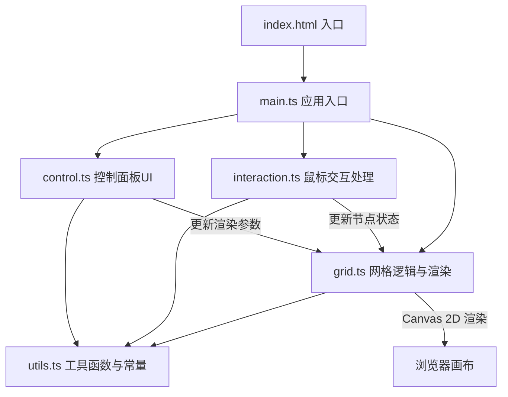

## 1. 架构设计



## 2. 技术说明

- 前端框架：纯 TypeScript + Canvas 2D API（无UI框架依赖，性能优先）
- 构建工具：Vite
- 初始化工具：npm init vite
- 后端：无
- 数据库：无

## 3. 文件结构

| 文件路径 | 用途 |
|----------|------|
| index.html | HTML入口，包含Canvas和控制面板DOM |
| src/main.ts | 应用入口，初始化各模块并启动动画循环 |
| src/grid.ts | 网格数据结构、弹性物理模拟、Canvas渲染 |
| src/interaction.ts | 鼠标拖拽和点击事件处理 |
| src/control.ts | 控制面板DOM操作和事件绑定 |
| src/utils.ts | 工具函数、常量定义、颜色预设 |
| package.json | 项目依赖和脚本 |
| tsconfig.json | TypeScript配置 |
| vite.config.js | Vite构建配置 |

## 4. 核心数据结构

### 4.1 节点（Node）

```typescript
interface Node {
  x: number
  y: number
  originX: number
  originY: number
  vx: number
  vy: number
  active: boolean
  explosionTime: number
}
```

### 4.2 粒子（Particle）

```typescript
interface Particle {
  x: number
  y: number
  vx: number
  vy: number
  life: number
  maxLife: number
  color: string
  size: number
}
```

### 4.3 丝线颜色预设

```typescript
interface ColorPreset {
  name: string
  colors: string[]
}
```

## 5. 核心算法

### 5.1 弹性物理模拟

每个节点有原始位置(originX, originY)和当前位置(x, y)。每帧计算：
- 弹性力：F = -k * (当前位置 - 原始位置)，k为弹性系数
- 阻尼力：F_damp = -d * v，d为阻尼系数
- 速度更新：v += (F + F_damp) * dt
- 位置更新：pos += v * dt

### 5.2 拖拽影响范围

拖拽时，以鼠标位置为圆心，影响半径R内的节点受到拖拽力：
- 力的大小与距离成反比：F_drag = strength * (1 - dist/R)
- 仅在鼠标按下且移动时施加

### 5.3 爆散粒子效果

点击时：
- 生成N个粒子，初始位置为点击节点位置
- 每个粒子随机方向和速度
- 粒子生命值随帧递减，透明度随生命值降低
- 丝线断裂：点击影响范围内节点间的丝线暂时隐藏
- 恢复：粒子消失后丝线逐渐重新显示

### 5.4 渲染优化

- 仅渲染视口内可见节点和丝线
- 使用requestAnimationFrame保持60fps
- 丝线使用二次贝塞尔曲线实现弹性弯曲
- 发光效果使用shadowBlur和渐变
- 背景使用离屏Canvas缓存渐变

## 6. 性能预算

- 节点数量：100×100 = 10,000个
- 丝线数量：约19,800条（水平+垂直）
- 目标帧率：60fps
- 每帧预算：16.67ms
- 策略：仅渲染屏幕内可见节点，视口外节点跳过渲染但仍参与物理计算
