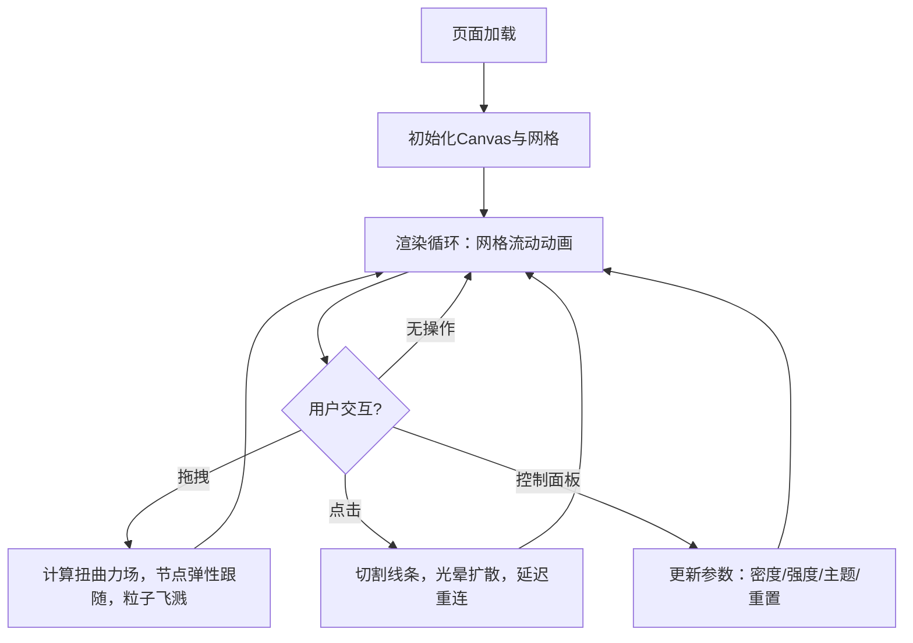

## 1. 产品概述

『流光织网』是一款基于浏览器 Canvas API 的交互式动态网格艺术应用，用户通过鼠标拖拽和点击来扭曲、切割、重组由发光丝线编织的动态网格，创造不断变化的流动图案。

- 目标用户：视觉艺术爱好者、交互设计探索者、数字创意工作者
- 核心价值：将抽象的数学网格美学化为可触碰的交互体验，兼具冥想式观赏与创造性玩法

## 2. 核心功能

### 2.1 功能模块

1. **画布主页**: 全屏发光网格画布，深空蓝到紫黑渐变背景，右下角毛玻璃控制面板
2. **交互层**: 鼠标拖拽扭曲、点击切割、弹性动画、粒子飞溅

### 2.2 页面详情

| 页面名称 | 模块名称 | 功能描述 |
|----------|----------|----------|
| 画布主页 | 动态网格 | 数百条半透明发光线条从左到右暖橙渐变到冷蓝，带微光拖尾，持续流动动画 |
| 画布主页 | 拖拽扭曲 | 鼠标拖拽时网格节点弹性跟随，形成波浪或漩涡，伴随粒子飞溅效果 |
| 画布主页 | 点击切割 | 点击处线条断开，向外扩散光晕，随后缓慢重连 |
| 画布主页 | 控制面板 | 毛玻璃面板含密度滑块、强度滑块、颜色主题选择器、重置按钮，悬停发光反馈 |

## 3. 核心流程

用户打开页面后看到深空背景上的流动发光网格。默认网格密度10、扭曲强度0.5、极光主题。用户可拖拽网格区域产生扭曲和粒子效果，可点击产生切割与光晕扩散，也可通过右下角控制面板调节参数或切换主题。

## 4. 用户界面设计

### 4.1 设计风格

- 主色调：深空蓝(#0a0a2e)到紫黑(#1a0a2e)渐变背景
- 网格线条：暖橙(#ff6a00)到冷蓝(#00b4ff)渐变，半透明发光
- 控制面板：毛玻璃效果(backdrop-filter: blur)，微光边框
- 按钮：悬停时发光效果，点击有缩放反馈
- 滑块：自定义样式，轨道半透明，滑块圆点发光
- 字体：细体无衬线字体，低对比度标签文字
- 布局：全屏画布，控制面板固定右下角，无多余UI

### 4.2 页面设计概览

| 页面名称 | 模块名称 | UI元素 |
|----------|----------|--------|
| 画布主页 | 全屏画布 | 深空渐变背景，发光线条网格覆盖全屏，持续流动动画 |
| 画布主页 | 控制面板 | 毛玻璃面板，4个控件（密度滑块、强度滑块、主题选择器、重置按钮），圆角12px，微光边框 |
| 画布主页 | 拖拽反馈 | 鼠标附近节点弹性位移，彩色粒子沿拖拽方向飞溅 |
| 画布主页 | 切割反馈 | 点击处光圈扩散，线条断开动画，缓慢重连过渡 |

### 4.3 响应式

- 桌面优先设计，全屏Canvas自适应窗口大小
- 控制面板在窗口缩小时保持可见
- 触摸设备支持touch事件

### 4.4 颜色主题预设

| 主题名 | 起始色 | 结束色 | 氛围描述 |
|--------|--------|--------|----------|
| 极光 | #00ff88（翠绿） | #8b5cf6（紫罗兰） | 北极光般的自然流光 |
| 熔岩 | #ff4500（火红） | #ffd700（金色） | 岩浆涌动的炽热感 |
| 深海 | #006994（深蓝绿） | #00ffff（青色） | 深海生物发光 |
| 霓虹 | #ff00ff（品红） | #00ffff（青色） | 赛博朋克霓虹灯 |
