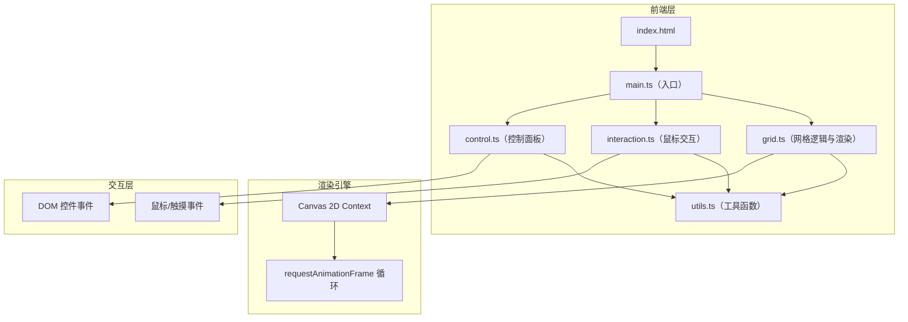

## 1. 架构设计



## 2. 技术说明

- **前端**: 纯 TypeScript + Canvas 2D API，无UI框架依赖
- **构建工具**: Vite + TypeScript 插件
- **包管理器**: npm
- **后端**: 无
- **数据库**: 无

### 技术选型理由

| 技术 | 用途 | 选型理由 |
|------|------|----------|
| TypeScript | 主要开发语言 | 类型安全，strict模式确保代码质量 |
| Canvas 2D API | 图形渲染 | 轻量高效，适合2D粒子/线条渲染 |
| Vite | 构建工具 | 快速HMR，零配置TypeScript支持 |
| requestAnimationFrame | 动画循环 | 浏览器原生，60fps流畅渲染 |

## 3. 文件结构

```
project/
├── index.html          # 入口HTML，Canvas容器
├── package.json        # 依赖与脚本
├── tsconfig.json       # TypeScript配置（strict模式）
├── vite.config.ts      # Vite配置
└── src/
    ├── main.ts         # 入口：初始化Canvas，启动渲染循环
    ├── grid.ts         # 网格数据模型、渲染、动画逻辑
    ├── interaction.ts  # 鼠标/触摸事件处理，力场计算
    ├── control.ts      # 控制面板DOM创建与事件绑定
    └── utils.ts        # 工具函数、常量、颜色主题定义
```

## 4. 模块职责

### 4.1 utils.ts - 工具函数与常量

- 颜色主题定义（极光/熔岩/深海/霓虹）
- 插值函数（线性插值、颜色插值）
- 向量运算工具
- 默认配置常量（网格密度范围、扭曲强度范围等）

### 4.2 grid.ts - 网格逻辑与渲染

- `GridNode` 数据结构：位置、速度、原始位置、偏移量、断开状态
- `Grid` 类：
  - 初始化网格节点（基于密度参数）
  - 更新节点位置（弹性回复、力场影响）
  - 渲染线条（颜色渐变、发光效果、拖尾）
  - 切割逻辑（节点断开与重连）
  - 粒子系统管理

### 4.3 interaction.ts - 交互处理

- 鼠标/触摸事件监听
- 拖拽力场计算（距离衰减的推力/拉力）
- 点击切割触发
- 粒子飞溅生成
- 交互状态管理

### 4.4 control.ts - 控制面板

- DOM元素创建（毛玻璃面板、滑块、选择器、按钮）
- 事件绑定与参数同步
- 主题切换时更新颜色配置
- 重置功能

### 4.5 main.ts - 入口

- Canvas初始化与尺寸适配
- 模块实例化与连接
- requestAnimationFrame 渲染循环
- 窗口resize处理

## 5. 性能策略

- 使用 `requestAnimationFrame` 保证60fps
- 网格节点位移计算使用简单弹簧模型，O(n)复杂度
- 粒子数量上限控制（最多200个活跃粒子）
- 切割断开线段使用标记跳过而非重建
- Canvas状态缓存，减少重复设置
- 使用离屏Canvas预渲染发光效果（如需要）

## 6. 数据模型

### 6.1 核心数据结构

```typescript
interface GridNode {
  x: number;
  y: number;
  originX: number;
  originY: number;
  vx: number;
  vy: number;
  cut: boolean;
  cutTime: number;
}

interface Particle {
  x: number;
  y: number;
  vx: number;
  vy: number;
  life: number;
  maxLife: number;
  color: string;
  size: number;
}

interface Theme {
  name: string;
  startColor: string;
  endColor: string;
}

interface Config {
  density: number;
  distortionStrength: number;
  theme: Theme;
}
```
