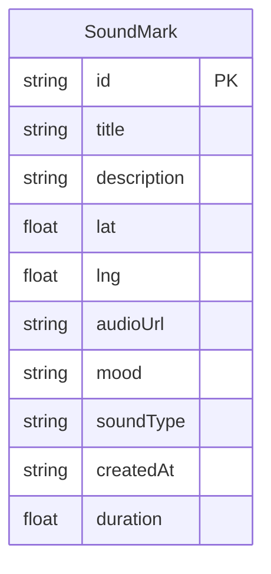

## 1. 架构设计

```mermaid
graph TB
    "前端 React + TypeScript" --> "API 调用层 (src/api.ts)"
    "API 调用层" --> "FastAPI 后端"
    "FastAPI 后端" --> "SQLite 数据库"
    "FastAPI 后端" --> "本地文件存储 (音频)"
    "前端 React + TypeScript" --> "Web Audio API (波形渲染)"
    "前端 React + TypeScript" --> "Leaflet 地图 (交互式地图)"
```

前端采用 React + TypeScript + Vite 构建，使用 React Router 管理页面路由。波形可视化使用 Canvas API + Web Audio API 实现。地图使用 Leaflet（轻量开源方案）。后端使用 FastAPI 提供 RESTful API，SQLite 存储数据，本地文件系统存储音频。

## 2. 技术说明

- **前端**: React@18 + TypeScript + Vite
- **样式方案**: CSS Modules + CSS Variables（毛玻璃、渐变、动画）
- **地图库**: Leaflet + react-leaflet（轻量交互式地图）
- **音频处理**: Web Audio API（解码、波形提取、播放控制）
- **波形渲染**: Canvas 2D API（高性能60fps渲染）
- **动画**: CSS transitions + requestAnimationFrame
- **布局**: CSS Grid + Masonry 瀑布流
- **初始化工具**: Vite
- **后端**: FastAPI (Python 3.10+)
- **数据库**: SQLite（开发阶段，使用 mock 数据优先）
- **数据策略**: 前端优先使用 mock 数据，API 调用层支持切换

## 3. 路由定义

| 路由 | 用途 |
|------|------|
| `/` | 首页 - 声音卡片瀑布流浏览 |
| `/sound/:id` | 声音详情页 - 完整波形与信息 |
| `/add` | 添加声音页 - 地图选点与上传 |
| `/soundscape` | 城市音景图 - 地图上的声音标记 |

## 4. API 定义

### 4.1 数据类型

```typescript
interface SoundMark {
  id: string;
  title: string;
  description: string;
  lat: number;
  lng: number;
  audioUrl: string;
  mood: Mood;
  soundType: SoundType;
  createdAt: string;
  duration: number;
  waveform?: number[];
}

type Mood = 'happy' | 'calm' | 'sad' | 'excited' | 'nostalgic' | 'focused';
type SoundType = 'nature' | 'urban' | 'mechanical' | 'human' | 'music';

interface MoodOption {
  value: Mood;
  label: string;
  emoji: string;
}

interface SoundTypeOption {
  value: SoundType;
  label: string;
  icon: string;
}
```

### 4.2 API 端点

| 方法 | 路径 | 描述 | 请求 | 响应 |
|------|------|------|------|------|
| GET | `/api/sounds` | 获取声音列表，支持筛选 | `?mood=&type=&q=` | `SoundMark[]` |
| GET | `/api/sounds/:id` | 获取单个声音详情 | - | `SoundMark` |
| POST | `/api/sounds` | 创建声音标记 | `FormData` | `SoundMark` |
| GET | `/api/sounds/:id/waveform` | 获取波形数据 | - | `number[]` |
| GET | `/api/soundscape` | 获取音景图数据 | `?bounds=` | `SoundMark[]` |

## 5. 前端组件架构

```mermaid
graph TD
    "App" --> "HomePage"
    "App" --> "DetailPage"
    "App" --> "AddSoundPage"
    "App" --> "SoundscapePage"
    "HomePage" --> "SearchBar"
    "HomePage" --> "FilterBar"
    "HomePage" --> "SoundCard"
    "HomePage" --> "AddButton"
    "HomePage" --> "SoundscapeEntry"
    "SoundCard" --> "Waveform (预览)"
    "DetailPage" --> "Waveform (完整)"
    "DetailPage" --> "InfoPanel"
    "DetailPage" --> "PlayerControls"
    "AddSoundPage" --> "MapPicker"
    "AddSoundPage" --> "AudioUpload"
    "AddSoundPage" --> "SoundForm"
    "SoundscapePage" --> "SoundMap"
    "SoundscapePage" --> "MiniPlayer"
```

## 6. 数据模型

### 6.1 数据模型定义



### 6.2 Mock 数据策略

项目前端优先使用内置 mock 数据，确保 `npm run dev` 即可直接运行。mock 数据包含 12+ 条预设声音记录，覆盖不同心情和声音类型，使用程序生成的波形数据。API 调用层 (`src/api.ts`) 在 mock 模式下直接返回本地数据，后端部署后可切换为真实 API。
