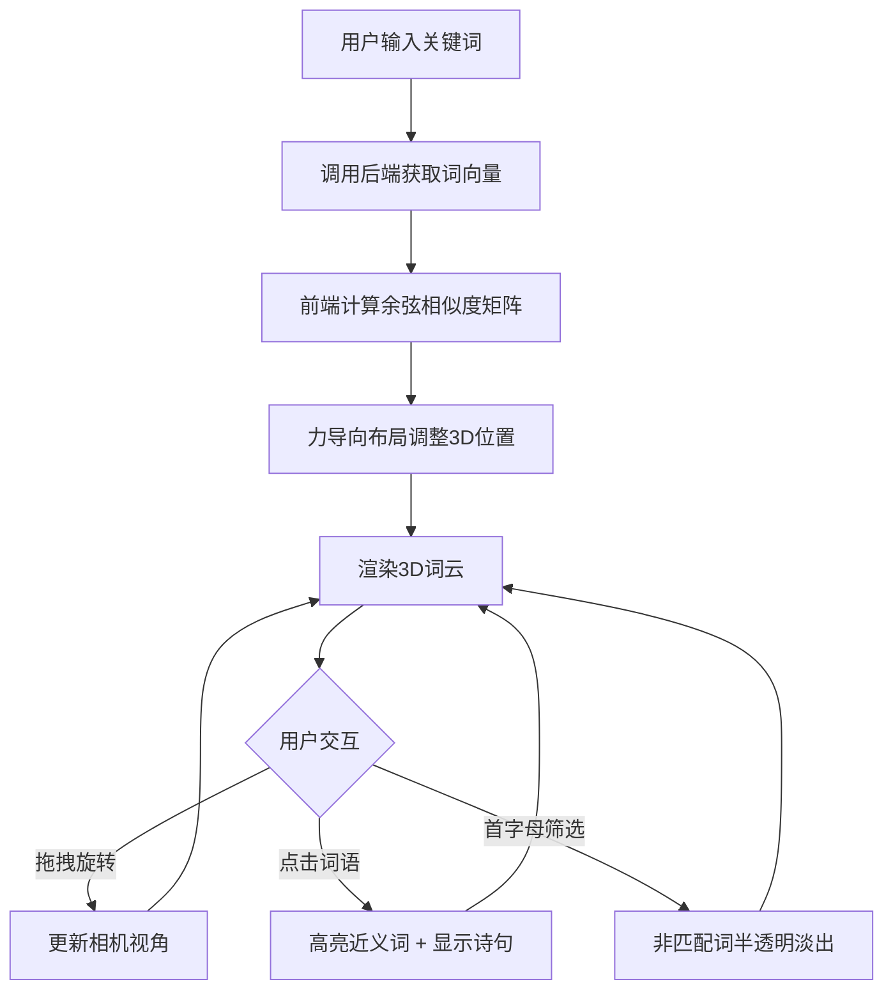

## 1. 产品概述

「词韵织机」是一款融合水墨国风与现代交互的全栈 Web 应用，用户输入关键词后，系统在 3D 词云中动态展示，依据语义相似度自动调整词的位置、颜色与大小，并支持点击交互、首字母筛选与诗词匹配。
- 目标用户：诗词爱好者、中文学习者、视觉艺术创作者
- 核心价值：以空间化的方式感知词语间的语义亲疏，让文字"活"起来

## 2. 核心功能

### 2.1 用户角色
无需注册，所有用户均为匿名访客，享有全部功能。

### 2.2 功能模块
1. **主页面**：3D 词云展示区 + 控制面板 + 诗词浮层
2. **首字母筛选栏**：横向排列的字母按钮，点击筛选

### 2.3 页面详情

| 页面名称 | 模块名称 | 功能描述 |
|----------|----------|----------|
| 主页面 | 3D 词云区 | 渲染关键词为 3D 文字精灵，语义相似度驱动位置/颜色/大小；拖拽旋转视角；点击词语高亮并显示近义词；缓慢自转 |
| 主页面 | 控制面板 | 输入关键词（逗号/空格分隔）；首字母筛选按钮；清除/重置操作 |
| 主页面 | 诗词浮层 | 点击词语后弹出毛玻璃卡片，显示行书诗句片段，来源从内置诗词库随机匹配 |
| 主页面 | 水墨晕染动画 | 点击高亮时词语周围出现水墨晕染扩散特效 |

## 3. 核心流程

1. 用户在控制面板输入关键词，点击"生成"
2. 前端将关键词发送至后端，获取词向量和诗词匹配
3. 前端基于余弦相似度计算词间关系，驱动 3D 布局
4. 词云自转中，用户可拖拽旋转、点击词语交互
5. 点击词语后高亮近义词，淡出无关词，显示诗句卡片
6. 用户可按首字母筛选，非匹配词半透明淡出

## 4. 用户界面设计

### 4.1 设计风格
- **主色调**：淡墨（#4A4A4A）与朱红（#C53D43），辅助色米白（#F5F0E8）到浅灰（#E8E3DB）渐变
- **按钮风格**：圆角胶囊形，朱红描边 + 半透明底，hover 时朱红填充
- **字体**：词语用圆润黑体（思源黑体 / Noto Sans SC），诗句用行书（Ma Shan Zheng），UI 用 Noto Sans SC
- **布局风格**：全屏沉浸式词云 + 左侧浮动控制面板 + 底部/右侧诗词浮层
- **图标风格**：极简线条图标，墨色

### 4.2 页面设计概览

| 页面名称 | 模块名称 | UI 元素 |
|----------|----------|---------|
| 主页面 | 3D 词云区 | 米白-浅灰渐变背景；词语为 3D 文字精灵，带半透明光晕；相似词暖色（朱红→橙黄），差异词冷色（淡墨→灰蓝）；点击时水墨晕染扩散动画 |
| 主页面 | 控制面板 | 左上角浮动毛玻璃卡片；输入框 + 生成按钮；首字母筛选横排按钮组；圆角、阴影、磨砂质感 |
| 主页面 | 诗词浮层 | 右下角弹出毛玻璃卡片；行书字体诗句；淡墨竖线装饰；淡入动画 |

### 4.3 响应式设计
- 桌面端（≥1024px）：全屏词云 + 左侧控制面板 + 右下诗句卡
- 平板端（768px-1023px）：词云占满，控制面板底部折叠抽屉
- 手机端（<768px）：词云占满，控制面板底部弹出，诗句卡居中弹出

### 4.4 3D 场景指引
- **环境**：无天空盒，纯渐变背景由 CSS 实现，3D 场景透明背景叠加
- **灯光**：环境光 + 点光源（暖白色），模拟纸面漫反射
- **相机**：透视相机，FOV 60°，初始距离 12，OrbitControls 支持拖拽旋转与缩放
- **构成**：词语文字精灵为视觉焦点，位置由力导向算法驱动
- **交互**：OrbitControls 旋转/缩放；Raycaster 点击检测；hover 时词语微微放大
- **动画**：词云缓慢自转（Y 轴）；词语入场时从中心弹出到目标位置；水墨晕染用着色器扩散效果
- **后处理**：可选的 UnrealBloomPass 为词语添加柔和光晕
- **性能预算**：60fps，词语数量 ≤100 时流畅

## 5. 数据需求

### 5.1 诗词库
内置约 200 条经典古诗词片段，每条包含：
- 关键词列表（2-5 个）
- 诗句原文
- 诗人、出处

### 5.2 词向量
后端使用预训练的中文词向量模型（如使用 gensim 加载轻量中文 Word2Vec），对输入关键词计算向量，返回 JSON 数组。若某个词不在词库中，返回零向量。
