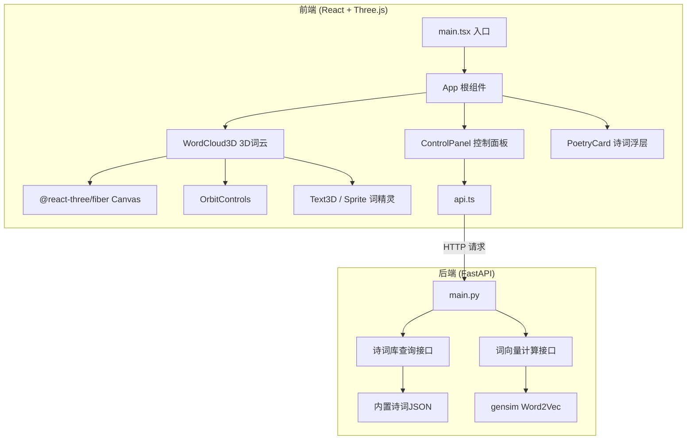
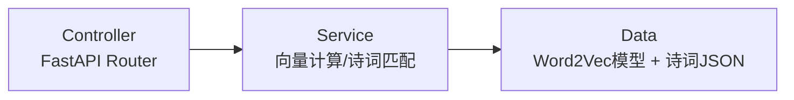
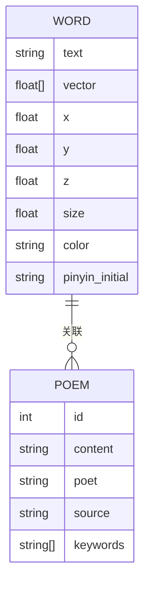

## 1. 架构设计



## 2. 技术说明

- **前端**：React 18 + TypeScript + Three.js + @react-three/fiber + @react-three/drei + Vite
- **初始化工具**：Vite (vite init)
- **后端**：FastAPI + uvicorn + gensim（加载预训练中文词向量）
- **数据库**：无数据库，诗词库以 JSON 文件内置，词向量模型文件本地加载
- **样式方案**：CSS Modules + CSS Variables（水墨主题色）

### 核心依赖

**前端 package.json 关键依赖**：
- react@18, react-dom@18
- three, @react-three/fiber, @react-three/drei
- axios
- @types/react, @types/three, typescript

**后端 requirements**：
- fastapi, uvicorn
- gensim（加载 Word2Vec 词向量）
- numpy（余弦相似度计算）
- pydantic

## 3. 路由定义

| 路由 | 用途 |
|------|------|
| / | 主页面，包含3D词云和控制面板 |

前端为单页应用，无客户端路由。后端路由如下：

| 后端路由 | 方法 | 用途 |
|----------|------|------|
| /api/vectors | POST | 接收关键词列表，返回词向量和相似度矩阵 |
| /api/poems | POST | 接收关键词，返回匹配的诗句片段 |

## 4. API 定义

### 4.1 词向量接口

**POST /api/vectors**

请求体：
```typescript
interface VectorsRequest {
  words: string[];
}
```

响应体：
```typescript
interface VectorsResponse {
  vectors: Record<string, number[]>;
  similarity_matrix: number[][];
  word_order: string[];
}
```

### 4.2 诗词查询接口

**POST /api/poems**

请求体：
```typescript
interface PoemsRequest {
  words: string[];
}
```

响应体：
```typescript
interface PoemsResponse {
  matches: Record<string, PoemMatch[]>;
}

interface PoemMatch {
  keyword: string;
  poem: string;
  poet: string;
  source: string;
}
```

## 5. 服务器架构图



## 6. 数据模型

### 6.1 数据模型定义



### 6.2 诗词库数据结构

诗词库以 JSON 文件存储，结构如下：
```json
[
  {
    "id": 1,
    "content": "床前明月光，疑是地上霜",
    "poet": "李白",
    "source": "静夜思",
    "keywords": ["月", "光", "霜", "夜"]
  }
]
```

约 200 条古诗词片段，覆盖常见意象词（山、水、月、风、花、雪、海、云等）。

### 6.3 词向量模型

使用轻量级预训练中文 Word2Vec 模型（维度 100-200），若模型文件过大则使用简化方案：后端内置一个关键词-向量映射表（约 500 个常见汉字/词的向量），前端在找不到向量时使用零向量退化为随机布局。
