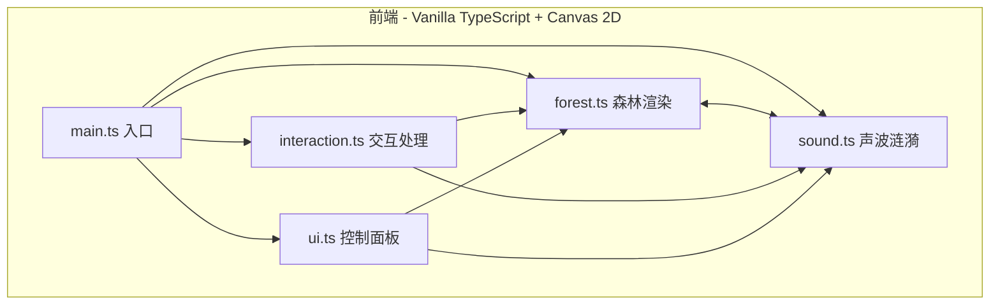
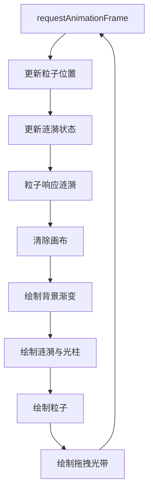

## 1. 架构设计



## 2. 技术说明

- **前端**：Vanilla TypeScript + Canvas 2D API（无框架）
- **构建工具**：Vite + TypeScript
- **包管理**：npm
- **后端**：无
- **数据库**：无

### 2.1 技术选型理由

- **Vanilla TS + Canvas**：项目核心是粒子渲染和动画，不需要 DOM 框架，Canvas 2D 直接绘制效率最高
- **Vite**：快速开发服务器和构建，TypeScript 原生支持
- **无第三方动画库**：requestAnimationFrame 足够，减少依赖

## 3. 文件结构

```
├── index.html          # 入口HTML
├── package.json        # 依赖配置
├── tsconfig.json       # TypeScript配置
├── vite.config.js      # Vite配置
└── src/
    ├── main.ts         # 入口：初始化Canvas、整合模块、启动渲染循环
    ├── forest.ts       # 森林场景：粒子类、粒子系统、渲染逻辑
    ├── sound.ts        # 声波涟漪：涟漪类、涟漪动画、光柱特效
    ├── interaction.ts  # 交互处理：鼠标/触摸事件、坐标转换
    └── ui.ts           # 控制面板：DOM构建、滑块/选择器、响应式折叠
```

## 4. 模块接口定义

### 4.1 forest.ts - 粒子系统

```typescript
interface Particle {
  x: number
  y: number
  baseX: number
  baseY: number
  size: number
  brightness: number
  color: string
  vx: number
  vy: number
  phase: number
}

interface ForestConfig {
  particleCount: number
  theme: ThemeName
}

interface ForestSystem {
  particles: Particle[]
  init(canvas: HTMLCanvasElement, config: ForestConfig): void
  update(): void
  render(ctx: CanvasRenderingContext2D): void
  applyRipple(x: number, y: number, strength: number): void
  reset(): void
  resize(width: number, height: number): void
}
```

### 4.2 sound.ts - 声波涟漪

```typescript
interface Ripple {
  x: number
  y: number
  radius: number
  maxRadius: number
  opacity: number
  strength: number
  lightBeamHeight: number
  lightBeamOpacity: number
}

interface SoundSystem {
  ripples: Ripple[]
  createRipple(x: number, y: number, strength: number): void
  createDragTrail(x: number, y: number, strength: number): void
  update(): void
  render(ctx: CanvasRenderingContext2D): void
}
```

### 4.3 interaction.ts - 交互处理

```typescript
interface InteractionPoint {
  x: number
  y: number
  type: 'click' | 'drag'
}

interface InteractionSystem {
  init(canvas: HTMLCanvasElement): void
  onInteract(callback: (point: InteractionPoint) => void): void
  destroy(): void
}
```

### 4.4 ui.ts - 控制面板

```typescript
type ThemeName = 'forest' | 'ocean' | 'dusk' | 'aurora'

interface UIConfig {
  particleDensity: number
  soundStrength: number
  theme: ThemeName
}

interface UISystem {
  init(container: HTMLElement): void
  onConfigChange(callback: (config: UIConfig) => void): void
  onReset(callback: () => void): void
  destroy(): void
}
```

## 5. 渲染循环架构



## 6. 性能优化策略

1. **对象池**：涟漪对象复用，减少 GC
2. **空间分区**：粒子按网格分区，涟漪只影响附近粒子
3. **离屏渲染**：静态背景可缓存（如有需要）
4. **帧率监控**：开发时可开启 FPS 显示
5. **批量绘制**：相同颜色粒子合并路径绘制
