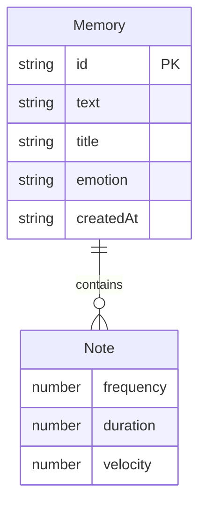

## 1. 架构设计

```mermaid
flowchart TB
    subgraph "前端 (React + Vite)"
        "App.tsx 主界面路由" --> "MemoryInput 输入组件"
        "App.tsx 主界面路由" --> "ParticleViz 粒子动画"
        "App.tsx 主界面路由" --> "MemoryCard 记忆卡片"
        "App.tsx 主界面路由" --> "ShareModal 分享弹窗"
    end

    subgraph "后端 (Express + TypeScript)"
        "index.ts Express服务" --> "melody.ts 旋律生成"
        "index.ts Express服务" --> "saved.ts 记忆存储"
    end

    subgraph "数据层"
        "memories.json 文件存储"
    end

    "前端" -->|"POST /api/generate"| "后端"
    "前端" -->|"GET /api/memories"| "后端"
    "前端 -->|POST /api/memories"| "后端"
    "后端" -->|"读写"| "数据层"
```

## 2. 技术说明

- **前端**：React@18 + TypeScript + Tailwind CSS@3 + Vite
- **初始化工具**：vite-init (react-express-ts 模板)
- **后端**：Express@4 + TypeScript (ESM格式)
- **数据库**：文件存储 (memories.json)，无需数据库服务
- **音频**：Web Audio API (浏览器原生)
- **动画**：Canvas 2D + requestAnimationFrame
- **状态管理**：Zustand

## 3. 路由定义

| 路由 | 用途 |
|------|------|
| `/` | 主页面 - 输入、生成、粒子动画、记忆卡片列表 |
| `/share/:id` | 分享页面 - 查看他人记忆及播放旋律 |

## 4. API定义

### 4.1 TypeScript类型定义

```typescript
interface Note {
  frequency: number;
  duration: number;
  velocity: number;
}

interface Memory {
  id: string;
  text: string;
  title: string;
  notes: Note[];
  createdAt: string;
  emotion: string;
}

interface GenerateRequest {
  text: string;
}

interface GenerateResponse {
  id: string;
  notes: Note[];
  emotion: string;
  title: string;
}

interface MemoryListResponse {
  memories: Memory[];
}
```

### 4.2 请求/响应模式

| 方法 | 路径 | 请求体 | 响应 | 用途 |
|------|------|--------|------|------|
| POST | `/api/generate` | `{ text: string }` | `GenerateResponse` | 根据文字生成旋律 |
| GET | `/api/memories` | - | `MemoryListResponse` | 获取所有已保存记忆 |
| POST | `/api/memories` | `Memory` | `{ success: boolean }` | 保存一条记忆 |
| GET | `/api/memories/:id` | - | `Memory` | 获取单条记忆(分享用) |

## 5. 服务端架构图

```mermaid
flowchart LR
    "Express路由控制器" --> "melody.ts 旋律生成服务"
    "Express路由控制器" --> "saved.ts 存储服务"
    "melody.ts 旋律生成服务" --> "笔画表映射"
    "melody.ts 旋律生成服务" --> "情感词典"
    "saved.ts 存储服务" --> "memories.json 文件"
```

## 6. 数据模型

### 6.1 数据模型定义



### 6.2 存储结构

```json
{
  "memories": [
    {
      "id": "mem_xxxxxxxx",
      "text": "那天海边的夕阳",
      "title": "那天海边的夕阳",
      "emotion": "warm",
      "notes": [
        { "frequency": 440, "duration": 500, "velocity": 0.8 },
        { "frequency": 523.25, "duration": 300, "velocity": 0.6 }
      ],
      "createdAt": "2026-06-08T12:00:00.000Z"
    }
  ]
}
```

## 7. 项目文件结构

```
├── package.json                 # 前后端依赖和启动脚本
├── tsconfig.json                # 根级TypeScript配置
├── api/                         # 后端代码
│   ├── index.ts                 # Express服务入口
│   ├── melody.ts                # 旋律生成算法
│   └── saved.ts                 # 记忆存储接口
├── src/                         # 前端代码
│   ├── main.tsx                 # React入口
│   ├── App.tsx                  # 主界面和路由
│   ├── store.ts                 # Zustand状态管理
│   ├── components/
│   │   ├── MemoryCard.tsx       # 记忆卡片组件
│   │   ├── ParticleViz.tsx      # 粒子动画组件
│   │   ├── MemoryInput.tsx      # 输入区域组件
│   │   └── ShareModal.tsx       # 分享弹窗组件
│   ├── hooks/
│   │   └── useAudioEngine.ts    # Web Audio API封装
│   ├── utils/
│   │   └── audio.ts             # 音频工具函数
│   └── styles/
│       └── index.css            # 全局样式+Tailwind
├── client/
│   ├── index.html               # HTML入口
│   ├── vite.config.ts           # Vite配置
│   └── tsconfig.json            # 前端TypeScript配置
└── data/
    └── memories.json            # 记忆数据存储
```

## 8. 关键技术实现

### 8.1 旋律生成算法 (melody.ts)

- 维护中文笔画查找表（约3000常用字）
- 五声音阶频率映射：宫(C4=261.63)、商(D4=293.66)、角(E4=329.63)、徵(G4=392.00)、羽(A4=440.00)
- 情感词典：分为温暖(warm/major)、忧伤(sad/minor)、宁静(calm/pentatonic)、激昂(intense/powerful)四类
- 生成策略：文字笔画数之和取模确定起始音高，情感关键词确定音阶模式，文字长度确定音符数量(8-16)

### 8.2 Web Audio API播放 (useAudioEngine.ts)

- AudioContext + AnalyserNode 实时获取频率数据
- OscillatorNode 播放每个音符，GainNode 控制音量和淡入淡出
- 播放状态通过Zustand store管理（当前播放记忆ID、播放进度、是否暂停）

### 8.3 粒子动画系统 (ParticleViz.tsx)

- Canvas 2D渲染，requestAnimationFrame循环
- 粒子对象池：预分配200个粒子，复用避免GC
- 频率数据映射：低频(0-200Hz)→暖橙色+汇聚运动，高频(2000Hz+)→亮蓝色+发散运动
- 节奏检测：分析音量突变点，触发脉冲效果

### 8.4 分享机制

- 后端为每条记忆生成唯一短ID（8位字母数字）
- 分享链接格式：`/share/{id}`
- 前端复制按钮使用navigator.clipboard API
- 复制成功后显示CSS动画气泡提示
