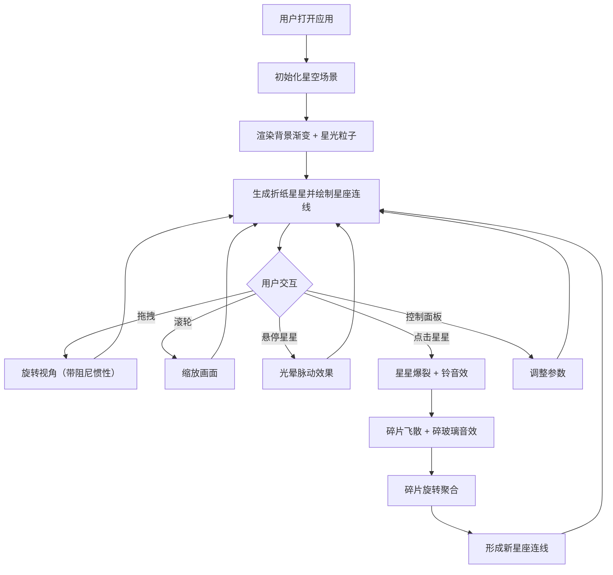

## 1. 产品概述

「纸间星图」是一款基于浏览器 Canvas API 的交互式动态星空模拟应用，以手工折纸风格的星星为核心视觉元素，用户可通过拖拽旋转视角、点击星星触发爆裂与重组动画，在深蓝紫黑的星空中体验一场纸艺与星空交融的沉浸式视觉旅程。
- 目标用户：追求视觉美感与交互体验的创意人群、星象爱好者、放松解压用户
- 核心价值：将折纸艺术与动态星座可视化结合，提供独一无二的交互式星空体验

## 2. 核心功能

### 2.1 功能模块

1. **星空画布页面**：折纸风格星星渲染、动态星座连线、背景星光粒子、交互操作

### 2.2 页面详情

| 页面名称 | 模块名称 | 功能描述 |
|----------|----------|----------|
| 星空画布 | 折纸星星渲染 | 以半透明多面体（4-6面）渲染手工折纸风格星星，边角微光，颜色随机（暖黄、淡粉、薄荷绿、浅紫），悬停光晕脉动 |
| 星空画布 | 星星爆裂效果 | 点击星星后分裂为十几个碎片向四周飞散，带轨迹拖尾，碎片缓缓旋转并重新聚合成新星座连线图案 |
| 星空画布 | 星空背景 | 深蓝到紫黑圆形渐变背景，散布细小闪烁的星光粒子 |
| 星空画布 | 星座连线 | 根据距离和亮度自动生成半透明发光连线，形成动态星座网，连线随鼠标拖拽流动变化 |
| 星空画布 | 视角控制 | 鼠标拖拽平滑旋转（带阻尼惯性），滚轮缩放画面 |
| 星空画布 | 音效系统 | 点击时播放清脆铃音（Web Audio API），爆裂时播放渐强碎玻璃音效 |
| 星空画布 | 控制面板 | 毛玻璃风格面板：星星密度滑块（50-300）、旋转速度滑块（0.1-1.5）、颜色主题选择器（星夜/极光/熔金/冰晶）、重置视角按钮 |

## 3. 核心流程

用户打开应用后，看到深蓝紫黑渐变星空背景，上面散布着折纸风格星星。星星之间自动生成发光连线形成星座网络。用户可以：
1. 拖拽旋转整个星空视角（带阻尼惯性）
2. 滚轮缩放画面
3. 悬停星星时出现柔和光晕脉动
4. 点击星星触发爆裂动画 + 音效，碎片飞散后重新聚合成新星座
5. 通过控制面板调整密度、速度、主题

## 4. 用户界面设计

### 4.1 设计风格

- **主色调**：深蓝（#0a0e27）到紫黑（#1a0a2e）圆形渐变背景
- **强调色**：暖黄（#ffd166）、淡粉（#ff9fb2）、薄荷绿（#63d4ae）、浅紫（#c4a7e7）
- **按钮样式**：毛玻璃质感（半透明白色背景 + 微发光边框），圆角
- **字体**：使用「Noto Serif SC」作为标题展示字体，系统字体作为辅助
- **布局**：全屏画布 + 右下角浮动控制面板
- **动画**：悬停渐变过渡、点击弹出缩放、星星光晕脉动、碎片旋转聚合

### 4.2 页面设计概览

| 页面名称 | 模块名称 | UI元素 |
|----------|----------|--------|
| 星空画布 | 星空背景 | 圆形渐变（深蓝→紫黑），细小闪烁粒子，CSS径向渐变 |
| 星空画布 | 折纸星星 | 半透明多面体（4-6面），Canvas 2D路径绘制，边角发光（shadowBlur），颜色随机 |
| 星空画布 | 星座连线 | 半透明发光线条，Canvas strokeStyle + globalAlpha，距离/亮度决定透明度 |
| 星空画布 | 控制面板 | 毛玻璃卡片（backdrop-filter: blur），滑块（range input 自定义样式），主题选择器，重置按钮 |

### 4.3 响应式适配

- 桌面端：全屏展示，完整控制面板
- 平板端：自动缩小控制面板，触控事件适配（单指拖拽旋转）
- 手机端：控制面板折叠为图标按钮，单指拖拽旋转、双指缩放
- 断点：768px（平板）、480px（手机）

### 4.4 2D Canvas 场景指引

- **环境氛围**：深空感，圆形径向渐变从中心深蓝到边缘紫黑，细小闪烁粒子营造深空感
- **光照**：星星自带微弱发光（Canvas shadowBlur + shadowColor），连线半透明发光
- **相机**：2D伪3D旋转，通过坐标变换实现拖拽旋转效果，带阻尼惯性衰减
- **构图**：星星均匀分布，星座连线自然生成，爆裂碎片向外扩散后聚合
- **交互**：拖拽旋转、悬停光晕、点击爆裂、控制面板参数调整
- **后期效果**：星星发光辉光、连线半透明发光、碎片轨迹拖尾
- **性能预算**：100颗星星时保持60fps，使用空间哈希优化碰撞检测和连线计算，requestAnimationFrame驱动渲染循环
