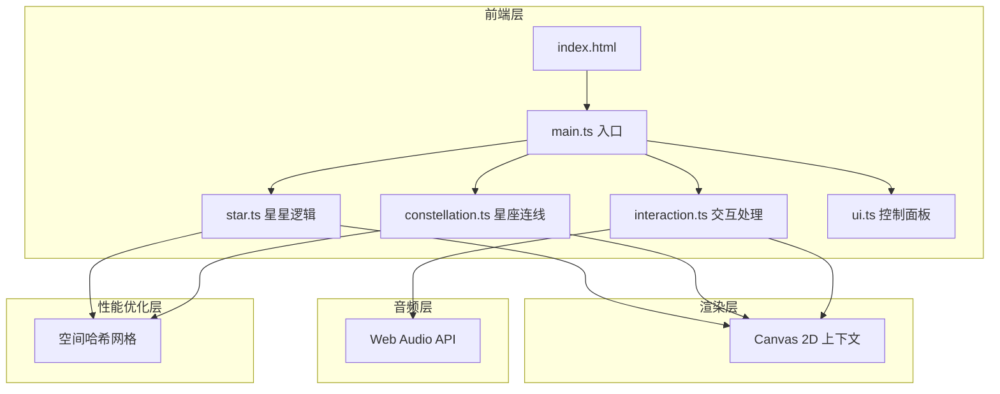

## 1. 架构设计



## 2. 技术说明

- **前端**：TypeScript + Canvas 2D API + Vite 构建
- **初始化工具**：Vite（手动配置，非模板创建，因项目为纯Canvas应用不使用React/Vue）
- **后端**：无
- **数据库**：无
- **音频**：Web Audio API（浏览器原生，生成铃音和碎玻璃音效）

### 2.1 文件结构

```
├── index.html              # 入口HTML
├── package.json            # 依赖和脚本
├── tsconfig.json           # TypeScript配置
├── vite.config.js          # Vite配置
└── src/
    ├── main.ts             # 入口和初始化（Canvas创建、渲染循环、模块协调）
    ├── star.ts             # 星星对象逻辑（折纸多面体渲染、光晕脉动、爆裂碎片动画、碎片聚合）
    ├── constellation.ts    # 星座生成与连接线渲染（距离检测、连线绘制、动态更新）
    ├── interaction.ts      # 鼠标拖拽和点击处理（旋转、缩放、点击检测、触控适配）
    └── ui.ts               # 控制面板UI组件（毛玻璃面板、滑块、选择器、响应式适配）
```

### 2.2 核心数据结构

```typescript
interface Star {
  id: number
  x: number
  y: number
  z: number
  faces: Face[]
  color: string
  size: number
  brightness: number
  hovered: boolean
  exploding: boolean
  fragments: Fragment[]
}

interface Face {
  points: { x: number; y: number }[]
  opacity: number
}

interface Fragment {
  x: number
  y: number
  vx: number
  vy: number
  rotation: number
  rotationSpeed: number
  size: number
  opacity: number
  trail: { x: number; y: number; opacity: number }[]
  targetX: number
  targetY: number
  phase: 'exploding' | 'gathering'
}

interface ConstellationLine {
  starA: Star
  starB: Star
  opacity: number
}

interface SpatialHash {
  cellSize: number
  grid: Map<string, Star[]>
}
```

### 2.3 颜色主题定义

| 主题名称 | 星星颜色组 | 连线颜色 | 背景渐变 |
|----------|-----------|---------|---------|
| 星夜 | 暖黄、淡粉、薄荷绿、浅紫 | 淡蓝半透明 | 深蓝→紫黑 |
| 极光 | 青色、翠绿、冰蓝、淡紫 | 绿色半透明 | 深绿→深蓝 |
| 熔金 | 金色、琥珀、橘红、暖白 | 金色半透明 | 深褐→暗红 |
| 冰晶 | 冰蓝、银白、淡青、薄荷 | 银色半透明 | 深灰蓝→墨蓝 |

## 3. 路由定义

单页应用，无路由。所有内容在一个 Canvas 画布上渲染。

## 4. 性能优化策略

- **空间哈希**：将画布划分为网格单元，仅检测同单元及相邻单元的星星之间的连线，避免 O(n²) 全量计算
- **离屏Canvas缓存**：静态背景（渐变 + 粒子）缓存到离屏Canvas，仅动态元素每帧重绘
- **请求动画帧**：使用 requestAnimationFrame 驱动渲染循环，确保帧率稳定
- **碎片对象池**：爆裂碎片使用对象池复用，减少GC压力
- **视口裁剪**：仅渲染视口内可见的星星和连线

## 5. 音频设计

- **点击铃音**：使用 OscillatorNode 生成 800Hz-1200Hz 正弦波，持续 150ms，带指数衰减
- **碎玻璃音效**：使用多个 OscillatorNode 生成高频噪声（3000Hz-8000Hz），白噪声混合，持续 500ms，渐强后衰减
- **AudioContext**：懒初始化，首次用户交互时创建，避免浏览器自动播放限制

## 6. 响应式与触控

- **触控事件映射**：touchstart → mousedown, touchmove → mousemove, touchend → mouseup
- **双指缩放**：检测两个触控点的距离变化，映射为缩放因子
- **控制面板自适应**：768px以下面板宽度缩小，480px以下折叠为图标按钮
