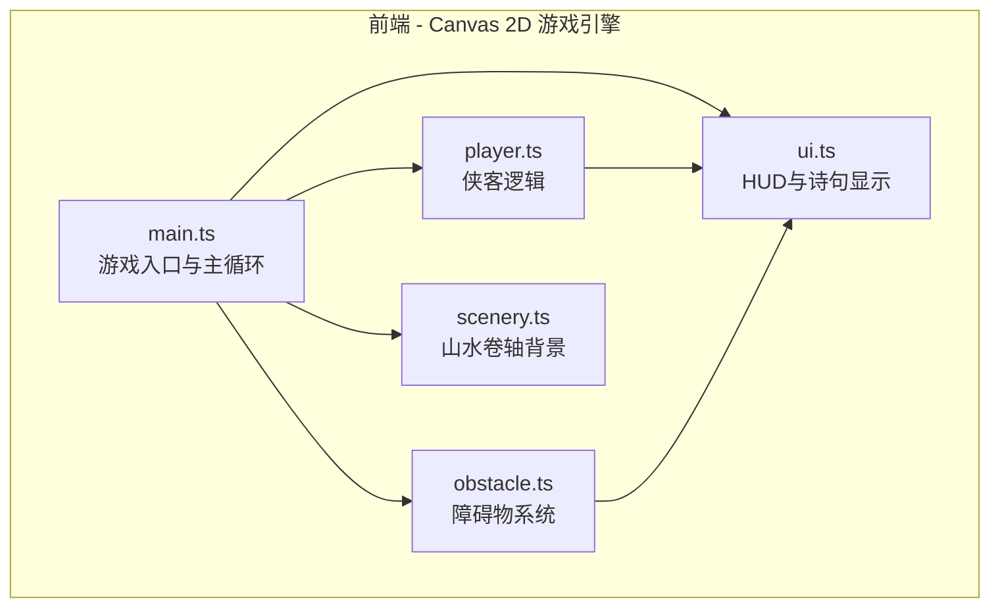

## 1. 架构设计



## 2. 技术说明

- 前端：TypeScript + Canvas 2D API + Vite
- 构建工具：Vite
- 无后端、无数据库、无外部服务
- 运行方式：`npm install && npm run dev`

## 3. 文件结构

```
├── index.html              # 游戏入口HTML
├── package.json            # 依赖与脚本配置
├── tsconfig.json           # TypeScript配置
├── vite.config.js          # Vite构建配置
└── src/
    ├── main.ts             # 游戏入口：初始化Canvas、游戏循环（requestAnimationFrame）、状态管理、输入处理
    ├── player.ts           # 侠客：移动、跳跃、滑铲、碰撞盒、墨痕拖尾渲染
    ├── obstacle.ts         # 障碍物：生成策略、三种类型（墨团/毛笔字/印章）、碰撞检测、泼墨/消散动画
    ├── scenery.ts          # 山水背景：卷轴滚动、山峦/瀑布/松树程序化生成、淡墨晕染动画、视差层
    └── ui.ts               # HUD：进度条、碎片计数、生命值墨滴、诗句浮现动画、开始/结束画面
```

## 4. 核心类与接口设计

### 4.1 Game 主控 (main.ts)

```typescript
interface GameState {
  status: 'menu' | 'playing' | 'paused' | 'gameover' | 'levelcomplete';
  score: number;
  lives: number;
  fragments: number;
  scrollSpeed: number;
  progress: number;
}
```

- 初始化Canvas和所有子系统
- requestAnimationFrame驱动的主循环：update() → render()
- 全局输入管理（键盘+触摸）
- 协调各模块的update和render调用

### 4.2 Player (player.ts)

```typescript
interface PlayerState {
  x: number;
  y: number;
  width: number;
  height: number;
  velocityY: number;
  isJumping: boolean;
  isSliding: boolean;
  slideTimer: number;
  inkTrails: InkTrail[];
}
```

- 固定X位置，Y轴跳跃/滑铲
- 跳跃：抛物线运动，重力模拟
- 滑铲：低位碰撞盒，限时
- 墨痕拖尾：半透明渐隐效果

### 4.3 Obstacle (obstacle.ts)

```typescript
type ObstacleType = 'ink_blob' | 'calligraphy' | 'seal';

interface Obstacle {
  type: ObstacleType;
  x: number;
  y: number;
  width: number;
  height: number;
  speed: number;
  splashing: boolean;
  splashTimer: number;
}
```

- 三种障碍物类型，不同视觉和行为
- 对象池管理，避免GC
- 碰撞检测：AABB矩形碰撞
- 被躲避后：泼墨消散粒子效果

### 4.4 Scenery (scenery.ts)

```typescript
interface SceneryElement {
  type: 'mountain' | 'waterfall' | 'pine' | 'cloud';
  x: number;
  y: number;
  scale: number;
  opacity: number;
  inkSpreadProgress: number;
}
```

- 多层视差滚动（远山→中景→近景）
- 程序化生成山水元素
- 淡墨晕染动画：元素出现时墨迹缓慢扩散
- 卷轴底色渐变

### 4.5 UI (ui.ts)

- 进度条：水墨填充风格
- 碎片计数：金色数字+图标
- 生命值：墨滴图标，碰撞时墨滴扩散消散
- 诗句浮现：从右向左，墨迹干涸渐变
- 开始/结束/暂停画面

## 5. 性能优化策略

- **对象池**：障碍物和粒子使用对象池复用，避免频繁new/GC
- **离屏Canvas**：静态背景元素预渲染到离屏Canvas
- **脏矩形**：仅重绘变化区域（如需要）
- **粒子数量上限**：限制同屏粒子数量
- **requestAnimationFrame**：确保与显示器刷新率同步
