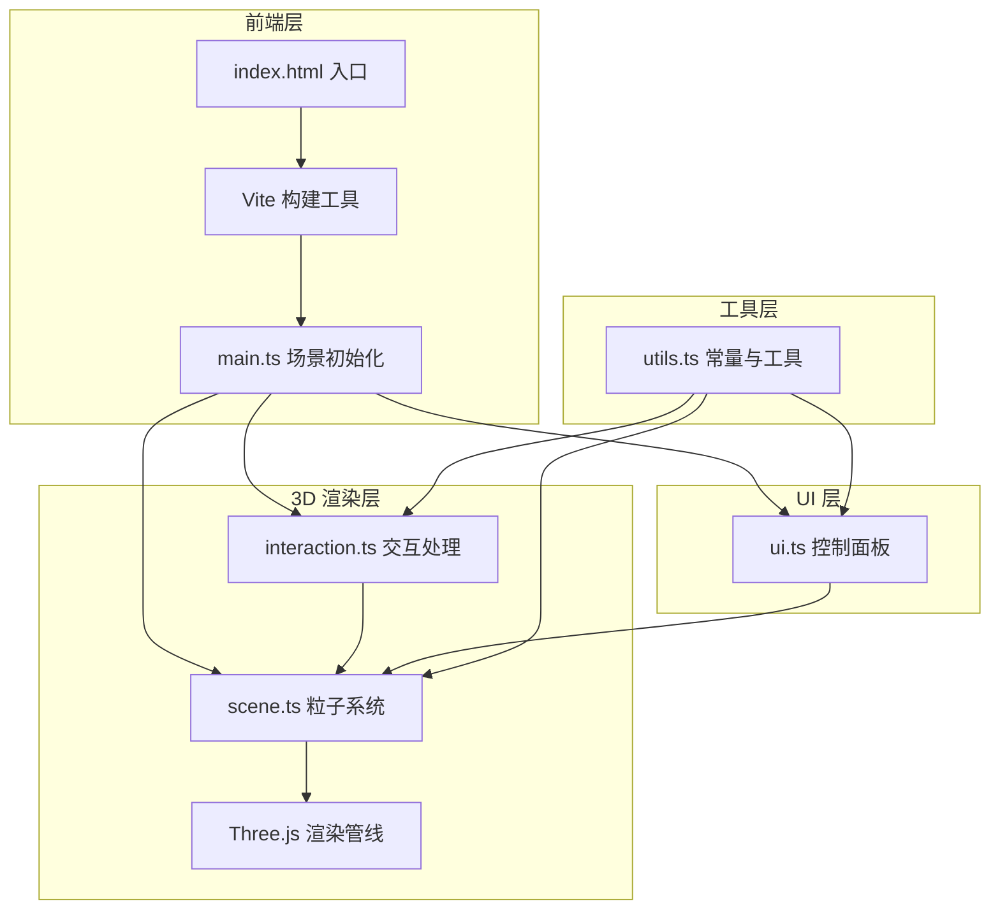

## 1. 架构设计



## 2. 技术说明

- **前端框架**：TypeScript + Three.js（纯原生，非 React），Vite 构建
- **初始化工具**：Vite
- **3D 引擎**：Three.js + 自定义 GLSL 着色器
- **后处理**：three/examples/jsm/postprocessing（UnrealBloomPass）
- **交互控制**：OrbitControls + Raycaster
- **后端**：无
- **数据库**：无

## 3. 路由定义

| 路由 | 用途 |
|------|------|
| / | 唯一页面，全屏 3D 粒子交互体验 |

## 4. 文件结构

```
├── index.html                  # 入口 HTML
├── package.json                # 项目依赖和脚本
├── tsconfig.json               # TypeScript 配置
├── vite.config.js              # Vite 构建配置
└── src/
    ├── main.ts                 # 入口：初始化场景、相机、渲染器、后处理、动画循环
    ├── scene.ts                # 粒子系统（InstancedMesh）、波浪动画、光网（LineSegments）、涟漪管理
    ├── interaction.ts          # 鼠标交互：OrbitControls 旋转缩放、Raycaster 点击涟漪
    ├── ui.ts                   # 毛玻璃控制面板 UI 组件
    └── utils.ts                # 工具函数、常量定义、颜色主题
```

## 5. 核心模块设计

### 5.1 main.ts — 入口初始化

- 创建 `Scene`、`PerspectiveCamera`、`WebGLRenderer`
- 配置 `EffectComposer` + `RenderPass` + `UnrealBloomPass` 后处理
- 初始化 `OrbitControls`
- 调用 `scene.ts` 创建粒子系统和光网
- 调用 `interaction.ts` 绑定交互事件
- 调用 `ui.ts` 创建控制面板
- 启动 `requestAnimationFrame` 动画循环

### 5.2 scene.ts — 粒子系统与动画

- **ParticleSystem 类**：使用 `InstancedMesh` 渲染六边形粒子
  - 自定义 `ShaderMaterial`：顶点着色器实现波浪起伏，片元着色器实现六边形形状和自发光
  - 每帧更新 `instanceMatrix` 和 `instanceColor` 属性
  - 涟漪效果通过 uniform 数组传递到着色器，影响粒子位移和颜色
- **LightNet 类**：使用 `LineSegments` + `LineBasicMaterial` 渲染粒子间连接线
  - 每帧计算距离阈值内的粒子对，更新几何体
  - 透明度随距离衰减
- **颜色主题**：4 种预设配色方案，通过 uniform 切换

### 5.3 interaction.ts — 交互处理

- **OrbitControls**：鼠标拖拽旋转、滚轮缩放，启用阻尼平滑
- **Raycaster**：点击检测水面位置
  - 水面为不可见平面 `Mesh`，用于射线检测
  - 点击时向 `scene.ts` 发送涟漪事件（位置 + 时间）
- **触控支持**：touch 事件映射到旋转/缩放/点击

### 5.4 ui.ts — 控制面板

- 纯 DOM 创建，CSS 毛玻璃效果
- 粒子数量滑块：实时调用 `scene.ts` 重建粒子系统
- 波浪幅度滑块：更新着色器 uniform
- 颜色主题选择器：切换 4 种颜色预设
- 重置视角按钮：重置相机位置和 OrbitControls

### 5.5 utils.ts — 工具函数

- 颜色主题定义（幻彩、极光、熔岩、深海）
- 常量：最大粒子数、波浪参数、涟漪参数
- 数学工具函数：lerp、clamp 等

## 6. 着色器设计

### 6.1 粒子顶点着色器

```glsl
// 输入：粒子基础位置（instanceMatrix）、时间、波浪幅度
// 处理：正弦波叠加计算 Y 轴偏移、涟漪位移
// 输出：变换后位置、颜色传递到片元着色器
```

### 6.2 粒子片元着色器

```glsl
// 输入：颜色、UV
// 处理：六边形 SDF 裁剪形状、中心发光衰减、涟漪颜色叠加
// 输出：发光六边形粒子颜色
```

## 7. 性能优化策略

- `InstancedMesh` 批量渲染粒子，单次 draw call
- 自定义着色器实现波浪和涟漪，避免逐粒子 JS 计算
- 光网使用 `BufferGeometry` + `LineSegments`，限制最大连线数
- 涟漪影响范围裁剪，远距离粒子不参与计算
- 移动端自动降低粒子默认数量
- `renderer.setPixelRatio` 限制最大 2，防止高 DPI 设备过载
