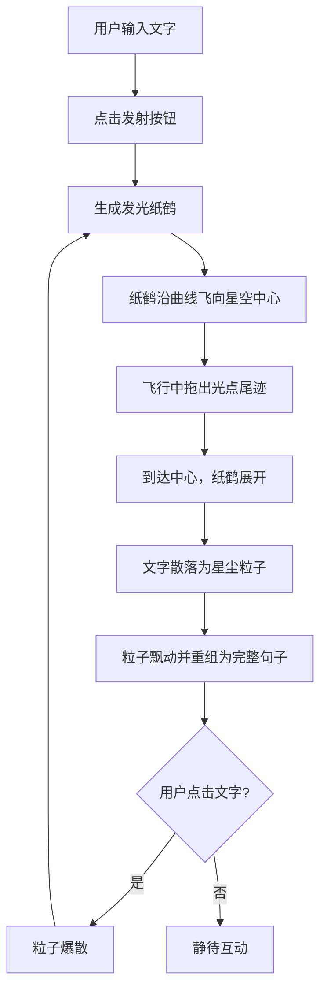

## 1. 产品概述

『星语信笺』是一款交互式Web应用，模拟在夜空中将文字折成发光纸鹤的浪漫体验。用户输入一句话后，纸鹤携带文字飞向星空，文字如星尘般飘散并重新组合成动态星辰诗篇。
- 目标用户：追求浪漫与治愈体验的年轻用户、创意写作爱好者
- 核心价值：将文字转化为视觉诗篇，创造沉浸式的星空书写体验

## 2. 核心功能

### 2.1 功能模块

1. **星空画布页面**：夜空背景、纸鹤飞行、文字星尘化、银河光晕

### 2.2 页面详情

| 页面名称 | 模块名称 | 功能描述 |
|----------|----------|----------|
| 星空画布 | 夜空背景 | 深蓝到紫黑渐变背景，散布静态闪烁星星，中央银河光晕 |
| 星空画布 | 发光纸鹤 | 半透明折线轮廓带微光，从左下角沿曲线飞向星空中心，拖出光点尾迹 |
| 星空画布 | 文字星尘 | 纸鹤展开后文字散落为发光粒子，随机飘动并缓慢重组回完整句子，暖金到冷白渐变 |
| 星空画布 | 点击交互 | 点击已重组文字，粒子再次爆散，重新飞行和重组，支持多次循环 |
| 星空画布 | 控制面板 | 毛玻璃面板含文字输入框、发射按钮、纸鹤尺寸滑块、粒子数量滑块 |

## 3. 核心流程

用户输入文字 → 点击「发射」→ 纸鹤从左下角生成并起飞 → 沿贝塞尔曲线飞向星空中心（拖出光点尾迹）→ 到达中心后纸鹤自动展开 → 文字散落为发光星尘粒子 → 粒子随机飘动后缓慢重组回完整句子 → 用户点击文字 → 粒子爆散 → 纸鹤重新生成 → 再次飞行与重组（循环）

## 4. 用户界面设计

### 4.1 设计风格

- 主色调：深蓝(#0a0e27) → 紫黑(#1a0a2e) 渐变
- 强调色：暖金(#ffd700) ↔ 冷白(#e8f4ff) 渐变用于文字发光
- 按钮风格：圆角胶囊型，光晕悬浮效果
- 字体：输入框使用细等宽字体（Courier New），星尘文字使用优雅衬线体
- 布局风格：全屏Canvas沉浸式，左下角浮动控制面板
- 图标风格：极简线条图标

### 4.2 页面设计概览

| 页面名称 | 模块名称 | UI元素 |
|----------|----------|--------|
| 星空画布 | 夜空背景 | 全屏Canvas，渐变背景，200+闪烁星星，中央椭圆银河光晕 |
| 星空画布 | 纸鹤 | 半透明折线轮廓(#ffd700, opacity 0.6)，内部微光填充，尺寸可调 |
| 星空画布 | 控制面板 | 毛玻璃背景(backdrop-filter: blur)，圆角16px，内边距20px，输入框+按钮+滑块 |

### 4.3 响应式

- 桌面优先设计，Canvas自适应窗口大小
- 移动端：控制面板缩小并贴底，触摸交互适配
- 触摸优化：触摸区域最小44px，滑动代替hover

### 4.4 性能目标

- 帧率：稳定60fps
- 粒子数量：50-200可调
- Canvas优化：离屏渲染星星背景，requestAnimationFrame驱动动画循环
