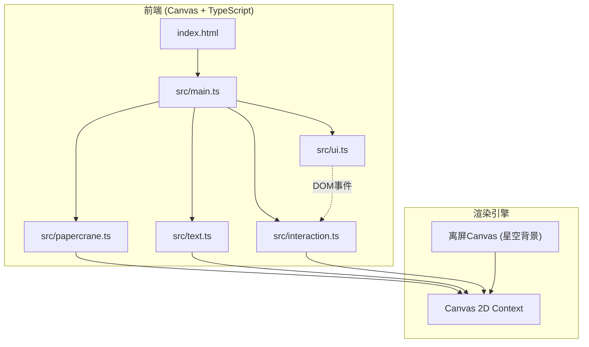

## 1. 架构设计



## 2. 技术说明

- 前端：TypeScript + Canvas API + Vite
- 初始化工具：Vite (vanilla-ts template)
- 后端：无
- 数据库：无

### 技术选型理由

| 技术 | 用途 | 理由 |
|------|------|------|
| TypeScript | 主语言 | 类型安全，提升代码质量 |
| Canvas 2D API | 渲染引擎 | 高性能粒子系统，精确控制绘制 |
| Vite | 构建工具 | 快速HMR，零配置TypeScript支持 |
| 离屏Canvas | 星空背景缓存 | 静态星星只需渲染一次，提升性能 |

## 3. 模块职责

| 模块文件 | 职责 |
|----------|------|
| src/main.ts | 入口初始化，Canvas创建，主渲染循环(requestAnimationFrame)，模块协调 |
| src/papercrane.ts | 纸鹤几何绘制（折线轮廓），折叠/展开动画状态机，贝塞尔曲线飞行轨迹，光点尾迹系统 |
| src/text.ts | 文字→星尘粒子转换，粒子飘散算法（布朗运动），粒子重组算法（弹性归位），颜色渐变系统 |
| src/interaction.ts | 鼠标/触摸点击检测，点击爆散触发，纸鹤重飞循环控制 |
| src/ui.ts | 毛玻璃控制面板DOM构建，输入框/按钮/滑块事件绑定，控件状态管理 |

## 4. 核心数据结构

```typescript
interface Particle {
  x: number;
  y: number;
  targetX: number;
  targetY: number;
  originX: number;
  originY: number;
  vx: number;
  vy: number;
  char: string;
  color: string;
  alpha: number;
  size: number;
  life: number;
}

interface PaperCrane {
  x: number;
  y: number;
  scale: number;
  rotation: number;
  foldProgress: number;
  trail: TrailPoint[];
  state: 'folding' | 'flying' | 'unfolding' | 'done';
  path: BezierCurve;
}

interface TrailPoint {
  x: number;
  y: number;
  alpha: number;
  size: number;
}

interface Star {
  x: number;
  y: number;
  size: number;
  twinkleSpeed: number;
  twinkleOffset: number;
  brightness: number;
}

interface AppState {
  craneSize: number;
  particleCount: number;
  isFlying: boolean;
  particles: Particle[];
  crane: PaperCrane | null;
  stars: Star[];
  inputText: string;
}
```

## 5. 动画系统设计

### 5.1 主渲染循环

```
每帧执行:
1. 清空Canvas
2. 绘制离屏星空背景（含闪烁）
3. 如果纸鹤存在且正在飞行：更新纸鹤位置 + 绘制尾迹 + 绘制纸鹤
4. 如果纸鹤展开中：更新折叠进度
5. 更新所有粒子位置（飘散/归位）
6. 绘制所有粒子
7. 绘制银河光晕
8. requestAnimationFrame(下一帧)
```

### 5.2 纸鹤飞行轨迹

- 使用三次贝塞尔曲线：起点(左下角) → 控制点1(中部偏左) → 控制点2(中部偏右) → 终点(星空中心)
- 飞行时间约2秒，使用easeInOutCubic缓动函数
- 飞行时纸鹤沿轨迹切线方向旋转

### 5.3 粒子系统

- 文字拆分为单字，每个字生成 (particleCount / textLength) 个粒子
- 飘散阶段：布朗运动 + 随机速度衰减
- 重组阶段：弹性归位，每个粒子向目标字符位置移动，使用弹簧阻尼模型
- 颜色：暖金(#ffd700) → 冷白(#e8f4ff) 线性渐变，基于粒子生命周期

## 6. 文件结构

```
auto456/
├── index.html
├── package.json
├── tsconfig.json
├── vite.config.ts
└── src/
    ├── main.ts
    ├── papercrane.ts
    ├── text.ts
    ├── interaction.ts
    └── ui.ts
```
