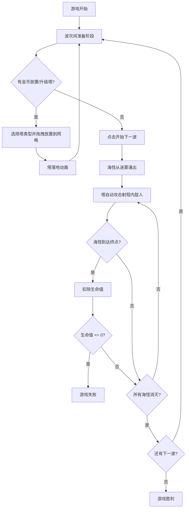

## 1. 产品概述

「晨曦灯塔」是一款2D海洋风格塔防游戏，玩家在海上孤岛的网格上布置防御塔，抵御从迷雾中涌出的一波波暗影海怪。游戏融合策略布局与即时战斗，以航海主题视觉和流畅动画为核心卖点。

- 目标用户：喜欢策略塔防的休闲及中硬核玩家
- 核心价值：简洁上手、深度策略、沉浸式海洋视觉体验

## 2. 核心功能

### 2.1 用户角色

无多角色区分，单人游戏体验。

### 2.2 功能模块

1. **游戏战场页面**：海岛地图、网格放置塔、海怪路径、战斗动画
2. **UI 覆盖层**：资源面板、塔选择面板、波次提示、暂停按钮

### 2.3 页面详情

| 页面名称 | 模块名称 | 功能描述 |
|----------|----------|----------|
| 游戏战场 | 海岛地图 | 绘制海洋背景、孤岛地形、迷雾效果、路径标记 |
| 游戏战场 | 网格系统 | 淡蓝色网格线显示可放置区域，放置时高亮可用格子 |
| 游戏战场 | 防御塔渲染 | 三种塔的静态外观和攻击动画（箭矢流光、爆炸波纹、旋转符文） |
| 游戏战场 | 海怪渲染 | 三类海怪的移动、受击闪烁抖动、死亡粒子消散 |
| 游戏战场 | 波次管理 | 迷雾涌出动画提示新波次，波次间倒计时 |
| UI 覆盖层 | 资源面板 | 顶部显示金币、生命值、当前波次 |
| UI 覆盖层 | 塔选择面板 | 底部三座塔卡片，显示名称、费用、简介；拖拽到格子放置 |
| UI 覆盖层 | 波次提示 | 屏幕中央大字提示"第 N 波来袭"并渐隐 |
| UI 覆盖层 | 暂停按钮 | 右上角暂停图标，点击或按 P 键暂停 |
| UI 覆盖层 | 升级面板 | 点击已放置的塔弹出半透明提示框，显示升级后数据 |

## 3. 核心流程

玩家进入游戏后，在网格上选择并放置防御塔。每波海怪从地图入口沿预设路径行进，防御塔自动攻击射程内的敌人。玩家通过击杀海怪获得金币，用于放置新塔或升级已有塔。若海怪到达终点则扣除生命值，生命值归零则游戏失败；所有波次清空则胜利。

## 4. 用户界面设计

### 4.1 设计风格

- **主色调**：海洋蓝 `#1A5276` 为背景主色，浅色木纹 `#D4B896` 为 UI 基底
- **点缀色**：暖黄 `#F4D03F` 用于高亮、金币、波次提示
- **按钮风格**：圆角木质按钮，hover 时微微上浮发光
- **字体**：标题使用 Pirata One（航海手写风），正文使用 Noto Sans SC
- **布局**：全屏 Canvas 游戏画面，顶部半透明资源条，底部塔选择面板
- **图标**：航海风格图标（船锚、灯塔、金币图标）

### 4.2 页面设计概览

| 页面名称 | 模块名称 | UI 元素 |
|----------|----------|---------|
| 游戏战场 | 海岛地图 | 浅色木纹底 + 海洋蓝水域，暗色迷雾在路径入口处，淡蓝色网格线覆盖可放置区 |
| 游戏战场 | 防御塔 | 箭塔（尖顶木塔）、炮塔（矮胖石炮）、魔法塔（发光水晶），攻击时光效动画 |
| 游戏战场 | 海怪 | 普通海怪（暗色水母形）、精英海怪（带护甲的甲壳类）、Boss（巨型海兽） |
| UI 覆盖层 | 资源面板 | 半透明深色条，左金币图标+数字，中波次文字，右心形图标+生命值 |
| UI 覆盖层 | 塔选择面板 | 底部3张木质卡片，显示塔图标+名称+费用，长按可拖拽 |
| UI 覆盖层 | 升级面板 | 半透明弹窗，居中显示当前等级→新等级数据，确认/取消按钮 |

### 4.3 响应式适配

- 桌面端：鼠标拖拽放置塔，点击选中/升级
- 移动端：触屏拖拽放置，长按格子弹出操作菜单（升级/出售），Canvas 自适应屏幕宽度
- 布局优先桌面端设计，移动端缩放适配

### 4.4 交互反馈设计

| 交互场景 | 反馈效果 |
|----------|----------|
| 拖拽塔到格子 | 塔半透明跟随鼠标/手指 |
| 释放放置 | 塔落地带下坠弹跳动画 |
| 升级塔 | 塔身发光扩散，弹出半透明数据面板 |
| 箭塔攻击 | 射出流光箭矢 |
| 炮塔攻击 | 炮弹飞行后爆炸产生圆形波纹 |
| 魔法塔攻击 | 释放旋转符文并减速光环 |
| 海怪被击中 | 短暂白色闪烁 + 抖动 |
| 海怪死亡 | 碎成若干粒子消散 |
| 暂停 | 半透明覆盖层 + 暂停图标 |
| 波次来袭 | 中央大字"第 N 波"渐入渐出 |
