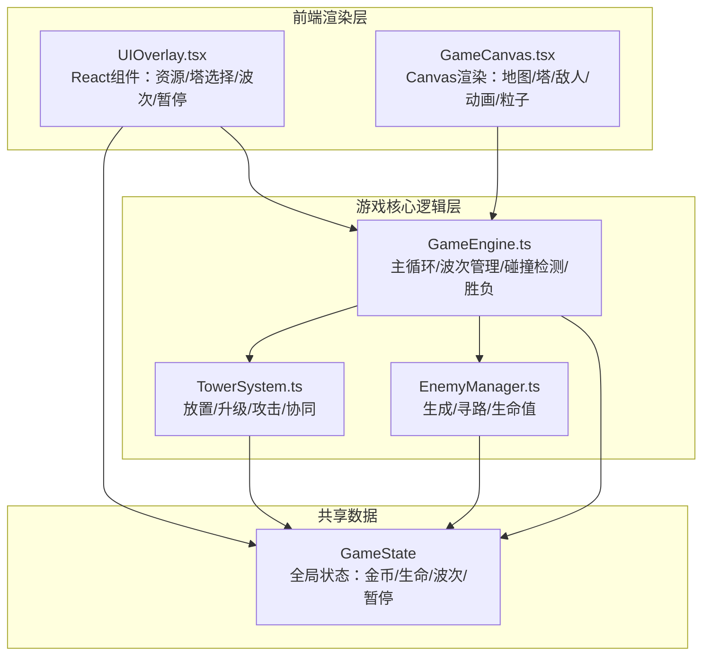

## 1. 架构设计



## 2. 技术说明

- **前端框架**：React 18 + TypeScript + Vite
- **状态管理**：Zustand（管理游戏全局状态，供 React UI 响应式更新）
- **渲染引擎**：HTML5 Canvas 2D（主循环使用 requestAnimationFrame）
- **样式方案**：Tailwind CSS（UI 覆盖层样式）
- **项目初始化**：vite-init react-ts 模板
- **后端**：无（纯前端单机游戏）
- **数据库**：无

## 3. 路由定义

| 路由 | 用途 |
|------|------|
| / | 游戏主页面（唯一的页面，包含 Canvas 和 UI 覆盖层） |

## 4. 数据模型

### 4.1 核心类型定义

```typescript
interface Tower {
  id: string;
  type: 'arrow' | 'cannon' | 'magic';
  gridX: number;
  gridY: number;
  level: number;
  attackCooldown: number;
  lastAttackTime: number;
  target: Enemy | null;
}

interface Enemy {
  id: string;
  type: 'normal' | 'elite' | 'boss';
  hp: number;
  maxHp: number;
  speed: number;
  armor: number;
  pathIndex: number;
  position: { x: number; y: number };
  slowTimer: number;
  flashTimer: number;
  shakeTimer: number;
}

interface Wave {
  enemies: { type: EnemyType; count: number; interval: number }[];
  spawnTimer: number;
  spawnedCount: number;
}

interface Particle {
  x: number;
  y: number;
  vx: number;
  vy: number;
  life: number;
  maxLife: number;
  color: string;
  size: number;
}

interface GameState {
  gold: number;
  lives: number;
  currentWave: number;
  maxWaves: number;
  isPaused: boolean;
  isGameOver: boolean;
  isVictory: boolean;
  towers: Tower[];
  enemies: Enemy[];
  particles: Particle[];
  waveInProgress: boolean;
  selectedTowerType: TowerType | null;
  selectedPlacedTower: Tower | null;
}
```

### 4.2 防御塔属性表

| 属性 | 箭塔 Lv1 | 箭塔 Lv2 | 箭塔 Lv3 | 炮塔 Lv1 | 炮塔 Lv2 | 炮塔 Lv3 | 魔法塔 Lv1 | 魔法塔 Lv2 | 魔法塔 Lv3 |
|------|----------|----------|----------|----------|----------|----------|------------|------------|------------|
| 费用 | 50 | 80 | 120 | 100 | 150 | 200 | 75 | 120 | 180 |
| 射程 | 150 | 170 | 200 | 120 | 140 | 160 | 180 | 200 | 230 |
| 伤害 | 15 | 25 | 40 | 40 | 70 | 110 | 10 | 18 | 30 |
| 攻击间隔(ms) | 800 | 700 | 500 | 1500 | 1300 | 1000 | 1200 | 1000 | 800 |
| 溅射半径 | - | - | - | 60 | 75 | 90 | - | - | - |
| 减速比例 | - | - | - | - | - | - | 30% | 40% | 50% |
| 减速时长(ms) | - | - | - | - | - | - | 2000 | 2500 | 3000 |

### 4.3 海怪属性表

| 属性 | 普通 | 精英 | Boss |
|------|------|------|------|
| 生命值 | 60 | 200 | 800 |
| 速度 | 1.2 | 0.9 | 0.6 |
| 护甲 | 0 | 5 | 10 |
| 免疫减速 | 否 | 否 | 是 |
| 召唤小怪 | 否 | 否 | 每10秒召唤2只普通 |
| 击杀金币 | 10 | 30 | 100 |

## 5. 文件结构

```
src/
  GameEngine.ts        — 主循环、波次管理、碰撞检测、胜负判定
  TowerSystem.ts       — 防御塔放置、升级、攻击逻辑、协同效果
  EnemyManager.ts      — 海怪生成、路径寻路、生命值、状态效果
  Renderer.ts          — Canvas 渲染：地图、塔、敌人、动画、粒子
  ParticleSystem.ts    — 粒子系统：死亡粒子、攻击特效
  types.ts             — TypeScript 类型定义和常量
  store.ts             — Zustand 状态管理
  UIOverlay.tsx        — React UI 覆盖层
  GameCanvas.tsx       — Canvas 容器组件
  App.tsx              — 根组件
  main.tsx             — 入口
  index.css            — Tailwind + 自定义样式
```

## 6. 性能策略

- 主循环使用 `requestAnimationFrame`，目标 60fps
- 粒子池上限 200 个，超出时回收最老粒子
- Canvas 仅重绘脏区域（视实现复杂度可降级为全量重绘）
- 塔攻击动画和粒子使用简单几何图形，不使用图片精灵
- 海怪寻路使用预计算路径点数组，无需实时寻路
- 状态更新与渲染分离：逻辑按固定时间步长更新，渲染跟随帧率
