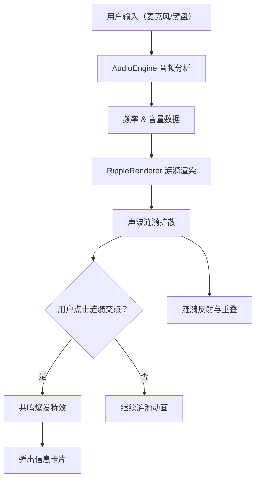

## 1. 产品概述

「空谷回音」是一款基于 Web 的 3D 交互可视化项目，模拟山谷中的回声涟漪效应。用户通过麦克风说话或敲击键盘，声音信号被实时转化为从山谷中心向外扩散的彩色声波涟漪，涟漪相互交织形成动态声场图案。整体呈现超现实空灵风格，为用户带来沉浸式的视听交互体验。

- 目标用户：音频可视化爱好者、交互艺术体验者、创意开发者
- 核心价值：将不可见的声音转化为可见的、可交互的 3D 视觉艺术

## 2. 核心功能

### 2.1 功能模块

1. **3D 山谷场景**：低多边形山体地形、深蓝到青灰渐变天空、飘动雾气、闪烁星光粒子
2. **音频输入与涟漪生成**：麦克风实时采集 + 键盘敲击触发，声音转化为向外扩散的半透明彩色声波涟漪
3. **涟漪交互**：鼠标拖拽旋转 360° 视角、滚轮缩放、点击涟漪交点触发「共鸣爆发」
4. **信息展示**：毛玻璃信息卡片显示频率、强度和反射次数；频率仪表盘和强度条

### 2.2 页面详情

| 页面名称 | 模块名称 | 功能描述 |
|----------|----------|----------|
| 主场景 | 山谷地形 | 低多边形网格山体，渐变色材质，缓慢旋转动画 |
| 主场景 | 天空与氛围 | 深蓝到青灰渐变天空、飘动雾气粒子、闪烁星光粒子 |
| 主场景 | 声波涟漪 | 从中心向外扩散的半透明发光环状粒子，颜色随频率变化（高频蓝紫、低频红橙），带呼吸光晕 |
| 主场景 | 共鸣爆发 | 点击涟漪交点触发彩色冲击波放射，周围涟漪扭曲并产生波纹 |
| 叠加层 | 频率仪表盘 | 实时显示当前音频频率分布 |
| 叠加层 | 强度条 | 显示当前音量强度 |
| 叠加层 | 信息卡片 | 半透明毛玻璃卡片，显示频率、强度、反射次数 |

## 3. 核心流程

1. 用户进入页面，3D 山谷场景加载完成
2. 用户授权麦克风权限，开始采集音频
3. 用户说话或敲击键盘 → AudioEngine 分析频率和音量 → 生成涟漪数据
4. RippleRenderer 根据涟漪数据在山谷中渲染扩散的彩色声波涟漪
5. 涟漪在山体上反射、重叠，形成动态声场图案
6. 用户拖拽旋转视角、缩放观察涟漪效果
7. 用户点击涟漪交点 → 触发共鸣爆发 → 弹出信息卡片

## 4. 用户界面设计

### 4.1 设计风格

- **主色调**：深蓝（#0a0e27）到青灰（#2d3a4a）渐变
- **涟漪色**：高频蓝紫（#6366f1 → #a855f7）、低频红橙（#ef4444 → #f97316），随频率循环渐变
- **文字风格**：半透明白色文字，毛玻璃效果背景
- **布局**：全屏 3D 场景 + 浮动叠加层 UI
- **动画**：涟漪呼吸光晕、共鸣爆发冲击波、雾气飘动、星光闪烁

### 4.2 页面设计概览

| 页面名称 | 模块名称 | UI 元素 |
|----------|----------|---------|
| 主场景 | 山谷地形 | 低多边形网格，渐变色材质（深蓝→青色），缓慢旋转 |
| 主场景 | 天空 | 深蓝到青灰渐变，粒子星光（白色闪烁点） |
| 主场景 | 雾气 | 半透明白灰色粒子，缓慢水平飘动 |
| 主场景 | 涟漪 | 半透明发光环状粒子，颜色渐变，呼吸光晕动画 |
| 叠加层 | 频率仪表盘 | 左下角，弧形仪表盘，颜色随频率变化 |
| 叠加层 | 强度条 | 左下角仪表盘旁，竖向渐变条，高度随音量变化 |
| 叠加层 | 信息卡片 | 点击触发，毛玻璃效果卡片，显示频率/强度/反射次数 |

### 4.3 响应式

- 桌面优先设计，全屏 3D 场景
- 移动端适配触控操作（单指拖拽旋转、双指缩放、点击触发共鸣）

### 4.4 3D 场景指导

- **环境/氛围**：超现实空灵风格，深蓝到青灰渐变天空，低饱和度冷色调
- **光照设置**：柔和环境光 + 月光方向光，低强度，营造幽暗神秘氛围
- **摄像机**：透视相机，初始俯视 45° 角度，OrbitControls 支持拖拽旋转和缩放
- **构图与焦点**：山谷中心为涟漪扩散原点，山体环绕形成自然画框
- **交互与动画**：涟漪扩散动画、共鸣爆发冲击波、山体缓慢旋转、雾气飘动、星光闪烁
- **后处理效果**：发光（Bloom）效果增强涟漪光晕，可选景深效果
- **性能预算**：目标 60fps，粒子数量控制在合理范围内（涟漪粒子 < 5000，星光 < 2000，雾气 < 1000）
