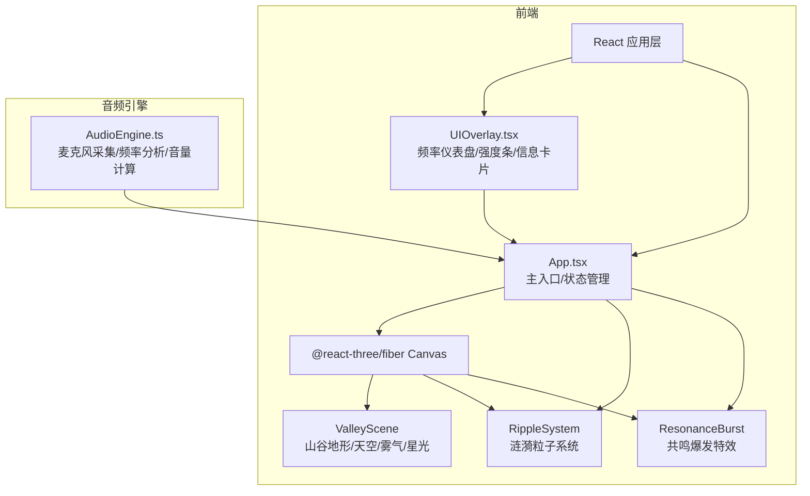

## 1. 架构设计



## 2. 技术说明

- **前端框架**：React 18 + TypeScript
- **3D 渲染**：Three.js + @react-three/fiber + @react-three/drei + @react-three/postprocessing
- **构建工具**：Vite
- **样式方案**：Tailwind CSS（用于 UI 叠加层）
- **状态管理**：Zustand（管理涟漪数据、音频状态、共鸣爆发事件）
- **后端**：无（纯前端项目）

## 3. 路由定义

| 路由 | 用途 |
|------|------|
| / | 主场景页面，包含 3D 山谷和所有交互 |

## 4. 数据流设计

### 4.1 核心数据结构

```typescript
interface RippleData {
  id: string;
  origin: [number, number, number];
  startTime: number;
  frequency: number;
  amplitude: number;
  color: [number, number, number];
  reflections: number;
  maxRadius: number;
}

interface ResonanceBurst {
  id: string;
  position: [number, number, number];
  startTime: number;
  frequency: number;
  intensity: number;
  reflections: number;
}

interface AudioState {
  isActive: boolean;
  frequency: number;
  volume: number;
  frequencySpectrum: Float32Array;
}
```

### 4.2 数据流

1. **AudioEngine** 通过 Web Audio API 的 AnalyserNode 实时分析麦克风输入
2. 当检测到音量超过阈值或键盘事件触发时，生成 RippleData
3. RippleData 通过 Zustand store 传递给 RippleSystem
4. RippleSystem 在 Three.js 场景中创建涟漪粒子
5. 用户点击涟漪交点时，生成 ResonanceBurst 事件
6. UIOverlay 从 store 读取数据更新仪表盘和信息卡片

## 5. 模块职责

### 5.1 AudioEngine.ts

- 请求麦克风权限，创建 AudioContext
- 使用 AnalyserNode 进行 FFT 频率分析
- 计算主频率和音量（RMS）
- 键盘事件监听，将敲击映射为脉冲信号
- 提供 `start()` / `stop()` / `getFrequencyData()` / `getVolume()` 方法

### 5.2 RippleRenderer（由多个 3D 组件组成）

- **ValleyScene**：低多边形山体地形（PlaneGeometry + 顶点位移），渐变色材质
- **RippleSystem**：环状粒子系统，从中心向外扩散，颜色随频率变化，带呼吸光晕
- **ResonanceBurst**：冲击波特效，点击触发时急速放射彩色粒子
- **Atmosphere**：雾气粒子（半透明白色，水平飘动）+ 星光粒子（白色闪烁点）
- **SkyDome**：深蓝到青灰渐变天空球

### 5.3 UIOverlay.tsx

- **FrequencyGauge**：弧形频率仪表盘组件
- **IntensityBar**：竖向音量强度条组件
- **ResonanceCard**：毛玻璃信息卡片，显示频率/强度/反射次数

## 6. 性能优化策略

- 涟漪粒子使用 InstancedMesh 批量渲染，减少 draw call
- 共鸣爆发粒子使用对象池复用
- AudioEngine 使用 requestAnimationFrame 同步分析，避免过度计算
- 涟漪超出最大半径后自动回收
- Bloom 后处理使用较低的分辨率倍率
- 山体地形使用 BufferGeometry，低多边形面数控制在 500 以内
