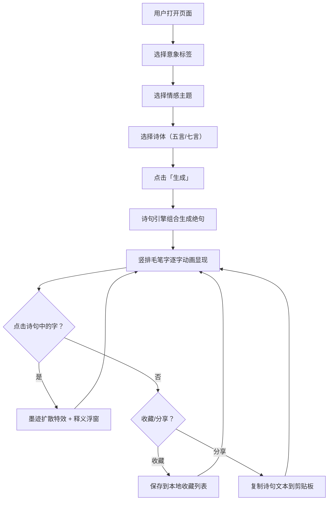

## 1. 产品概述

「风吟诗签」是一款交互式古诗生成器，用户通过选择意象词与情感主题，系统基于规则库自动组合生成五言或七言绝句。界面采用古风水墨美学，配合桃花粒子飘落动画与毛笔字逐字显现效果，打造沉浸式诗词体验。

- 目标用户：古诗词爱好者、文学创作者、文化体验用户
- 核心价值：以交互式、视觉化的方式让用户零门槛创作古风诗句，体验传统诗词之美

## 2. 核心功能

### 2.1 用户角色

无角色区分，所有用户拥有相同权限。

### 2.2 功能模块

1. **主界面**：诗句展示区（左侧）+ 控制面板（右侧）+ 底部操作栏
2. **诗句生成引擎**：意象词库 + 情感规则库 + 诗句组合逻辑

### 2.3 页面详情

| 页面名称 | 模块名称 | 功能描述 |
|----------|----------|----------|
| 主界面 | 诗句展示区 | 竖排毛笔字逐字动画显示生成的四句绝句，点击任意字触发墨迹扩散特效并展示释义浮窗 |
| 主界面 | 控制面板 | 意象筛选标签（月、山、花、水、风、雪等）、情感下拉菜单（离别、思念、归乡、隐逸等）、诗体切换（五言/七言）、「生成」按钮 |
| 主界面 | 底部操作栏 | 「收藏」按钮（保存到本地列表）、「分享」按钮（复制诗句文本到剪贴板） |
| 主界面 | 水墨动态背景 | 全屏Canvas渲染水墨晕染背景动画 + 桃花粒子飘落动画 |

## 3. 核心流程

用户打开页面 → 从控制面板选择意象标签和情感主题 → 点击「生成」→ 诗句引擎根据词库和规则组合生成四句绝句 → 诗句在左侧展示区以竖排毛笔字逐字动画显现 → 用户可点击任意字查看释义 → 点击收藏或分享

## 4. 用户界面设计

### 4.1 设计风格

- 主色调：浅青灰（#B8C5C9）+ 墨色（#2C2C2C）+ 宣纸色（#F5F0E8）
- 辅助色：桃粉（#E8B4B8）用于粒子和高亮，墨青（#4A6670）用于标题和按钮
- 按钮风格：圆角矩形，毛玻璃质感（backdrop-filter: blur），缓动悬停效果（cubic-bezier过渡）
- 字体：诗词使用书法风格字体（Ma Shan Zheng 或 ZCOOL XiaoWei），UI文字使用 Noto Serif SC
- 布局风格：左右双栏布局，左侧诗句展示区占 60%，右侧控制面板占 40%
- 粒子动画：桃花花瓣以贝塞尔曲线路径缓慢飘落，半透明水墨晕染在背景中缓缓流动
- 毛玻璃效果：卡片和面板使用 `backdrop-filter: blur(12px)` + 半透明背景

### 4.2 页面设计概览

| 页面名称 | 模块名称 | UI元素 |
|----------|----------|--------|
| 主界面 | 诗句展示区 | 竖排排版、毛笔字字体、逐字淡入动画、墨迹扩散Canvas特效、释义浮窗（毛玻璃卡片） |
| 主界面 | 控制面板 | 意象标签组（pill形状、可多选、带选中态）、情感下拉菜单、诗体切换Toggle、「生成」按钮（墨青色、悬停缩放） |
| 主界面 | 底部操作栏 | 「收藏」图标按钮、「分享」图标按钮，毛玻璃背景条 |
| 主界面 | 水墨动态背景 | 全屏Canvas、多层水墨晕染渐变、桃花粒子系统（贝塞尔曲线路径+旋转+透明度变化） |

### 4.3 响应式适配

- 桌面端（≥1024px）：左右双栏布局
- 平板端（768px-1023px）：上下布局，诗句展示区在上，控制面板在下
- 手机端（<768px）：单列全宽布局，控制面板可折叠/展开，触控优化（增大点击区域）

### 4.4 性能要求

- Canvas动画使用 requestAnimationFrame 保持60fps
- 粒子数量自适应屏幕尺寸（桌面约80个，平板约50个，手机约30个）
- 诗句逐字动画使用CSS transition + transform，不触发重排
