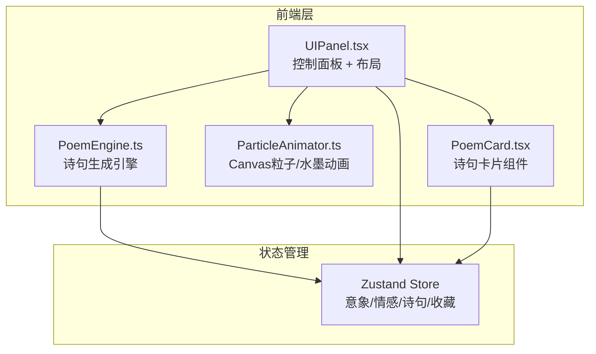

## 1. 架构设计



纯前端架构，无后端服务。所有诗句生成逻辑在客户端完成，收藏数据存储在 localStorage。

## 2. 技术说明

- 前端框架：React 18 + TypeScript（严格模式）
- 构建工具：Vite
- 样式方案：Tailwind CSS + 自定义CSS（毛玻璃、动画）
- 状态管理：Zustand
- 动画渲染：Canvas 2D（粒子系统 + 水墨背景）
- 字体：Google Fonts（Ma Shan Zheng / ZCOOL XiaoWei / Noto Serif SC）
- 图标：lucide-react
- 初始化工具：vite-init（react-ts 模板）

## 3. 路由定义

| 路由 | 用途 |
|------|------|
| / | 主界面（唯一页面，包含诗句展示、控制面板、底部操作栏） |

## 4. 文件结构

```
src/
  PoemEngine.ts        # 核心模块：意象词库、情感规则库、诗句生成逻辑
  ParticleAnimator.ts   # Canvas渲染：桃花粒子系统、水墨背景动画
  UIPanel.tsx          # React组件：控制面板、诗句展示区、底部操作栏
  PoemCard.tsx         # React组件：单句诗句毛玻璃卡片、墨迹特效、释义浮窗
  App.tsx              # 根组件：整合Canvas背景 + UIPanel
  main.tsx             # 入口文件
  index.css            # 全局样式、动画关键帧、字体引入
  store.ts             # Zustand状态管理
public/
  index.html           # 入口HTML
package.json
tsconfig.json
vite.config.ts
tailwind.config.js
postcss.config.js
```

## 5. 核心模块设计

### 5.1 PoemEngine.ts

- **意象词库**：按类别分组（天象：月/星/云/雨，地理：山/水/江/湖，植物：花/柳/松/竹，时令：春/秋/雪/霜）
- **情感规则库**：每种情感对应一组诗句模板（含平仄和韵脚约束），情感与意象的搭配规则
- **生成算法**：根据用户选择的意象+情感+诗体，从规则库中匹配模板，填充意象词，保证韵脚一致
- **释义库**：常见古诗词用字的释义数据

### 5.2 ParticleAnimator.ts

- **桃花粒子系统**：每个粒子包含位置、速度、旋转角度、透明度、大小、贝塞尔曲线路径参数
- **水墨背景**：多层径向渐变缓慢移动和变形，模拟水墨晕染效果
- **帧率控制**：使用 requestAnimationFrame，deltaTime 归一化保证不同设备一致
- **自适应**：根据屏幕尺寸调整粒子数量和画布分辨率

### 5.3 PoemCard.tsx

- **竖排文字**：CSS `writing-mode: vertical-rl` 实现竖排
- **逐字动画**：每个字独立span，通过CSS transition逐个显现（opacity + transform）
- **墨迹扩散**：点击字时在Canvas层叠加墨迹扩散动画（径向扩展的墨色圆）
- **释义浮窗**：绝对定位的毛玻璃卡片，显示点击字的释义

### 5.4 UIPanel.tsx

- **意象标签**：Pill形按钮组，支持多选，选中态有颜色变化和缩放效果
- **情感下拉**：自定义下拉菜单，带过渡动画
- **诗体切换**：Toggle组件，五言/七言
- **生成按钮**：墨青色主按钮，悬停缩放 + 点击涟漪效果
- **收藏/分享**：底部图标按钮，带操作反馈（toast提示）
