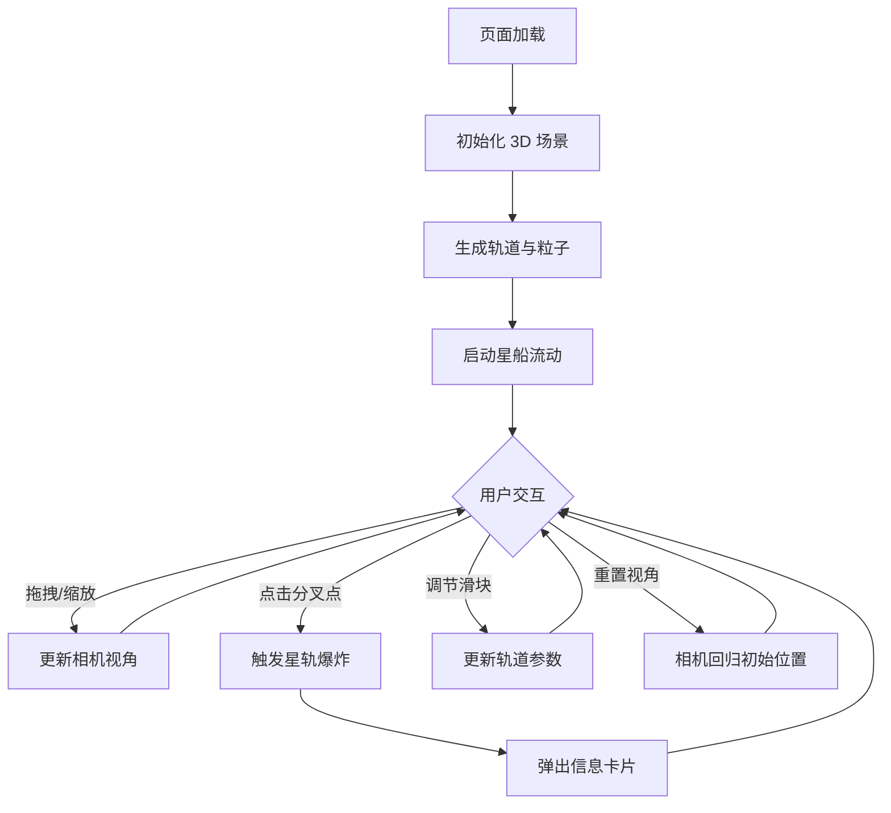

## 1. 产品概述

「星轨回廊」是一个基于 Three.js 的 3D 交互可视化项目，模拟宇宙中蜿蜒旋转的星际轨道。轨道由无数发光粒子构成，星船沿轨道流动并留下彩色尾迹。用户可拖拽旋转视角、滚轮缩放，点击轨道分叉点触发「星轨爆炸」特效并查看节点信息。

- 目标用户：3D 可视化爱好者、科幻艺术创作者、交互设计探索者
- 核心价值：沉浸式宇宙轨道可视化体验，展示粒子系统、路径计算与实时交互的综合能力

## 2. 核心功能

### 2.1 功能模块

1. **3D 星轨场景**：深空背景、发光粒子轨道、螺旋分叉结构
2. **星船流动系统**：星船沿轨道流动、彩色尾迹拖尾
3. **交互系统**：鼠标拖拽旋转、滚轮缩放、点击分叉点触发爆炸
4. **信息展示**：毛玻璃信息卡片显示节点坐标/曲率/流量
5. **参数控制**：轨道流速、粒子密度、尾迹长度滑块 + 重置视角按钮

### 2.2 页面详情

| 页面名称 | 模块名称 | 功能描述 |
|----------|----------|----------|
| 主场景 | 3D 星轨场景 | 渲染深空蓝-紫黑渐变背景、发光粒子轨道、螺旋分叉结构，粒子为半透明发光小球带脉冲光晕和缓动漂浮动画 |
| 主场景 | 星船流动系统 | 星船沿轨道不断流动，留下蓝紫粉渐变彩色尾迹，尾迹长度可调 |
| 主场景 | 交互系统 | 鼠标拖拽旋转 3D 视角，滚轮缩放，点击轨道分叉点触发「星轨爆炸」——该点急速膨胀并放射彩色流光射线，周围粒子被排开 |
| 主场景 | 信息卡片 | 点击分叉点后弹出半透明毛玻璃卡片，显示该节点坐标（x, y, z）、曲率值、流量值 |
| 主场景 | 控制面板 | 右侧半透明毛玻璃面板，含三个滑块（轨道流速、粒子密度、尾迹长度）和一个「重置视角」按钮 |

## 3. 核心流程

用户打开页面后，自动进入 3D 星轨场景。轨道粒子持续流动，星船沿轨道移动并留下尾迹。用户可自由旋转和缩放观察。当用户点击轨道上的分叉点时，触发爆炸动画并弹出信息卡片。用户可通过右侧面板调节参数。

## 4. 用户界面设计

### 4.1 设计风格

- **主色调**：深空蓝（#0a0e2a）到紫黑（#1a0a2e）渐变背景
- **强调色**：霓虹紫（#b44aff）、霓虹金（#ffd700）、霓虹粉（#ff44cc）
- **粒子色**：蓝（#4488ff）、紫（#8844ff）、粉（#ff44aa）之间循环脉冲
- **卡片风格**：半透明毛玻璃（backdrop-blur + rgba 白色/紫色底）
- **字体**：科幻风格无衬线体，标题用 Orbitron，正文用 Rajdhani
- **布局**：全屏 3D 场景 + 右侧浮动控制面板 + 点击弹出信息卡片

### 4.2 页面设计总览

| 页面名称 | 模块名称 | UI 元素 |
|----------|----------|---------|
| 主场景 | 3D 画布 | 全屏 canvas，深空蓝-紫黑渐变背景，粒子发光半透明小球带脉冲光晕 |
| 主场景 | 控制面板 | 右侧浮动，毛玻璃背景，标题 "星轨控制台"，三个自定义滑块，重置按钮 |
| 主场景 | 信息卡片 | 点击弹出，毛玻璃背景，显示坐标/曲率/流量数据，带关闭按钮 |
| 主场景 | 星轨爆炸特效 | 分叉点急速膨胀球体 + 放射彩色流光射线 + 粒子排开动画 |

### 4.3 响应式设计

- 桌面端优先：全屏 3D 场景体验
- 控制面板在小屏幕下可折叠
- 触屏设备支持触摸拖拽和双指缩放

### 4.4 3D 场景指导

- **环境**：深空星云氛围，无 HDRI，使用程序化背景渐变
- **光照**：微弱环境光 + 粒子自发光（emissive），无需额外光源
- **相机**：透视相机，初始距离适中，可 OrbitControls 旋转/缩放
- **构图**：轨道在空间中蜿蜒旋转形成 3D 螺旋结构，分叉点作为视觉焦点
- **交互**：OrbitControls 拖拽旋转/缩放，Raycaster 点击检测分叉点
- **动画**：粒子流动、星船移动、脉冲光晕、爆炸膨胀射线
- **后处理**：可选 UnrealBloomPass 增强发光效果
- **性能预算**：60fps 目标，粒子总数控制在 5000-10000，使用 BufferGeometry + Points 优化
