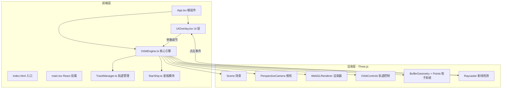

## 1. 架构设计



## 2. 技术说明

- **前端框架**：React 18 + TypeScript + Vite
- **3D 渲染**：Three.js（直接使用，非 @react-three/fiber，以便精细控制渲染循环）
- **状态管理**：Zustand（管理 UI 状态、参数值、选中节点信息）
- **样式方案**：Tailwind CSS + 自定义 CSS（毛玻璃效果、滑块样式）
- **初始化工具**：vite-init react-ts 模板
- **后端**：无

## 3. 路由定义

| 路由 | 用途 |
|------|------|
| / | 单页应用，3D 星轨场景 + UI 覆盖层 |

## 4. 文件结构

```
├── index.html                    # 入口 HTML
├── package.json                  # 依赖与脚本
├── vite.config.ts                # Vite 配置
├── tsconfig.json                 # TypeScript 配置
├── src/
│   ├── main.tsx                  # React 入口
│   ├── App.tsx                   # 根组件
│   ├── OrbitEngine.ts            # 核心模块：场景初始化、粒子系统、动画循环
│   ├── TrackManager.ts           # 轨道路径计算、分叉点、碰撞检测
│   ├── StarShip.ts               # 星船流动、尾迹效果、交互事件
│   ├── UIOverlay.tsx             # React 组件：控制面板 + 信息卡片
│   ├── store.ts                  # Zustand 状态管理
│   └── index.css                 # 全局样式
```

## 5. 模块职责

### 5.1 OrbitEngine.ts

- 初始化 Three.js 场景、相机、渲染器、OrbitControls
- 创建粒子系统（BufferGeometry + Points + ShaderMaterial）
- 管理动画循环（requestAnimationFrame）
- 处理窗口 resize
- 接收外部参数更新（流速、密度、尾迹长度）
- 集成 Raycaster 处理点击事件

### 5.2 TrackManager.ts

- 基于参数方程生成螺旋轨道路径（3D 空间曲线）
- 计算轨道分叉点位置和法线方向
- 提供路径采样接口（给定 t 返回位置）
- 管理多条分叉轨道的连接关系
- 碰撞检测辅助（射线与分叉点的距离判定）

### 5.3 StarShip.ts

- 管理星船对象沿轨道流动
- 实现尾迹效果（粒子尾迹或线条拖尾）
- 处理「星轨爆炸」动画（膨胀、射线、粒子排开）
- 颜色循环动画（蓝紫粉渐变）
- 脉冲光晕动画

### 5.4 UIOverlay.tsx

- 渲染右侧毛玻璃控制面板
  - 轨道流速滑块（0.1x - 3.0x）
  - 粒子密度滑块（1000 - 10000）
  - 尾迹长度滑块（0.2 - 2.0）
  - 重置视角按钮
- 渲染点击弹出的信息卡片
  - 节点坐标 (x, y, z)
  - 曲率值
  - 流量值
  - 关闭按钮
- 所有 UI 绝对定位覆盖在 3D canvas 上方

### 5.5 store.ts（Zustand）

```typescript
interface AppState {
  flowSpeed: number;
  particleDensity: number;
  trailLength: number;
  selectedNode: { x: number; y: number; z: number; curvature: number; flow: number } | null;
  setFlowSpeed: (v: number) => void;
  setParticleDensity: (v: number) => void;
  setTrailLength: (v: number) => void;
  setSelectedNode: (node: AppState['selectedNode']) => void;
}
```

## 6. 关键技术决策

### 6.1 粒子系统方案

使用 Three.js 原生 `BufferGeometry` + `Points` + 自定义 `ShaderMaterial`：
- 顶点着色器：控制粒子位置、大小、脉冲动画
- 片段着色器：圆形粒子 + 发光光晕效果（径向渐变透明度）
- 颜色属性在蓝紫粉间循环，通过 uniform 传递时间实现颜色脉冲

### 6.2 轨道生成方案

使用参数方程生成 3D 螺旋曲线：
- 主轨道：`x = R·cos(t), y = A·sin(2t), z = R·sin(t)`，其中 R 和 A 控制螺旋形状
- 分叉点：在特定 t 值处生成子轨道，方向偏转形成 Y 形分叉
- 路径用 CatmullRomCurve3 平滑处理

### 6.3 尾迹方案

每艘星船维护一个位置历史队列，用 `Line` 或 `Points` 渲染拖尾：
- 尾迹点颜色从亮到暗渐变
- 尾迹长度通过参数控制队列长度
- 使用 `BufferGeometry` 动态更新位置

### 6.4 爆炸特效方案

点击分叉点时：
1. 在该点创建一个快速膨胀的球体（SphereGeometry + 半透明材质）
2. 生成 6-12 条从该点向外放射的彩色流光射线（Line 几何体）
3. 周围粒子获得向外的速度偏移（排开效果）
4. 1.5 秒后动画结束，清理临时对象

### 6.5 性能优化

- 粒子使用 `BufferGeometry` + `Points` 而非独立 Mesh
- ShaderMaterial 实现 GPU 端动画，减少 CPU 到 GPU 数据传输
- OrbitControls 启用阻尼提升交互流畅感
- 窗口 resize 时更新相机和渲染器
- 合理使用 `dispose()` 释放资源
