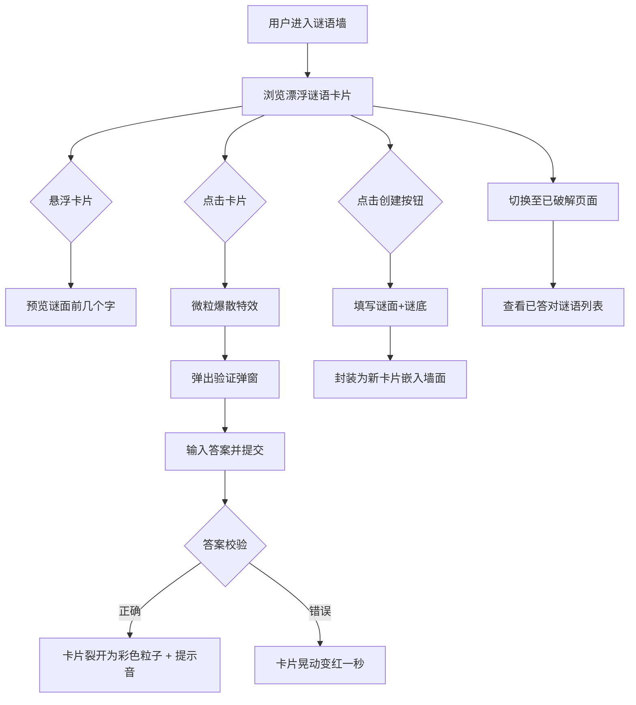

## 1. 产品概述

「谜语回廊」是一个匿名谜语交换平台，用户可创作谜面并封装为发光谜语卡嵌入动态谜语墙，其他用户可浏览、猜测答案，答对即破解。目标用户为喜欢谜语和互动游戏的休闲用户，核心价值在于沉浸式的视觉体验与匿名互动的趣味性。

## 2. 核心功能

### 2.1 用户角色

| 角色 | 注册方式 | 核心权限 |
|------|----------|----------|
| 匿名用户 | 无需注册 | 创建谜语、浏览谜语墙、提交答案、查看已破解列表 |

### 2.2 功能模块

1. **谜语墙页面**：动态旋转的谜语墙，卡片随机分布并缓慢漂浮，悬浮显示谜面预览，点击触发验证弹窗
2. **已破解页面**：网格列表展示所有答对的谜语，带半透明卡片和破解时间

### 2.3 页面详情

| 页面名称 | 模块名称 | 功能描述 |
|----------|----------|----------|
| 谜语墙页面 | 创建谜语按钮 | 底部浮动按钮，点击弹出毛玻璃表单提交谜面+谜底 |
| 谜语墙页面 | 谜语墙区域 | 3D旋转墙面上随机分布发光谜语卡片，带呼吸光晕和漂浮动画 |
| 谜语墙页面 | 谜语卡片 | 鼠标悬浮放大并显示谜面前几个字，点击触发微粒爆散特效 |
| 谜语墙页面 | 验证弹窗 | 毛玻璃卡片展示完整谜面、输入框、提交答案按钮 |
| 谜语墙页面 | 答案反馈 | 正确：卡片裂开为彩色粒子+提示音；错误：晃动变红一秒 |
| 已破解页面 | 破解列表 | 网格展示已答对谜语，半透明卡片样式，带破解时间 |
| 已破解页面 | 入场动画 | 卡片逐个淡入滑出，平滑入场效果 |

## 3. 核心流程

用户打开谜语墙，看到不断旋转漂浮的发光谜语卡片。悬浮某张卡片可预览谜面前几个字，点击后触发微粒爆散特效并弹出验证弹窗，显示完整谜面和输入框。用户输入答案提交：答对则卡片裂开为彩色粒子并播放提示音，答错则卡片晃动变红一秒。用户也可通过底部按钮创建新谜语，填写谜面和谜底后封装成新卡片嵌入墙面。底部导航可切换至已破解页面查看所有已答对的谜语。

## 4. 用户界面设计

### 4.1 设计风格

- 主色调：深色基底（#0a0a1a），霓虹渐变点缀（暖黄 #fbbf24、青绿 #34d399、淡蓝 #60a5fa）
- 卡片风格：三种随机颜色（暖黄、青绿、淡蓝），带呼吸光晕动画，毛玻璃半透明效果
- 字体：展示字体选用 Noto Serif SC（衬线中文字体），正文选用 Noto Sans SC
- 布局：全屏沉浸式谜语墙，底部导航栏切换页面
- 图标：Lucide React 图标库
- 动画：CSS缓动漂浮、呼吸光晕、微粒爆散、卡片裂开粒子化

### 4.2 页面设计概览

| 页面名称 | 模块名称 | UI元素 |
|----------|----------|--------|
| 谜语墙页面 | 谜语墙背景 | 深色渐变底色，缓慢旋转的3D透视墙面 |
| 谜语墙页面 | 谜语卡片 | 圆角矩形，三种颜色随机，box-shadow呼吸光晕，transform漂浮动画 |
| 谜语墙页面 | 创建按钮 | 底部右侧浮动圆形按钮，霓虹渐变边框 |
| 谜语墙页面 | 创建表单 | 毛玻璃弹窗，谜面文本域+谜底输入框+提交按钮 |
| 谜语墙页面 | 验证弹窗 | 毛玻璃半透明卡片，谜面文字+输入框+提交按钮，微粒爆散背景 |
| 谜语墙页面 | 答对反馈 | 卡片碎裂为彩色粒子四散，播放清脆提示音 |
| 谜语墙页面 | 答错反馈 | 卡片左右晃动动画+背景变红一秒后恢复 |
| 已破解页面 | 破解卡片 | 半透明毛玻璃卡片，谜面文字+破解时间，逐个淡入动画 |
| 已破解页面 | 空状态 | 居中提示文案+装饰图标 |

### 4.3 响应式

- 桌面端优先：谜语墙使用3D透视旋转效果，卡片较大间距宽松
- 移动端适配：谜语墙切换为2D平面布局，卡片缩小适配屏幕，触摸交互优化
- 触摸优化：悬浮效果替换为长按预览，点击交互保持不变

### 4.4 性能要求

- 仅渲染可视区域内的卡片（虚拟化列表思路）
- 动画使用 CSS transform 和 opacity（GPU加速）
- 粒子效果使用 Canvas 2D 渲染
- 帧率保持 60fps
