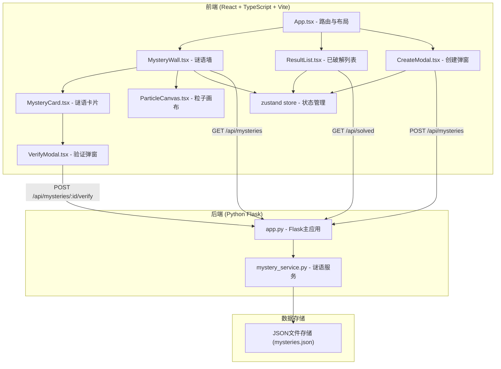
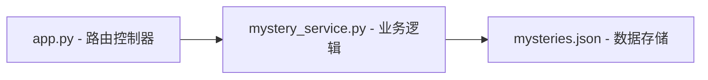
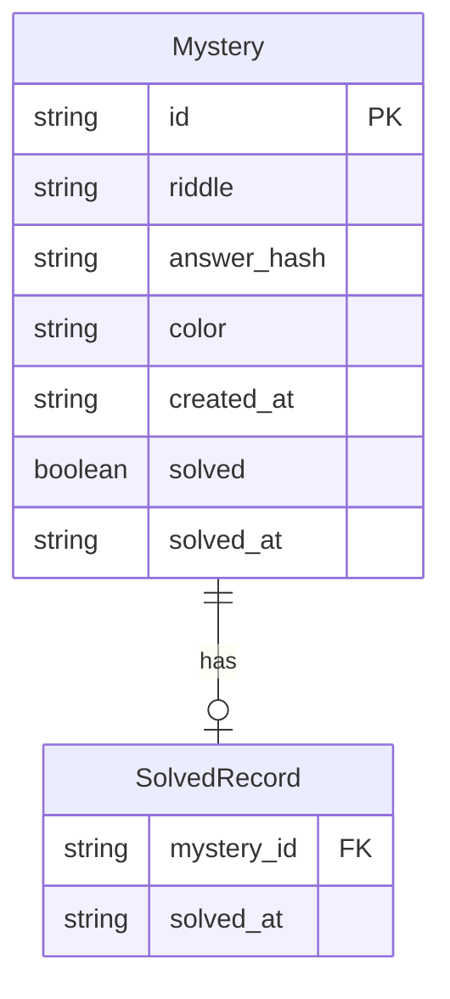

## 1. 架构设计



## 2. 技术说明

- 前端：React@18 + TypeScript + Vite + Tailwind CSS
- 初始化工具：vite-init（react-ts 模板）
- 后端：Python Flask（独立进程，与前端开发服务器并行运行）
- 数据库：JSON文件存储（轻量级，无需数据库服务）
- 状态管理：Zustand
- 动画：CSS动画 + Canvas 2D粒子系统
- 音效：Web Audio API

## 3. 路由定义

| 路由 | 用途 |
|------|------|
| / | 谜语墙主页面，展示动态谜语墙和创建按钮 |
| /solved | 已破解页面，展示用户答对的谜语列表 |

## 4. API 定义

### 4.1 获取所有谜语

```typescript
GET /api/mysteries
Response: {
  mysteries: Array<{
    id: string;
    riddle_preview: string;
    color: 'warm-yellow' | 'cyan-green' | 'light-blue';
    created_at: string;
    solved: boolean;
  }>
}
```

### 4.2 创建谜语

```typescript
POST /api/mysteries
Request: {
  riddle: string;
  answer: string;
}
Response: {
  id: string;
  riddle_preview: string;
  color: string;
  created_at: string;
}
```

### 4.3 获取谜语详情（点击卡片时）

```typescript
GET /api/mysteries/:id
Response: {
  id: string;
  riddle: string;
  color: string;
  created_at: string;
  solved: boolean;
}
```

### 4.4 验证答案

```typescript
POST /api/mysteries/:id/verify
Request: {
  answer: string;
}
Response: {
  correct: boolean;
  riddle: string;
  answer: string;
}
```

### 4.5 获取已破解谜语

```typescript
GET /api/solved
Response: {
  solved: Array<{
    id: string;
    riddle: string;
    answer: string;
    color: string;
    solved_at: string;
  }>
}
```

## 5. 服务端架构图



## 6. 数据模型

### 6.1 数据模型定义



### 6.2 数据存储格式

mysteries.json 结构：

```json
{
  "mysteries": [
    {
      "id": "uuid-string",
      "riddle": "谜面文本",
      "answer_hash": "sha256哈希值",
      "color": "warm-yellow",
      "created_at": "2026-06-08T12:00:00Z",
      "solved": false,
      "solved_at": null
    }
  ],
  "solved_ids": ["uuid-1", "uuid-2"]
}
```

- 谜底使用 SHA-256 哈希存储，验证时对用户输入做同样哈希后比较
- solved_ids 记录当前会话中已破解的谜语ID列表
