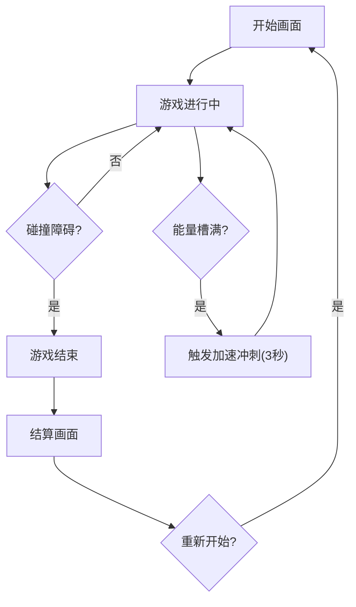

## 1. 产品概述

「星轨跃迁」是一款2D无尽跑酷游戏，玩家操控一艘光粒飞船在动态生成的星轨跑道上跳跃、闪避障碍物并收集能量水晶。跑道包含随机弯曲、断裂和移动平台，难度随分数递增，每收集一定数量水晶可触发短时加速冲刺。

- 目标用户：休闲与核心游戏玩家，偏好赛博朋克美学和快节奏操作体验
- 核心价值：流畅的60fps操作手感 + 赛博朋克视觉冲击 + 随机生成的高重玩性

## 2. 核心功能

### 2.1 功能模块

1. **游戏主界面**：开始按钮、最高分展示、深空蓝紫渐变背景动画
2. **游戏画面**：Canvas渲染的2D跑道、飞船、障碍物、水晶和粒子特效
3. **UI覆盖层**：实时得分、能量条、加速按钮
4. **游戏结束面板**：本次得分（缓动动画）、最高分、重新开始按钮

### 2.2 页面详情

| 页面名称 | 模块名称 | 功能描述 |
|---------|---------|---------|
| 游戏主界面 | 开始画面 | 显示游戏标题、开始按钮、最高分、背景星云动画 |
| 游戏画面 | 跑道渲染 | 三跑道动态生成，包含普通/断裂/移动平台、移动方块/激光栅栏障碍 |
| 游戏画面 | 飞船操控 | 左右切换跑道、跳跃、滑铲，带发光尾迹和操作反馈 |
| 游戏画面 | 水晶系统 | 随机分布水晶，收集有粒子爆发反馈和分数加成 |
| 游戏画面 | 加速冲刺 | 能量槽满时触发3秒冲刺，期间无敌+自动吸附水晶 |
| UI覆盖层 | 得分显示 | 实时分数用缓动数字动画更新 |
| UI覆盖层 | 能量条 | 显示当前水晶收集进度，满时高亮闪烁 |
| UI覆盖层 | 加速按钮 | 能量满时可点击，有悬停放大和点击缩放动画 |
| 游戏结束面板 | 结算画面 | 显示本次得分、最高分、重新开始按钮，分数用缓动动画 |

## 3. 核心流程

玩家点击开始 → 飞船在三条跑道之一出发 → 跑道持续向前滚动并动态生成分段 → 玩家通过键盘/触摸操控飞船切换跑道、跳跃、滑铲 → 收集水晶积累能量并得分 → 能量槽满触发加速冲刺 → 碰撞障碍物游戏结束 → 结算画面展示得分 → 重新开始

## 4. 用户界面设计

### 4.1 设计风格

- **主题**：赛博朋克深空风格
- **主色调**：深空蓝紫渐变（#0a0a2e → #1a0a3e → #2d1b69）
- **强调色**：霓虹青（#00f0ff）、能量橙（#ff6b35）
- **障碍物**：暗红色描边（#ff1744）
- **水晶**：霓虹青呼吸光晕
- **字体**：Orbitron（标题/数字）、Rajdhani（正文/UI）
- **按钮风格**：半透明毛玻璃质感，悬停放大1.08倍，点击缩小0.95倍
- **布局**：全屏Canvas + 悬浮UI覆盖层

### 4.2 页面设计概览

| 页面名称 | 模块名称 | UI元素 |
|---------|---------|--------|
| 游戏主界面 | 开始画面 | 深空渐变背景、星云粒子、游戏标题发光效果、毛玻璃开始按钮 |
| 游戏画面 | 跑道 | 三条跑道线、发光跑道边界、弯曲段过渡动画 |
| 游戏画面 | 飞船 | 光粒飞船、霓虹青发光尾迹、跳跃/滑铲动画 |
| 游戏画面 | 水晶 | 菱形晶体、呼吸光晕、收集粒子爆发 |
| 游戏画面 | 障碍物 | 暗红色描边移动方块、激光栅栏闪烁效果 |
| UI覆盖层 | 得分 | 左上角半透明毛玻璃卡片、缓动数字 |
| UI覆盖层 | 能量条 | 顶部居中弧形能量条、霓虹青渐变填充 |
| UI覆盖层 | 加速按钮 | 右下角圆形按钮、能量满时脉冲动画 |
| 游戏结束面板 | 结算画面 | 居中毛玻璃面板、缓动得分数字、渐变按钮 |

### 4.3 响应式

- 桌面优先，键盘操控（A/D或←/→切换跑道，W/↑跳跃，S/↓滑铲，Space加速）
- 移动端适配触摸手势（左右滑动切换、上滑跳跃、下滑滑铲、点击加速按钮）
- Canvas自适应屏幕尺寸，保持16:9逻辑比例

### 4.4 操控映射

| 操作 | 键盘 | 触摸 |
|------|------|------|
| 左移跑道 | A / ← | 左滑 |
| 右移跑道 | D / → | 右滑 |
| 跳跃 | W / ↑ | 上滑 |
| 滑铲 | S / ↓ | 下滑 |
| 加速冲刺 | Space | 点击加速按钮 |
