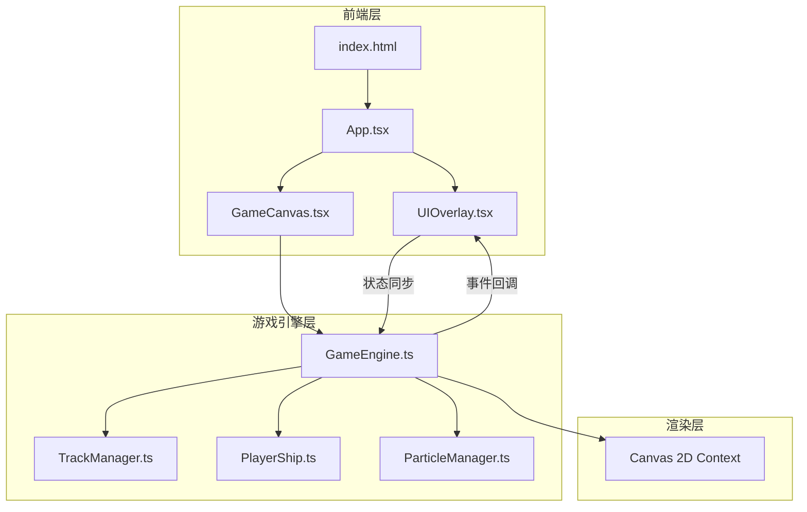

## 1. 架构设计



## 2. 技术说明

- **前端**：React 18 + TypeScript + Vite
- **样式**：CSS Modules + 自定义CSS变量（赛博朋克主题）
- **状态管理**：Zustand（游戏状态共享）
- **游戏渲染**：Canvas 2D API，requestAnimationFrame驱动60fps主循环
- **项目初始化**：vite-init react-ts模板
- **后端**：无
- **数据库**：无（最高分存储在localStorage）

## 3. 路由定义

本项目为单页面游戏，无路由切换。

| 路由 | 用途 |
|------|------|
| / | 游戏主页面（包含开始/游戏/结算三种状态） |

## 4. 文件结构

```
src/
  GameEngine.ts        — 主循环、关卡生成、碰撞检测、得分计算
  TrackManager.ts      — 跑道分段管理、障碍物生成、平台动画
  PlayerShip.ts        — 飞船操控（跳跃、闪避、能量收集）
  ParticleManager.ts   — 粒子特效（尾迹、水晶爆发、加速光效）
  GameCanvas.tsx       — React组件，挂载Canvas并初始化引擎
  UIOverlay.tsx        — React组件，得分、能量条、加速按钮、游戏结束面板
  App.tsx              — 根组件，组合GameCanvas和UIOverlay
  main.tsx             — 入口
  index.css            — 全局样式、CSS变量、毛玻璃效果
  store.ts             — Zustand游戏状态store
index.html             — HTML入口
package.json           — 依赖和脚本
tsconfig.json          — TypeScript配置
vite.config.ts         — Vite配置
```

## 5. 核心模块设计

### 5.1 GameEngine.ts

```typescript
interface GameEngine {
  canvas: HTMLCanvasElement
  ctx: CanvasRenderingContext2D
  trackManager: TrackManager
  playerShip: PlayerShip
  particleManager: ParticleManager
  score: number
  highScore: number
  gameSpeed: number
  isRunning: boolean
  isBoosting: boolean
  boostTimer: number

  start(): void
  stop(): void
  restart(): void
  update(deltaTime: number): void
  render(): void
  gameLoop(timestamp: number): void
  checkCollision(): boolean
  updateScore(deltaTime: number): void
  triggerBoost(): void
}
```

### 5.2 TrackManager.ts

```typescript
interface TrackSegment {
  x: number
  y: number
  width: number
  type: 'normal' | 'broken' | 'moving'
  moveOffset?: number
  moveSpeed?: number
  obstacles: Obstacle[]
  crystals: Crystal[]
}

interface Obstacle {
  x: number
  lane: number
  type: 'moving_block' | 'laser_fence'
  width: number
  height: number
  moveSpeed?: number
  moveRange?: number
}

interface Crystal {
  x: number
  lane: number
  collected: boolean
  glowPhase: number
}

interface TrackManager {
  segments: TrackSegment[]
  scrollSpeed: number
  difficulty: number

  generateSegment(): TrackSegment
  update(deltaTime: number): void
  render(ctx: CanvasRenderingContext2D): void
  getActiveObstacles(): Obstacle[]
  getActiveCrystals(): Crystal[]
}
```

### 5.3 PlayerShip.ts

```typescript
interface PlayerShip {
  lane: number          // 0, 1, 2
  x: number
  y: number
  targetX: number
  isJumping: boolean
  isSliding: boolean
  jumpVelocity: number
  energy: number
  maxEnergy: number
  isBoosting: boolean
  trailParticles: TrailParticle[]

  moveLeft(): void
  moveRight(): void
  jump(): void
  slide(): void
  update(deltaTime: number): void
  render(ctx: CanvasRenderingContext2D): void
  addEnergy(amount: number): void
  getBounds(): { x: number; y: number; width: number; height: number }
}
```

### 5.4 Zustand Store

```typescript
interface GameStore {
  score: number
  displayScore: number
  highScore: number
  energy: number
  maxEnergy: number
  isBoosting: boolean
  gameState: 'menu' | 'playing' | 'gameover'
  boostAvailable: boolean

  setScore: (score: number) => void
  setEnergy: (energy: number) => void
  setGameState: (state: 'menu' | 'playing' | 'gameover') => void
  setBoosting: (boosting: boolean) => void
  restart: () => void
}
```

## 6. 性能目标

- 帧率：稳定60fps，Canvas绘制优化（离屏Canvas缓存静态元素）
- 碰撞检测：AABB包围盒检测，仅检测当前可见区域
- 粒子池：对象池模式管理粒子，避免GC
- 跑道生成：视口外回收、前方动态生成
