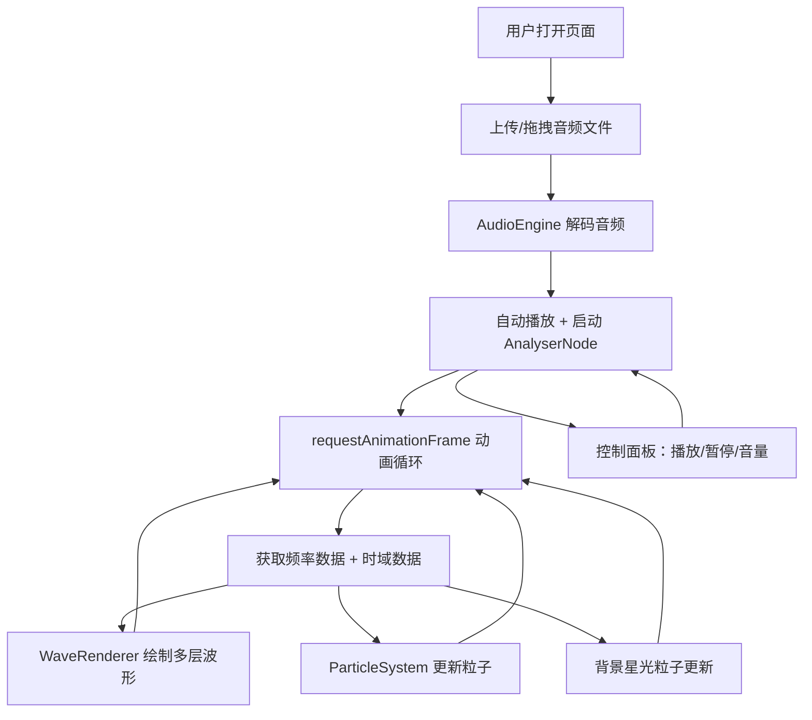

## 1. 产品概述

「幻音涟漪」是一款交互式音乐可视化 Web 应用，用户上传音频文件后，画布上实时生成随音乐频率和振幅变化的彩色波形与粒子动画，打造沉浸式视听体验。目标用户为音乐爱好者、视觉艺术创作者和前端技术探索者。

## 2. 核心功能

### 2.1 功能模块

1. **主可视化画布**：多层半透明渐变波形 + 粒子系统 + 背景星光
2. **控制面板**：文件上传（拖拽区域）、播放/暂停、音量调节

### 2.2 页面详情

| 页面名称 | 模块名称 | 功能描述 |
|----------|----------|----------|
| 主页面 | 可视化画布 | 实时渲染多层波形与粒子动画，背景星光漂移 |
| 主页面 | 波形渲染 | 根据频率数据绘制多层半透明渐变线条，低频偏红橙、中频偏绿、高频偏蓝紫，带缓动跟随 |
| 主页面 | 粒子系统 | 波形上下两侧生成粒子，大小和颜色随音量动态变化，高音量扩散变大变亮，低音量缩小暗淡汇聚 |
| 主页面 | 控制面板 | 毛玻璃半透明风格，含文件上传拖拽区、播放/暂停按钮、音量滑块 |
| 主页面 | 背景星光 | 缓慢漂移的星光粒子，深灰到黑渐变背景 |

## 3. 核心流程

用户打开页面 → 上传/拖拽 .mp3 或 .wav 文件 → 音频自动解码并开始播放 → 同时启动实时可视化 → 波形随频率变化、粒子随音量变化 → 用户可通过控制面板暂停/播放/调节音量 → 切换文件时平滑过渡

## 4. 用户界面设计

### 4.1 设计风格

- **主色调**：深灰到黑的渐变底色，霓虹蓝紫辅色
- **波形配色**：低频 #FF4500→#FF8C00（红橙）、中频 #00FF7F→#32CD32（绿）、高频 #8A2BE2→#4169E1（蓝紫）
- **按钮风格**：圆角胶囊按钮，hover 时发光扩散，带缓动过渡
- **字体**：标题用 Orbitron（科技感显示字体），正文用 Rajdhani（清晰未来风）
- **布局**：画布占主体（100vh），控制面板叠加在底部
- **毛玻璃效果**：backdrop-filter: blur(20px)，深色半透明底板

### 4.2 页面设计概览

| 页面名称 | 模块名称 | UI 元素 |
|----------|----------|---------|
| 主页面 | 可视化画布 | 全屏 Canvas，深色渐变背景，多层彩色波形线，上下两侧发光粒子 |
| 主页面 | 控制面板 | 底部固定毛玻璃面板，拖拽上传区（虚线边框+图标），播放/暂停圆形按钮，自定义音量滑块（霓虹蓝紫轨道） |
| 主页面 | 背景星光 | 缓慢漂移的微小白点星光，营造深空氛围 |

### 4.3 响应式适配

- 桌面端：画布全屏，控制面板底部居中，最大宽度 800px
- 移动端：画布全屏，控制面板适配触摸操作，按钮和滑块增大触控区域
- Canvas 尺寸随窗口 resize 自适应，保持 60fps

### 4.4 交互反馈

- 播放/暂停按钮：点击时微缩放动效 + 波形平滑过渡（不突兀停止）
- 文件上传：拖拽区域 hover 时边框发光 + 上传中加载提示动画
- 音量调节：滑块拖动时波形和粒子实时响应幅度变化
