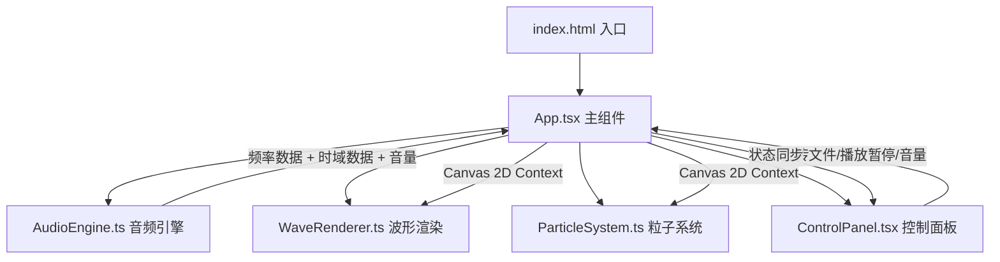

## 1. 架构设计



## 2. 技术说明

- **前端框架**：React 18 + TypeScript
- **构建工具**：Vite + @vitejs/plugin-react
- **音频处理**：Web Audio API（AudioContext + AnalyserNode）
- **可视化渲染**：Canvas 2D API + requestAnimationFrame
- **状态管理**：React useState/useRef（项目规模小，无需 zustand）
- **样式方案**：CSS Modules + 内联样式（毛玻璃等效果）

## 3. 路由定义

本项目为单页应用，无路由切换：

| 路由 | 用途 |
|------|------|
| / | 主页面，包含可视化画布和控制面板 |

## 4. 核心模块设计

### 4.1 AudioEngine.ts

```typescript
class AudioEngine {
  private audioContext: AudioContext
  private analyser: AnalyserNode
  private source: AudioBufferSourceNode | null
  private gainNode: GainNode
  private audioBuffer: AudioBuffer | null

  async loadFile(file: File): Promise<void>    // 读取文件并解码
  play(): void                                   // 播放音频
  pause(): void                                  // 暂停音频
  setVolume(value: number): void                 // 设置音量 0-1
  getFrequencyData(): Uint8Array                 // 获取频率数据
  getTimeDomainData(): Uint8Array                // 获取时域数据
  getAverageVolume(): number                     // 获取平均音量
}
```

### 4.2 WaveRenderer.ts

```typescript
class WaveRenderer {
  private ctx: CanvasRenderingContext2D
  private smoothingFactor: number

  render(frequencyData: Uint8Array, timeDomainData: Uint8Array): void
  // 多层半透明渐变线条，颜色根据频段映射：
  // 低频(0-30%): 红橙渐变
  // 中频(30-70%): 绿色渐变
  // 高频(70-100%): 蓝紫渐变
  // 带缓动跟随（lerp 平滑插值）
}
```

### 4.3 ParticleSystem.ts

```typescript
class ParticleSystem {
  private particles: Particle[]
  private maxParticles: number

  update(averageVolume: number, frequencyData: Uint8Array): void
  render(ctx: CanvasRenderingContext2D): void
  // 粒子属性：位置、速度、大小、颜色、透明度、生命值
  // 高音量：粒子变大变亮，向四周扩散
  // 低音量：粒子缩小暗淡，向中心汇聚
}

interface Particle {
  x: number
  y: number
  vx: number
  vy: number
  size: number
  color: string
  alpha: number
  life: number
  maxLife: number
}
```

### 4.4 ControlPanel.tsx

React 组件，props 包含：
- `onFileUpload: (file: File) => void`
- `isPlaying: boolean`
- `onTogglePlay: () => void`
- `volume: number`
- `onVolumeChange: (v: number) => void`
- `isLoading: boolean`

### 4.5 App.tsx

主组件职责：
- 管理 AudioEngine 实例（useRef）
- 管理播放状态、音量、加载状态
- 管理 Canvas 引用和动画循环（requestAnimationFrame）
- 整合 WaveRenderer、ParticleSystem、背景星光粒子
- 响应窗口 resize 自适应 Canvas 尺寸
- 处理文件上传、播放/暂停、音量变更

## 5. 性能策略

- Canvas 渲染：每帧清屏后一次性绘制，避免多次重绘
- 粒子池：预分配粒子数组，减少 GC 压力
- 缓动：波形数据使用 lerp 插值，避免帧间跳变
- requestAnimationFrame：确保与显示器刷新率同步
- AnalyserNode fftSize 设为 2048，提供足够的频率分辨率
- 窗口 resize 时 debounce 更新 Canvas 尺寸

## 6. 文件结构

```
├── index.html
├── package.json
├── vite.config.js
├── tsconfig.json
├── src/
│   ├── App.tsx
│   ├── App.css
│   ├── AudioEngine.ts
│   ├── WaveRenderer.ts
│   ├── ParticleSystem.ts
│   ├── ControlPanel.tsx
│   ├── ControlPanel.css
│   └── main.tsx
```
