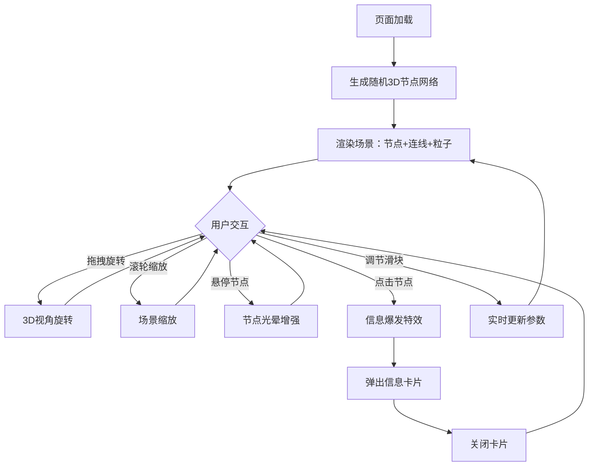

## 1. 产品概述

「星语织网」是一款3D交互可视化应用，模拟由发光节点和流光线条构成的宇宙信息网络。用户可以在三维空间中旋转、缩放视角，观察网络扭曲分形，点击节点触发信息爆发特效，通过控制面板调节网络参数。

- 目标用户：数据可视化爱好者、科技艺术爱好者、交互体验探索者
- 核心价值：以沉浸式3D交互体验将抽象的网络数据转化为可感知、可操作的视觉艺术

## 2. 核心功能

### 2.1 功能模块

1. **主场景页**：3D宇宙网络可视化、节点交互、控制面板、信息卡片弹窗

### 2.2 页面详情

| 页面名称 | 模块名称 | 功能描述 |
|----------|----------|----------|
| 主场景页 | 3D网络场景 | 随机生成约150个3D节点，按距离阈值创建连线，形成信息网络结构 |
| 主场景页 | 节点呼吸光晕 | 节点带呼吸动画（大小和透明度周期性变化），鼠标悬停时放大并光晕增强 |
| 主场景页 | 连线流光 | 连线有从一端到另一端周期性渐变的流动彩色流光，颜色在蓝、紫、粉间循环 |
| 主场景页 | 信息爆发特效 | 点击节点时节点膨胀并放射彩色流光射线，周围节点被推开并短暂闪烁 |
| 主场景页 | 信息卡片弹窗 | 点击节点弹出半透明毛玻璃信息卡片，显示节点名称、连接数、信息流强度，带渐入动画和关闭按钮 |
| 主场景页 | 控制面板 | 右侧半透明毛玻璃面板，含三个滑块（流速/节点密度/连线透明度）和重置视角按钮 |
| 主场景页 | 星光粒子背景 | 约500颗缓慢漂浮的星光粒子，随机大小和闪烁频率 |
| 主场景页 | 响应式适配 | 桌面端控制面板右侧浮动，移动端变为底部抽屉式 |

## 3. 核心流程

用户打开页面 → 自动生成随机3D节点网络 → 用户拖拽旋转视角/滚轮缩放 → 悬停节点查看光晕增强 → 点击节点触发信息爆发特效 → 弹出信息卡片查看详情 → 通过控制面板调节参数 → 实时更新网络状态

## 4. 用户界面设计

### 4.1 设计风格

- **主色调**：深蓝(#0a0a2e)到紫黑(#1a0a2e)渐变背景
- **强调色**：电光蓝(#00d4ff)、霓虹紫(#b44aff)、赛博粉(#ff4da6)
- **按钮风格**：半透明毛玻璃质感，圆角8px，霓虹色边框
- **字体**：展示字体 Orbitron（科技感），UI字体 Rajdhani（清晰可读）
- **布局**：全屏3D场景 + 浮动UI层
- **动效**：呼吸光晕、流光渐变、粒子尾迹、爆发扩散

### 4.2 页面设计概览

| 页面名称 | 模块名称 | UI元素 |
|----------|----------|--------|
| 主场景页 | 3D网络场景 | 全屏Canvas，深蓝到紫黑渐变背景，发光半透明节点球体，渐变发光流线 |
| 主场景页 | 信息卡片 | 居中半透明毛玻璃卡片，backdrop-blur(20px)，霓虹色边框，渐入动画0.3s |
| 主场景页 | 控制面板 | 右侧固定半透明毛玻璃面板，宽240px，backdrop-blur(16px)，圆角12px |
| 主场景页 | 星光粒子 | 微小白点/淡蓝色点，随机大小1-3px，闪烁动画 |

### 4.3 响应式适配

- 桌面端（>768px）：控制面板右侧浮动，信息卡片居中显示
- 移动端（≤768px）：控制面板变为底部抽屉，可上滑展开/下滑收起，信息卡片适配小屏宽度

### 4.4 3D场景指引

- **环境/氛围**：深空宇宙感，深蓝到紫黑渐变，无HDRI
- **光照**：微弱环境光(AmbientLight #1a1a3e 强度0.3)，无方向光，节点自发光为主
- **相机**：PerspectiveCamera，FOV 60°，初始距离25，OrbitControls旋转阻尼0.05
- **构图**：网络居中分布，相机略偏上俯视角度
- **交互**：OrbitControls拖拽旋转+滚轮缩放，Raycaster点击检测，悬停高亮
- **后处理**：Bloom发光效果(UnrealBloomPass)，增强节点和连线的发光感
- **性能预算**：150节点+连线+500粒子，目标60fps，使用InstancedMesh优化节点渲染
