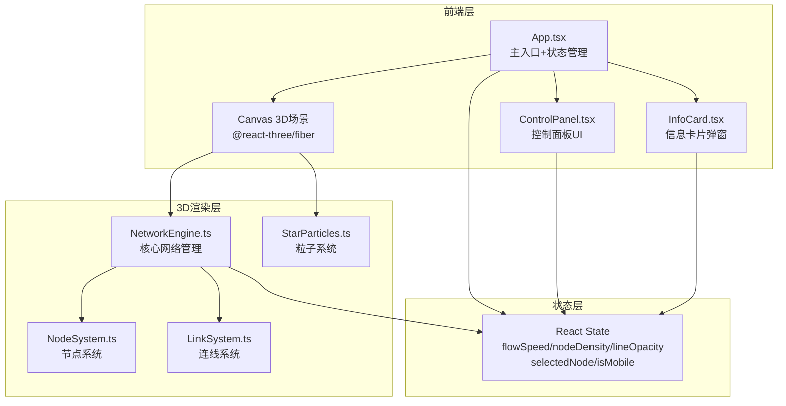

## 1. 架构设计



## 2. 技术说明

- **前端框架**：React@18 + TypeScript
- **3D渲染**：Three.js + @react-three/fiber + @react-three/drei + @react-three/postprocessing
- **构建工具**：Vite
- **样式方案**：CSS Modules + CSS Variables（毛玻璃效果通过backdrop-filter实现）
- **状态管理**：React useState/useCallback（项目规模小，无需Redux）
- **无后端**：纯前端项目，所有数据在内存中生成

## 3. 路由定义

| 路由 | 用途 |
|------|------|
| / | 主场景页，3D网络可视化+控制面板+信息卡片 |

## 4. 数据模型

### 4.1 核心数据结构

```typescript
interface NetworkNode {
  id: string
  position: [number, number, number]
  connections: number
  flowIntensity: number
  name: string
  baseScale: number
  currentScale: number
  breathPhase: number
  isExploding: boolean
  explodeProgress: number
  velocity: [number, number, number]
  color: string
}

interface NetworkLink {
  source: string
  target: string
  flowOffset: number
  opacity: number
  color: [string, string]
}

interface NetworkState {
  flowSpeed: number
  nodeDensity: number
  lineOpacity: number
}
```

### 4.2 文件结构

```
├── index.html
├── package.json
├── tsconfig.json
├── vite.config.js
└── src/
    ├── main.tsx
    ├── App.tsx
    ├── App.css
    ├── NetworkEngine.ts
    ├── NodeSystem.tsx
    ├── LinkSystem.tsx
    ├── StarParticles.ts
    ├── ControlPanel.tsx
    ├── ControlPanel.css
    ├── InfoCard.tsx
    └── InfoCard.css
```
