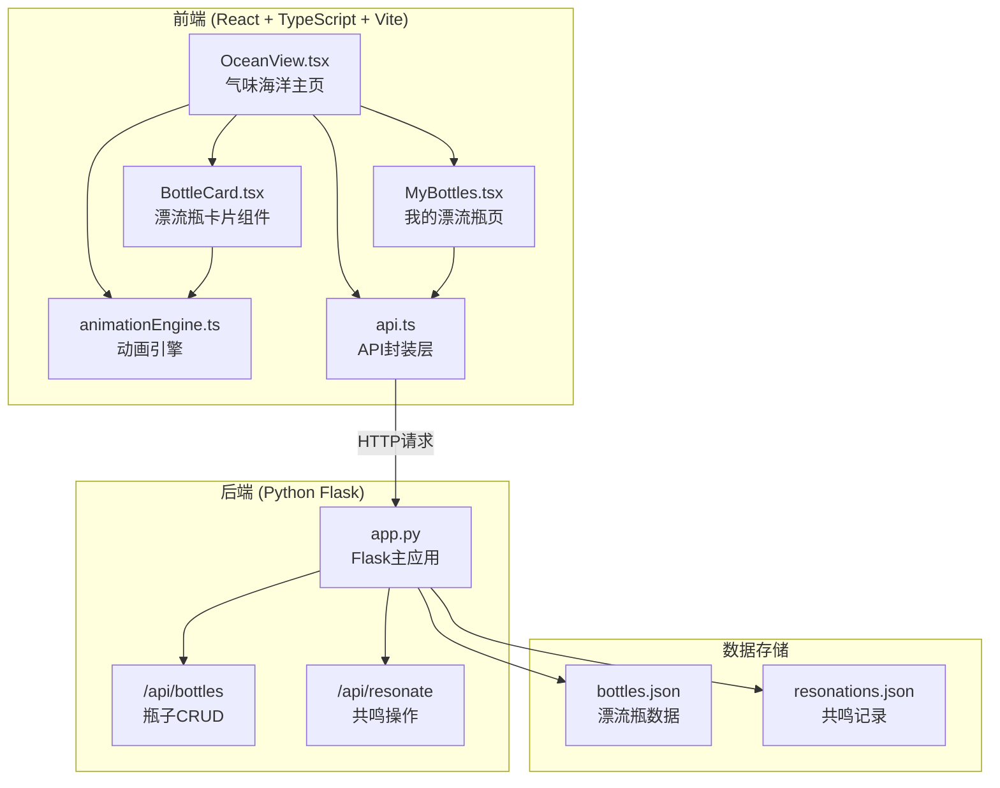
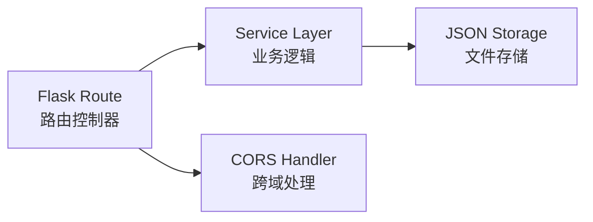
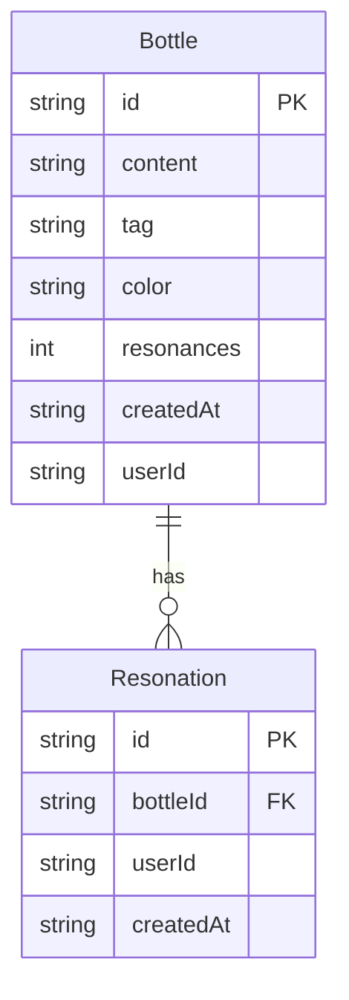

## 1. 架构设计



## 2. 技术说明
- 前端：React@18 + TypeScript + Vite + CSS Modules（无tailwind，使用纯CSS实现毛玻璃和动画效果）
- 初始化工具：vite-init
- 后端：Python Flask（轻量API服务，JSON文件存储）
- 数据库：JSON文件持久化（无需外部数据库依赖，适合原型和轻量部署）
- 动画：Canvas 2D API + requestAnimationFrame（60fps渲染循环）
- 状态管理：React Context + useReducer

## 3. 路由定义
| 路由 | 用途 |
|------|------|
| / | 气味海洋首页，Canvas渲染漂流瓶海洋 |
| /my | 我的漂流瓶页面，展示已发送和共鸣的瓶子 |

## 4. API定义

### 4.1 TypeScript类型定义

```typescript
interface Bottle {
  id: string
  content: string
  tag: string
  color: string
  resonances: number
  createdAt: string
  userId: string
  resonatedBy: string[]
}

interface CreateBottleRequest {
  content: string
  tag: string
  userId: string
}

interface ResonateRequest {
  bottleId: string
  userId: string
}

interface ApiResponse<T> {
  success: boolean
  data?: T
  error?: string
}
```

### 4.2 接口定义

| 方法 | 路径 | 请求体 | 响应 | 说明 |
|------|------|--------|------|------|
| POST | /api/bottles | CreateBottleRequest | ApiResponse\<Bottle\> | 创建漂流瓶 |
| GET | /api/bottles | - | ApiResponse\<Bottle[]\> | 获取所有漂流瓶 |
| GET | /api/bottles/:userId | - | ApiResponse\<Bottle[]\> | 获取用户发送的瓶子 |
| POST | /api/resonate | ResonateRequest | ApiResponse\<Bottle\> | 共鸣操作 |

## 5. 服务器架构图



## 6. 数据模型

### 6.1 数据模型定义



### 6.2 数据定义

**bottles.json**
```json
[
  {
    "id": "btl_xxxx",
    "content": "雨后的泥土味，让我想起外婆家的后院",
    "tag": "雨后泥土",
    "color": "#8B6914",
    "resonances": 3,
    "createdAt": "2026-06-08T12:00:00Z",
    "userId": "usr_xxxx",
    "resonatedBy": ["usr_yyyy", "usr_zzzz"]
  }
]
```

**resonations.json**
```json
[
  {
    "id": "rsn_xxxx",
    "bottleId": "btl_xxxx",
    "userId": "usr_yyyy",
    "createdAt": "2026-06-08T13:00:00Z"
  }
]
```
