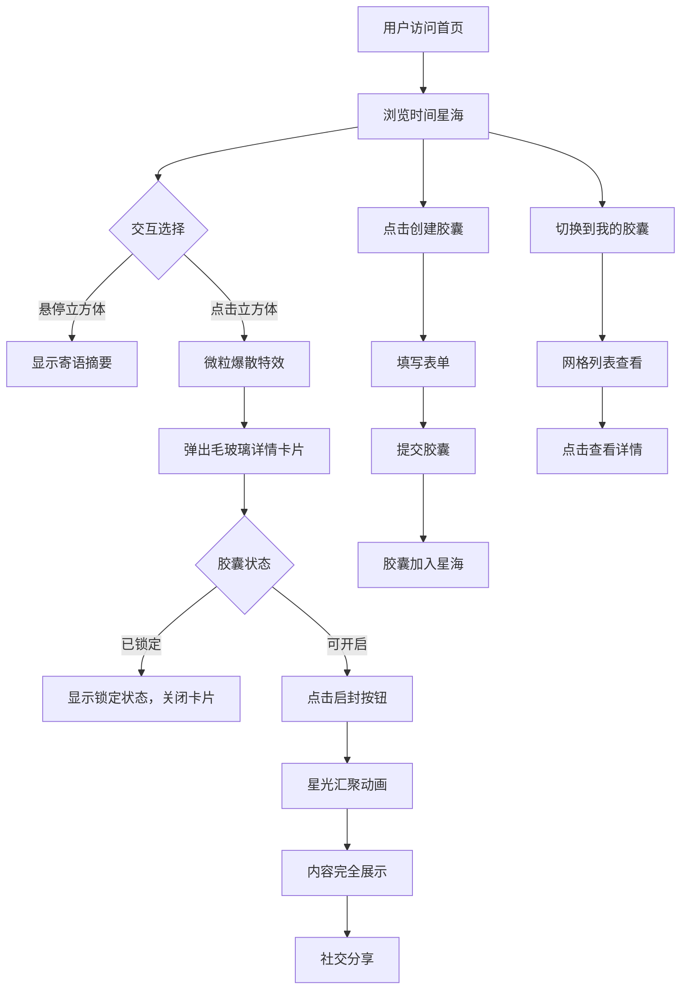

## 1. 产品概述

「记忆方舟」是一个匿名时间胶囊分享平台，用户可以创建包含文字、图片或音频的时间胶囊，设定未来开启日期，胶囊以发光立方体形态漂浮在「时间星海」3D 场景中。当到达设定日期时，胶囊可被启封，内容完全展示并支持社交分享。

- 面向希望为未来留存记忆的普通用户，以匿名方式封存与启封个人寄语
- 核心价值：将时间赋予仪式感，通过沉浸式 3D 视觉体验让「封存-等待-启封」过程充满情感张力

## 2. 核心功能

### 2.1 用户角色

| 角色 | 注册方式 | 核心权限 |
|------|----------|----------|
| 匿名用户 | 无需注册 | 创建胶囊、浏览星海、启封到期胶囊、查看我的胶囊 |

### 2.2 功能模块

1. **时间星海（首页）**: 3D 立方体星海场景、胶囊创建入口、胶囊交互（悬停预览、点击查看详情）
2. **胶囊详情（弹窗）**: 毛玻璃卡片展示寄语内容、附件预览、启封功能、社交分享
3. **我的胶囊**: 网格列表展示个人胶囊、状态筛选、点击查看详情

### 2.3 页面详情

| 页面名称 | 模块名称 | 功能描述 |
|----------|----------|----------|
| 时间星海 | 3D 星海场景 | 大量慢速旋转、随机漂浮的半透明发光立方体，颜色按开启年份渐变（近金色、中蓝色、远紫色），鼠标悬停立方体微微放大并显示寄语摘要前几字 |
| 时间星海 | 胶囊创建表单 | 文字输入（限500字）、附件上传（图片/音频）、日期选择器（1/5/10年预设+自定义），提交后刷新星海 |
| 时间星海 | 微粒爆散特效 | 点击立方体时触发粒子爆散动画，随后弹出详情卡片 |
| 胶囊详情 | 毛玻璃卡片 | 全屏毛玻璃遮罩，半透明卡片展示完整寄语、附件预览、时间戳、状态（已锁定/可开启），点击外部关闭 |
| 胶囊详情 | 启封功能 | 仅到达设定日期后可用，点击「启封」按钮播放星光汇聚动画，内容完全展示，状态不可逆更新 |
| 胶囊详情 | 社交分享 | 启封后显示分享按钮，支持复制链接等分享方式 |
| 我的胶囊 | 胶囊网格 | 以网格列表展示用户创建的所有胶囊，含预览缩略图、截止日期、状态标签（锁定/已启封） |
| 我的胶囊 | 胶囊详情跳转 | 点击胶囊卡片弹出详情卡片（复用首页卡片组件） |

## 3. 核心流程

用户打开平台 → 看到时间星海3D场景 → 点击「创建胶囊」按钮 → 填写文字、选择附件和开启日期 → 提交后胶囊以发光立方体加入星海 → 用户在星海中悬停/点击浏览其他胶囊 → 点击立方体触发粒子爆散+弹出详情卡片 → 到期胶囊可点击「启封」→ 播放星光汇聚动画 → 内容完全展示 → 可分享到社交平台。

底部导航栏可切换到「我的胶囊」页面，以网格形式查看自己创建的所有胶囊及状态。

## 4. 用户界面设计

### 4.1 设计风格

- **主色调**: 暗蓝紫渐变背景（#0a0a2e → #1a0a3e），暖金点缀（#d4a574 / #f0c878）
- **胶囊颜色**: 近年代金色（#f0c878）、中期蓝色（#4a9eff）、远年代紫色（#9b59b6）
- **按钮风格**: 圆角胶囊按钮，金色渐变主按钮，半透明毛玻璃次按钮
- **字体**: 标题使用 'Cinzel' 衬线字体（仪式感），正文使用 'Noto Sans SC' 无衬线字体
- **布局风格**: 全屏3D场景为基底，UI控件浮于其上，毛玻璃卡片弹出式交互
- **图标**: Lucide 图标库，线条风格
- **特效**: 毛玻璃（backdrop-blur）、粒子动画、星光汇聚、微粒爆散

### 4.2 页面设计概览

| 页面名称 | 模块名称 | UI 元素 |
|----------|----------|---------|
| 时间星海 | 3D 场景 | Three.js 全屏渲染，暗蓝紫渐变背景，漂浮发光立方体，颜色按年份渐变，60fps |
| 时间星海 | 创建按钮 | 右下角浮动金色圆形按钮，+号图标，hover放大发光 |
| 时间星海 | 创建表单 | 从底部滑入的毛玻璃面板，文字输入区、文件上传区、日期选择器、提交按钮 |
| 时间星海 | 悬停提示 | 立方体旁浮现小型毛玻璃气泡，显示寄语前几个字 |
| 胶囊详情 | 详情卡片 | 全屏半透明遮罩，居中毛玻璃卡片，圆角大阴影，内容滚动 |
| 胶囊详情 | 启封按钮 | 金色渐变按钮，仅在到期时显示，点击后播放星光汇聚动画 |
| 我的胶囊 | 网格列表 | 2列（手机）/ 3列（桌面）网格，每个胶囊为毛玻璃卡片，含缩略图、日期、状态标签 |
| 通用 | 底部导航 | 半透明毛玻璃底栏，两个标签：时间星海 / 我的胶囊，金色选中态 |
| 通用 | 粒子背景 | 细小星尘粒子缓慢飘落，增加空间深度感 |

### 4.3 响应式设计

- **桌面优先**: 3D 场景全屏铺满，UI控件自适应位置
- **手机适配**: 3D 场景降粒子数保持帧率，卡片全宽显示，网格列数减少
- **触摸优化**: 触摸长按替代悬停预览，点击交互适配触摸延迟

### 4.4 3D 场景指引

- **环境氛围**: 深空星海，暗蓝紫渐变雾气，远处有微弱星云
- **光照**: 环境光柔和（强度0.3），每个立方体自发光（emissive），点光源跟随鼠标微动
- **相机**: 透视相机，固定位置，允许用户拖拽旋转视角（OrbitControls 限制范围）
- **构图**: 立方体随机分布在球形空间内，近大远小形成纵深感
- **交互**: Raycaster 检测鼠标/触摸与立方体的交互，悬停放大1.2倍+发光增强，点击触发粒子爆散
- **后处理**: 可选 Bloom 效果增强发光感，注意性能预算
- **性能预算**: 立方体数量上限200，移动端降至80，保持60fps
