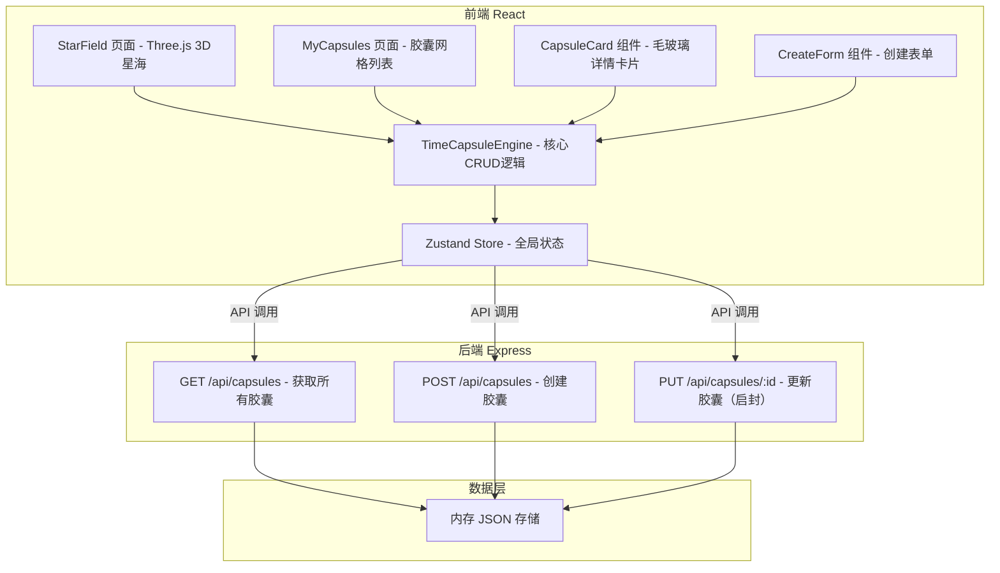
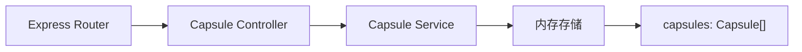
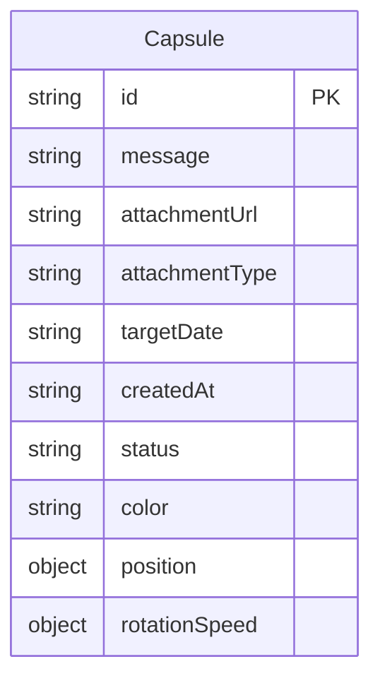

## 1. 架构设计



## 2. 技术说明

- **前端**: React@18 + TypeScript + Tailwind CSS@3 + Vite
- **3D 渲染**: Three.js + @react-three/fiber + @react-three/drei
- **状态管理**: Zustand
- **路由**: react-router-dom
- **后端**: Express@4 + TypeScript (ESM)
- **数据库**: 内存 JSON 存储（模拟数据库）
- **初始化工具**: vite-init (react-express-ts 模板)

## 3. 路由定义

| 路由 | 用途 |
|------|------|
| `/` | 时间星海首页 - 3D场景+胶囊交互 |
| `/my-capsules` | 我的胶囊 - 网格列表页 |

## 4. API 定义

### 4.1 TypeScript 类型定义

```typescript
interface Capsule {
  id: string;
  message: string;
  attachmentUrl?: string;
  attachmentType?: "image" | "audio";
  targetDate: string;
  createdAt: string;
  status: "locked" | "unsealed";
  color: string;
  position: { x: number; y: number; z: number };
  rotationSpeed: { x: number; y: number; z: number };
}

interface CreateCapsuleRequest {
  message: string;
  attachmentUrl?: string;
  attachmentType?: "image" | "audio";
  targetDate: string;
}

interface UnsealCapsuleResponse {
  success: boolean;
  capsule: Capsule;
}
```

### 4.2 API 端点

| 方法 | 路径 | 请求体 | 响应 | 说明 |
|------|------|--------|------|------|
| GET | `/api/capsules` | - | `Capsule[]` | 获取所有胶囊列表 |
| POST | `/api/capsules` | `CreateCapsuleRequest` | `Capsule` | 创建新胶囊，自动生成ID、位置、旋转速度、颜色 |
| PUT | `/api/capsules/:id` | `{ status: "unsealed" }` | `UnsealCapsuleResponse` | 启封胶囊（仅到期后可用，不可逆） |

## 5. 服务器架构图



## 6. 数据模型

### 6.1 数据模型定义



### 6.2 数据定义语言

- 胶囊存储在 Express 服务器的内存数组中
- 每个胶囊包含唯一ID（uuid）、寄语内容、附件URL、目标开启日期、创建时间、锁定状态、3D场景位置和旋转速度
- 颜色根据 targetDate 与当前时间的差距自动计算：1年内金色、1-5年蓝色、5年以上紫色
- position 和 rotationSpeed 在创建时随机生成，用于3D场景渲染
- 启封操作验证 targetDate <= 当前时间，通过后更新 status 为 "unsealed"，不可逆
