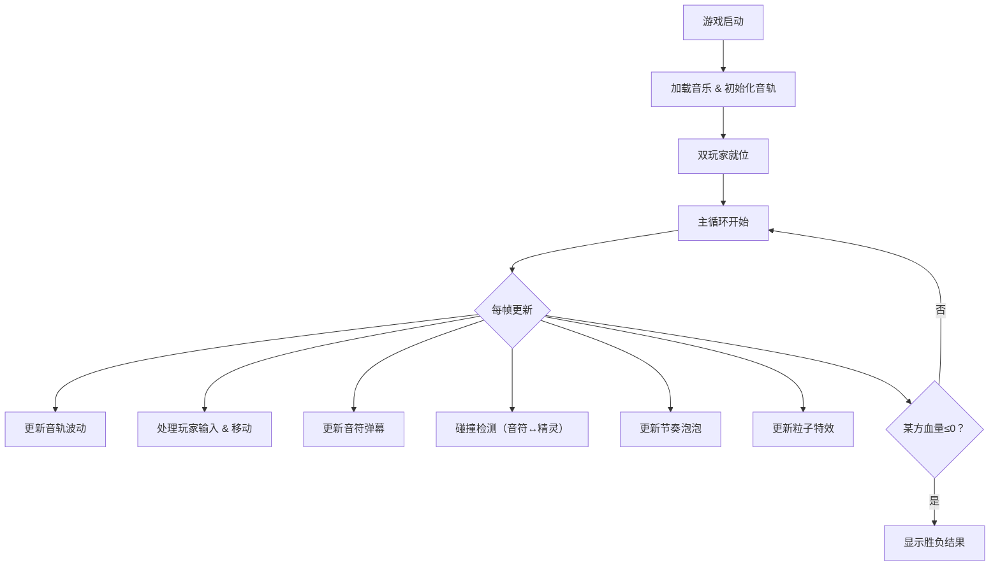
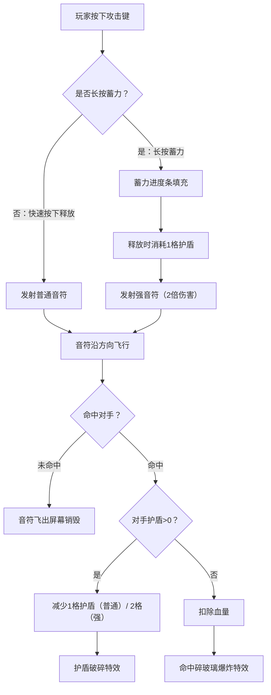

## 1. 产品概述

「弦语战境」是一款 2D 实时音律对战游戏，两名玩家各自操控音符精灵，在随音乐节奏波动的音轨上移动并发射音符攻击对方，击破护盾、耗尽血量获胜。
- 目标用户：追求快节奏竞技体验的休闲玩家和音游爱好者
- 核心价值：将音乐节奏感与实时对战策略融合，创造独特的"听节拍、打对战"玩法

## 2. 核心功能

### 2.1 用户角色
| 角色 | 进入方式 | 核心操作 |
|------|----------|----------|
| 玩家1 | 键盘左侧区域（WASD + 空格） | 移动、攻击、蓄力 |
| 玩家2 | 键盘右侧区域（方向键 + Enter） | 移动、攻击、蓄力 |

### 2.2 功能模块
1. **对战主界面**：音轨渲染、双玩家精灵、音符弹幕、节奏泡泡、粒子特效
2. **游戏 HUD**：双方血条、护盾格、技能CD环形进度条、回合倒计时

### 2.3 页面详情
| 页面名称 | 模块名称 | 功能描述 |
|----------|----------|----------|
| 对战主界面 | 音轨系统 | 实时波动的半透明发光流线音轨，玩家在音轨上方移动 |
| 对战主界面 | 精灵控制 | 双玩家音符精灵，带缓动移动和霓虹粒子尾迹 |
| 对战主界面 | 攻击系统 | 发射普通音符/蓄力强音符，命中触发碎玻璃粒子爆炸 |
| 对战主界面 | 防御系统 | 护盾格（3格）吸收伤害，护盾破碎屏幕闪红抖动 |
| 对战主界面 | 节奏机关 | 每8拍生成节奏泡泡，踩中加速/恢复护盾，漏掉扣血 |
| 对战主界面 | 胜负判定 | 一方血量归零即判定负，显示胜负结果 |
| 游戏 HUD | 血条显示 | 百分比霓虹光条血条（5格血量） |
| 游戏 HUD | 护盾显示 | 护盾格数霓虹光条（3格护盾） |
| 游戏 HUD | 技能CD | 蓄力技能环形进度条 |
| 游戏 HUD | 回合倒计时 | 对局剩余时间显示 |

## 3. 核心流程

玩家进入游戏后，系统加载音乐并初始化音轨。两名玩家在音轨上方移动，通过发射音符攻击对方。音轨随音乐节奏实时波动，每8拍出现节奏泡泡提供增益或惩罚。当一方护盾被击破后受到真实伤害，血量归零则对方获胜。

## 4. 用户界面设计

### 4.1 设计风格
- 主色调：暗紫 (#1a0a2e) 到纯黑 (#0a0a0a) 渐变背景
- 强调色：霓虹蓝 (#00f0ff)、霓虹紫 (#bf00ff)、霓虹红 (#ff0055)
- 按钮风格：霓虹发光边框，悬停时光晕扩散
- 字体：赛博朋克风显示字体（Orbitron）+ 简洁UI字体（Rajdhani）
- 布局风格：全屏 Canvas 游戏画面 + 叠加层 HUD
- 图标/装饰：音符符号 ♪ ♫、声波纹、节奏网格线

### 4.2 页面设计概述
| 页面名称 | 模块名称 | UI 元素 |
|----------|----------|---------|
| 对战主界面 | 背景层 | 暗紫-黑渐变，远景声波纹动画 |
| 对战主界面 | 音轨层 | 半透明发光流线，随节奏上下波动，幅度动态变化 |
| 对战主界面 | 精灵层 | 霓虹蓝/霓虹红音符精灵，带发光粒子尾迹 |
| 对战主界面 | 弹幕层 | 飞行音符带光晕扩散拖尾 |
| 对战主界面 | 特效层 | 命中碎玻璃粒子、护盾破碎闪红、踩泡泡微光脉冲 |
| 游戏 HUD | 顶部状态栏 | 左侧P1血条+护盾+CD，右侧P2血条+护盾+CD，中间倒计时 |
| 游戏 HUD | 血条 | 百分比霓虹光条，渐变色（满血绿→半血黄→残血红） |
| 游戏 HUD | 护盾格 | 3格霓虹光条，破碎时闪烁 |
| 游戏 HUD | 技能CD | 环形进度条围绕精灵，蓄力时填充 |

### 4.3 响应式适配
- 桌面优先设计，Canvas 自适应全屏
- iPad 横屏适配：触控区域映射虚拟按键
- Flex 布局自适应 HUD，字体和按钮大小随屏幕缩放
- 最小支持宽度 768px，推荐 1024px+

### 4.4 性能目标
- 帧率稳定 60fps
- 同屏音符和粒子总数 ≤ 200
- Canvas 尺寸随窗口 resize 实时调整
