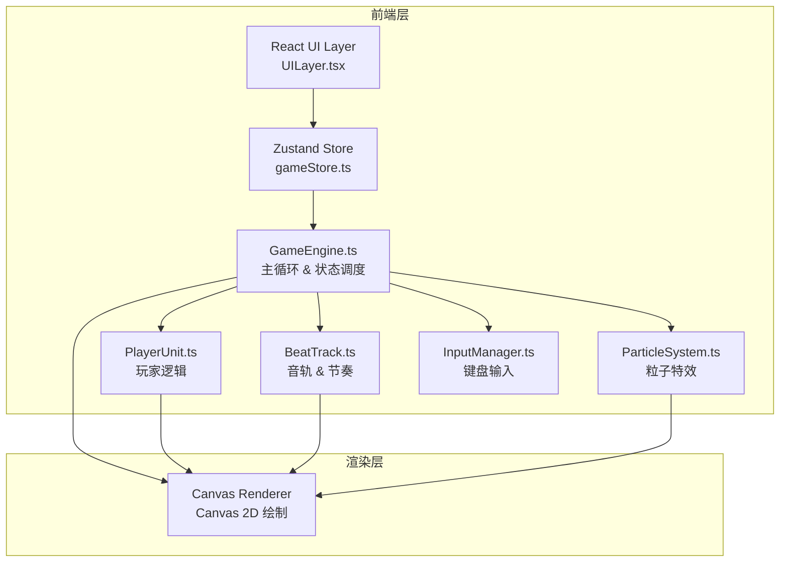

## 1. 架构设计



## 2. 技术说明

- 前端框架：React 18 + TypeScript
- 构建工具：Vite
- 状态管理：Zustand（桥接游戏引擎状态到 React UI）
- 渲染方式：Canvas 2D（游戏主体）+ React DOM（HUD 叠加层）
- 音频处理：Web Audio API（节拍检测与音轨波动驱动）
- 初始化工具：vite-init（react-ts 模板）
- 样式方案：Tailwind CSS（HUD 布局）+ Canvas 绘制（游戏画面）
- 后端：无（纯前端本地双人游戏）

## 3. 路由定义

| 路由 | 用途 |
|------|------|
| / | 游戏主界面（唯一的页面入口） |

## 4. 核心模块定义

### 4.1 GameEngine.ts
```typescript
interface GameEngine {
  start(): void;
  stop(): void;
  update(dt: number): void;
  render(ctx: CanvasRenderingContext2D): void;
  getState(): GameState;
}
interface GameState {
  phase: 'menu' | 'playing' | 'paused' | 'ended';
  players: [PlayerState, PlayerState];
  beatTrack: BeatTrackState;
  particles: Particle[];
  projectiles: Projectile[];
  beatBubbles: BeatBubble[];
  timeRemaining: number;
  winner: number | null;
}
```

### 4.2 PlayerUnit.ts
```typescript
interface PlayerState {
  id: 0 | 1;
  x: number;
  y: number;
  hp: number;          // 0-5
  shield: number;      // 0-3
  charging: boolean;
  chargeProgress: number; // 0-1
  speed: number;
  speedBoostTimer: number;
  color: string;
}
interface Projectile {
  x: number;
  y: number;
  vx: number;
  vy: number;
  ownerId: 0 | 1;
  isCharged: boolean;
  radius: number;
  color: string;
  life: number;
}
```

### 4.3 BeatTrack.ts
```typescript
interface BeatTrackState {
  points: { x: number; y: number }[];
  amplitude: number;
  frequency: number;
  phase: number;
  beatCount: number;
  bpm: number;
}
interface BeatBubble {
  x: number;
  y: number;
  radius: number;
  type: 'speed' | 'shield';
  collected: boolean;
  spawnBeat: number;
  life: number;
}
```

### 4.4 粒子系统
```typescript
interface Particle {
  x: number;
  y: number;
  vx: number;
  vy: number;
  life: number;
  maxLife: number;
  color: string;
  size: number;
  type: 'trail' | 'explosion' | 'shield_break' | 'pulse';
}
```

### 4.5 Zustand Store
```typescript
interface GameStore {
  gameState: GameState;
  updateFromEngine: (state: GameState) => void;
  canvasSize: { width: number; height: number };
  setCanvasSize: (size: { width: number; height: number }) => void;
}
```

## 5. 文件结构

```
src/
├── engine/
│   ├── GameEngine.ts      # 主循环、节拍生成、胜负判定
│   ├── PlayerUnit.ts      # 玩家位置、血量、护盾、攻击逻辑
│   ├── BeatTrack.ts       # 音轨波动和节奏泡泡管理
│   ├── ParticleSystem.ts  # 粒子特效系统
│   ├── InputManager.ts    # 键盘输入映射
│   ├── Renderer.ts        # Canvas 2D 渲染器
│   └── types.ts           # 共享类型定义
├── store/
│   └── gameStore.ts       # Zustand 状态管理
├── components/
│   ├── UILayer.tsx        # HUD 叠加层主组件
│   ├── HealthBar.tsx      # 血条组件
│   ├── ShieldBar.tsx      # 护盾格组件
│   ├── SkillCooldown.tsx  # 技能CD环形进度条
│   └── GameCanvas.tsx     # Canvas 容器组件
├── App.tsx
└── main.tsx
```

## 6. 输入映射

| 动作 | 玩家1 | 玩家2 |
|------|-------|-------|
| 上移 | W | ↑ |
| 下移 | S | ↓ |
| 左移 | A | ← |
| 右移 | D | → |
| 攻击/蓄力 | 空格 | Enter |

## 7. 渲染管线

1. 清空 Canvas
2. 绘制背景渐变 + 远景声波纹
3. 绘制音轨流线（半透明发光）
4. 绘制节奏泡泡
5. 绘制飞行音符弹幕
6. 绘制玩家精灵 + 尾迹粒子
7. 绘制爆炸/破碎粒子
8. 绘制护盾破碎屏幕闪红效果
9. React DOM 层叠加 HUD（血条、护盾、CD、倒计时）

## 8. 性能策略

- 粒子池复用，上限 200 个
- 音符弹幕超出屏幕立即销毁
- 使用 requestAnimationFrame 驱动主循环
- Canvas 分辨率按 devicePixelRatio 缩放
- 减少 GC：预分配数组和对象
- 音轨点数按屏幕宽度动态计算（约 100-200 个采样点）
