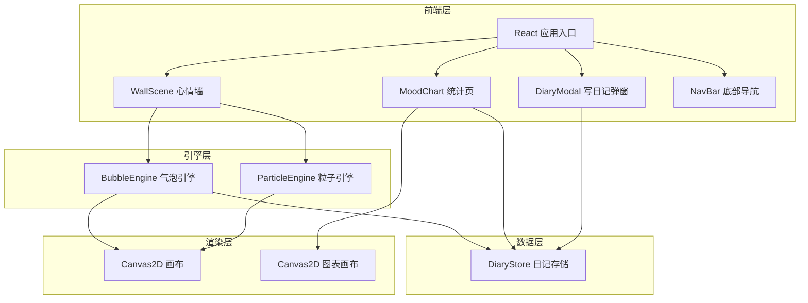

## 1. 架构设计



## 2. 技术说明

- 前端框架：React 18 + TypeScript + Vite
- 样式方案：Tailwind CSS 3
- 状态管理：Zustand（DiaryStore）
- 图标库：lucide-react
- 渲染引擎：Canvas2D（气泡、粒子、图表）
- 初始化工具：vite-init（react-ts 模板）
- 后端：无（纯前端，数据存储在 localStorage）
- 数据库：无（使用 localStorage 持久化）

## 3. 路由定义

| 路由 | 用途 |
|------|------|
| / | 心情墙主页面（默认） |
| /stats | 统计页面（圆环图 + 折线图） |

## 4. API 定义

无后端 API。数据通过 Zustand store + localStorage 在本地管理。

### 4.1 数据接口定义

```typescript
interface DiaryEntry {
  id: string;
  text: string;
  moodColor: MoodColor;
  createdAt: number;
}

type MoodColor =
  | '#FF9AA2'
  | '#FFB7B2'
  | '#FFDAC1'
  | '#E2F0CB'
  | '#B5EAD7'
  | '#C7CEEA'
  | '#B8A9C9'
  | '#F8C8DC';

interface MoodStat {
  color: MoodColor;
  count: number;
  percentage: number;
}

interface DiaryStoreState {
  entries: DiaryEntry[];
  addEntry: (text: string, moodColor: MoodColor) => void;
  getStats: () => MoodStat[];
  getTrend: (days: number) => { date: string; avgMood: number }[];
}
```

## 5. 文件结构

```
├── index.html
├── package.json
├── tsconfig.json
├── vite.config.ts
├── tailwind.config.js
├── postcss.config.js
├── src/
│   ├── main.tsx
│   ├── App.tsx
│   ├── index.css
│   ├── BubbleEngine.ts      # 气泡引擎：位置更新、碰撞检测、缩放淡入淡出
│   ├── ParticleEngine.ts    # 粒子引擎：爆散动画
│   ├── DiaryStore.ts        # 日记数据管理：增删改查 + 统计计算
│   ├── types.ts             # TypeScript 类型定义
│   ├── constants.ts         # 心情颜色常量和配置
│   ├── components/
│   │   ├── WallScene.tsx    # 心情墙 Canvas 组件
│   │   ├── MoodChart.tsx    # 统计图表 Canvas 组件
│   │   ├── DiaryModal.tsx   # 写日记弹窗组件
│   │   ├── DiaryCard.tsx    # 日记详情毛玻璃卡片
│   │   └── NavBar.tsx       # 底部导航栏
│   └── pages/
│       ├── WallPage.tsx     # 心情墙页面
│       └── StatsPage.tsx    # 统计页面
```

## 6. 核心引擎设计

### 6.1 BubbleEngine

- 管理气泡数组，每个气泡持有位置、速度、大小、颜色、透明度、关联日记ID
- 每帧更新：正弦波浮动（y偏移）、水平缓慢漂移、呼吸光晕（radialGradient alpha 脉冲）
- 碰撞检测：气泡间简单圆形碰撞，碰撞后速度反弹
- 淡入动画：新气泡从 scale 0 → 1 + opacity 0 → 1，使用缓动函数
- 鼠标检测：遍历气泡判断鼠标位置是否在气泡半径内
- 渲染：Canvas2D drawBubble → 径向渐变填充 + 外发光阴影

### 6.2 ParticleEngine

- 点击气泡时，在气泡位置生成60-80个粒子
- 每个粒子持有位置、速度（随机方向 + 随机速度）、颜色（继承气泡颜色）、生命周期
- 每帧更新：位置 += 速度，速度 *= 阻力，生命周期衰减
- 粒子渲染为小圆形，大小随生命周期缩小，透明度随生命周期衰减
- 当所有粒子生命周期归零时自动清理

### 6.3 DiaryStore

- Zustand store，entries 存储在 state 中并持久化到 localStorage
- addEntry：生成唯一ID，追加到 entries，触发 localStorage 同步
- getStats：按 moodColor 分组统计数量和占比
- getTrend：按日期聚合最近 N 天的心情趋势值
