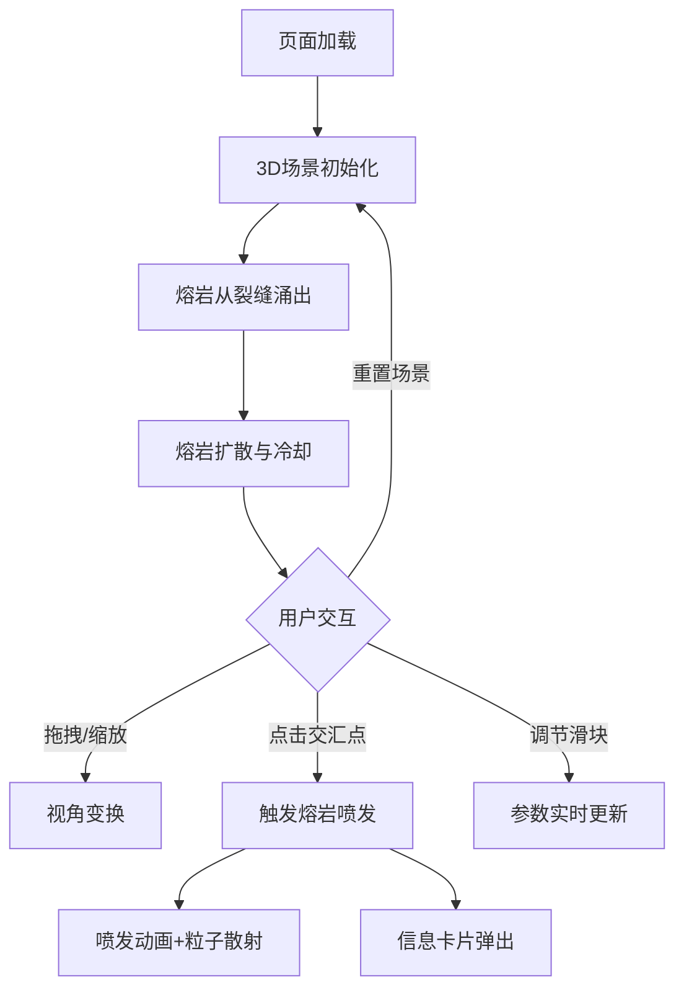

## 1. 产品概述

「熔岩脉动」是一个3D交互可视化项目，模拟地底深处熔岩在岩层裂隙中流动、冷却和爆发的动态过程。目标用户为对地质现象感兴趣的科普爱好者、数字艺术爱好者和3D可视化开发者。

- 通过实时3D渲染呈现熔岩流动、冷却成岩、喷发爆裂的完整地质过程
- 提供直观的交互方式让用户探索地底世界，通过参数调节理解熔岩动力学

## 2. 核心功能

### 2.1 功能模块

1. **3D场景页**: 熔岩流、岩层、裂缝、粒子效果、喷发交互、信息卡片、控制面板

### 2.2 页面详情

| 页面名称 | 模块名称 | 功能描述 |
|----------|----------|----------|
| 3D场景页 | 熔岩流系统 | 熔岩从地底裂缝涌出，沿地面缓慢扩散并冷却形成黑色岩石，使用半透明发光粒子流和动态流动纹理 |
| 3D场景页 | 岩层与裂缝 | 粗糙深灰色多面体岩层，发光橙红色裂缝线条，喷发时地面龟裂并发红光动画 |
| 3D场景页 | 粒子系统 | 飞溅的熔岩粒子和火花粒子，喷发时大量炽热粒子散射 |
| 3D场景页 | 熔岩喷发 | 点击熔岩流交汇点触发喷发——熔岩柱冲天而起，散射炽热粒子，地面龟裂发红光 |
| 3D场景页 | 信息卡片 | 喷发点弹出半透明毛玻璃信息卡片，显示温度、流速和压力值 |
| 3D场景页 | 控制面板 | 右侧半透明毛玻璃面板，三个滑块（熔岩流速、粒子密度、冷却速度）和重置场景按钮 |
| 3D场景页 | 视角控制 | 鼠标拖拽旋转视角、滚轮缩放，支持触摸操作 |

## 3. 核心流程

用户打开页面 → 3D场景加载，熔岩从裂缝中涌出 → 熔岩沿地面扩散并逐渐冷却 → 用户拖拽/缩放观察场景 → 用户点击交汇点触发喷发 → 喷发动画播放+信息卡片弹出 → 用户调节控制面板参数 → 可选重置场景

## 4. 用户界面设计

### 4.1 设计风格

- **风格**: 地心炽热风
- **主色**: 黑红渐变 → 橙黄渐变（背景）
- **辅色**: 深灰色（岩层）、橙红色（裂缝发光）
- **熔岩**: 半透明发光粒子流 + 动态流动纹理（红橙黄渐变）
- **岩层**: 粗糙深灰色多面体
- **裂缝**: 发光橙红色线条
- **UI**: 半透明毛玻璃效果（backdrop-filter: blur）
- **字体**: 使用有力量感的展示字体，搭配清晰的正文字体

### 4.2 页面设计概览

| 页面名称 | 模块名称 | UI元素 |
|----------|----------|--------|
| 3D场景页 | 全屏3D画布 | Three.js WebGL渲染，黑红到橙黄渐变背景 |
| 3D场景页 | 信息卡片 | 半透明毛玻璃卡片，居中弹出，显示温度/流速/压力数值 |
| 3D场景页 | 控制面板 | 右侧固定半透明毛玻璃面板，三个自定义滑块+重置按钮 |

### 4.3 响应式

- 桌面端：全屏3D场景，右侧面板固定
- 移动端：3D场景全屏，面板可折叠为底部抽屉，触摸旋转/缩放适配
- 性能目标：60fps，使用GPU粒子系统和LOD优化

### 4.4 3D场景指导

- **环境**: 无HDRI，使用自定义渐变背景（黑红→橙黄），营造地底炽热氛围
- **光照**: 点光源模拟熔岩发光（橙红色），环境光（暗红色），喷发时增加强光
- **相机**: 透视相机，初始45度俯角，OrbitControls拖拽旋转和滚轮缩放
- **焦点元素**: 熔岩流交汇点为视觉焦点，喷发时镜头可微震动
- **交互**: 点击交汇点触发喷发，OrbitControls旋转/缩放
- **后处理**: 可选辉光效果（UnrealBloomPass）增强熔岩发光感
- **性能**: GPU实例化粒子，控制粒子总量在5000以内，使用BufferGeometry
