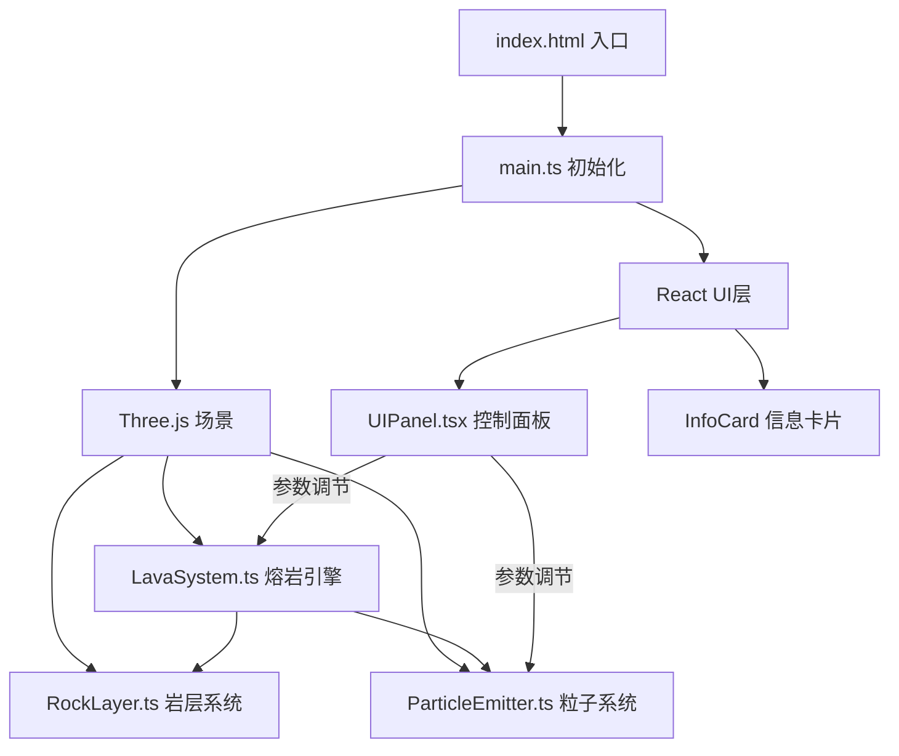

## 1. 架构设计



## 2. 技术说明

- **前端**: React@18 + TypeScript + Three.js
- **构建工具**: Vite
- **3D渲染**: Three.js（场景、相机、渲染器、后处理）
- **UI框架**: React（控制面板和信息卡片覆盖层）
- **状态管理**: Zustand（共享熔岩参数状态）
- **无后端**: 纯前端项目，所有计算在客户端完成

## 3. 路由定义

| 路由 | 用途 |
|------|------|
| / | 唯一页面，3D交互场景 + 控制面板 |

## 4. 文件结构

```
├── index.html
├── package.json
├── tsconfig.json
├── vite.config.ts
└── src/
    ├── main.ts          # 入口：初始化场景、相机、渲染器、动画循环
    ├── LavaSystem.ts    # 核心引擎：熔岩流生成、流动、冷却、喷发
    ├── ParticleEmitter.ts # 粒子系统：熔岩粒子和火花粒子
    ├── RockLayer.ts     # 岩层系统：岩层、裂缝、龟裂动画
    ├── UIPanel.tsx      # React组件：控制面板和信息卡片
    ├── store.ts         # Zustand状态管理
    └── style.css        # 全局样式
```

## 5. 模块职责

### main.ts
- 创建Three.js场景、透视相机、WebGL渲染器
- 初始化OrbitControls（鼠标拖拽旋转、滚轮缩放）
- 实例化LavaSystem、ParticleEmitter、RockLayer
- 创建React根节点挂载UIPanel
- 动画循环：更新所有系统 → 渲染

### LavaSystem.ts
- 管理熔岩流的生成点（裂缝交汇处）
- 熔岩流沿地面向外扩散的几何体和材质
- 冷却逻辑：随时间温度降低，颜色从红橙→暗红→黑色
- 喷发逻辑：触发时创建熔岩柱几何体、产生粒子、触发岩层龟裂

### ParticleEmitter.ts
- 两种粒子类型：熔岩飞溅粒子（大、橙红）、火花粒子（小、明亮）
- 使用BufferGeometry + Points实现GPU高效渲染
- 粒子生命周期：生成→运动→消散
- 喷发时批量生成大量粒子

### RockLayer.ts
- 生成深灰色多面体岩层几何体
- 裂缝系统：发光橙红色线条
- 龟裂动画：喷发时地面产生新裂缝并发红光
- 岩层与熔岩流的视觉交互

### UIPanel.tsx
- 控制面板：半透明毛玻璃效果，三个滑块+重置按钮
- 信息卡片：喷发点弹出的温度/流速/压力信息
- 使用Zustand store与3D系统通信

### store.ts
- Zustand状态管理：lavaSpeed、particleDensity、coolingRate
- 喷发状态：eruptionPoints数组
- 场景重置方法
