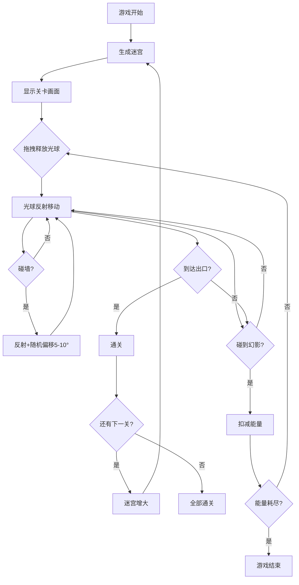

## 1. 产品概述

「光隙回廊」是一款 2D 迷宫探索游戏，玩家操控一个光球在充满镜像幻影的迷宫中寻找出口，利用光球反射机制破解谜题。核心玩法是鼠标拖拽释放光球，光球碰到墙壁会反射，玩家需利用反射路径到达出口，同时躲避延迟1秒追踪光球轨迹的镜像幻影。

- 目标用户：喜欢益智解谜与休闲游戏的玩家，年龄 12-40 岁
- 核心价值：独特的光球反射物理玩法 + 镜像幻影追逐机制，提供策略性与紧张感兼具的游戏体验

## 2. 核心功能

### 2.1 用户角色

| 角色 | 说明 |
|------|------|
| 玩家 | 单一角色，操控光球完成迷宫关卡 |

### 2.2 功能模块

1. **游戏主界面**：迷宫画布、光球、镜像幻影、出口标记、拖拽交互区域
2. **HUD 界面**：能量条、当前关卡、地图缩略图、提示文字

### 2.3 页面详情

| 页面名称 | 模块名称 | 功能描述 |
|----------|----------|----------|
| 游戏主界面 | 迷宫画布 | 渲染迷宫墙壁、光球、幻影、出口；处理鼠标/触屏拖拽释放光球 |
| 游戏主界面 | 光球物理 | 鼠标拖拽释放控制发射方向与力度；碰墙反射并随机偏移5-10度 |
| 游戏主界面 | 镜像幻影 | 复制光球轨迹，延迟1秒追踪；碰触光球则扣减能量 |
| 游戏主界面 | 迷宫生成 | 每关随机生成，尺寸从5x5到9x9递增；出口为发光漩涡标记 |
| HUD 界面 | 能量条 | 显示当前能量值，碰幻影扣减时闪红动画 |
| HUD 界面 | 地图缩略图 | 右上角显示迷宫全局俯视图，标记光球和出口位置 |
| HUD 界面 | 提示文字 | 显示关卡信息、操作提示、游戏结束信息 |
| HUD 界面 | 关卡指示 | 显示当前关卡编号和迷宫尺寸 |

## 3. 核心流程

玩家进入游戏 → 显示当前关卡迷宫 → 拖拽光球释放发射 → 光球在迷宫中反射移动 → 镜像幻影延迟1秒追踪 → 光球到达出口则通关 → 进入下一关（迷宫增大）→ 能量耗尽则游戏结束 → 重新开始

## 4. 用户界面设计

### 4.1 设计风格

- 主色调：深蓝（#0a0e27）到紫黑（#1a0a2e）渐变背景，营造深邃太空感
- 强调色：光球为温暖的金白色（#ffeaa7 → #ffffff），幻影为冷紫色（#a855f7）
- 按钮风格：圆角玻璃拟态，半透明磨砂效果
- 字体：标题使用 Orbitron（科技感显示字体），正文使用 Quicksand（圆润可读）
- 布局：全屏迷宫画布为主，HUD叠加在画布上方
- 图标/视觉风格：发光、半透明、噪声纹理，整体暗黑科幻风

### 4.2 页面设计概览

| 页面名称 | 模块名称 | UI 元素 |
|----------|----------|---------|
| 游戏主界面 | 迷宫画布 | 深蓝紫黑渐变背景；墙壁为带噪声纹理的半透明发光方块；出口为发光漩涡动画；光球为带呼吸光晕的金白小球；幻影为紫色半透明重影；拖尾粒子效果 |
| 游戏主界面 | 鼠标悬停出口 | 出口上方显示闪烁箭头指示 |
| HUD 界面 | 能量条 | 左上角水平条，渐变从绿到红，扣减时闪红动画 |
| HUD 界面 | 地图缩略图 | 右上角小地图，半透明背景，显示迷宫轮廓与光球/出口位置 |
| HUD 界面 | 提示文字 | 底部居中，淡入淡出提示信息 |
| HUD 界面 | 关卡指示 | 顶部居中，"第 N 关 · M×M"格式 |

### 4.3 响应式设计

- 桌面优先设计，画布自适应窗口尺寸
- 平板：触屏拖拽支持，HUD 元素适当放大
- 手机：全屏画布，HUD 元素紧凑布局，触控区域增大
- 最小支持宽度 320px

### 4.4 交互反馈设计

| 事件 | 反馈效果 |
|------|----------|
| 光球碰撞墙壁 | Web Audio API 生成清脆碰撞音效；墙壁短暂亮起 |
| 能量条减少 | 能量条闪红脉冲动画 |
| 幻影出现 | 屏幕边缘闪烁紫色光晕（vignette效果） |
| 通关 | 出口漩涡放大，金色粒子爆发 |
| 游戏结束 | 画面渐暗，显示重新开始按钮 |
