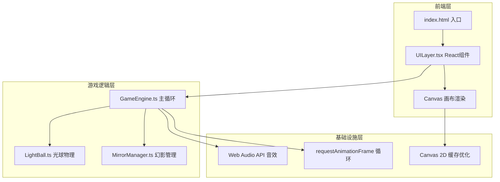

## 1. 架构设计



## 2. 技术说明

- 前端：React@18 + TypeScript（严格模式）+ Vite
- 初始化工具：Vite
- 后端：无（纯前端游戏）
- 数据库：无（游戏状态全在内存中）
- 渲染：Canvas 2D，迷宫墙壁缓存到离屏 Canvas 避免重复绘制
- 音频：Web Audio API 程序化生成音效，无外部音频文件
- 状态管理：React useState/useReducer 管理 UI 状态，游戏逻辑状态由 GameEngine 类内部管理

## 3. 路由定义

| 路由 | 用途 |
|------|------|
| / | 游戏主页面（单页应用，仅一个路由） |

## 4. 文件结构

```
├── index.html                 # 入口HTML
├── package.json               # 依赖管理
├── tsconfig.json              # TypeScript严格模式配置
├── vite.config.js             # Vite配置 + React插件
├── src/
│   ├── main.tsx               # React挂载入口
│   ├── GameEngine.ts          # 主循环、迷宫生成、碰撞检测、胜负判定
│   ├── LightBall.ts           # 光球物理运动、反射方向计算、能量条
│   ├── MirrorManager.ts       # 镜像幻影生成、移动和交互触发
│   └── UILayer.tsx            # React组件：能量条、地图缩略图、提示文字
```

## 5. 核心模块详细设计

### 5.1 GameEngine.ts

**职责**：游戏主循环、迷宫随机生成、碰撞检测、胜负判定

```typescript
// 核心接口
interface GameEngine {
  maze: CellType[][]              // 迷宫网格数据
  level: number                   // 当前关卡
  mazeSize: number                // 当前迷宫尺寸（5~9）
  canvas: HTMLCanvasElement       // 主画布
  offscreenCanvas: HTMLCanvasElement  // 离屏缓存画布

  start(): void                   // 启动游戏循环
  stop(): void                    // 停止游戏循环
  generateMaze(size: number): void // 随机生成迷宫（DFS算法）
  checkCollision(): void          // 碰撞检测（光球与墙壁、出口、幻影）
  checkWinCondition(): boolean    // 检查是否到达出口
  render(): void                  // 渲染帧
  update(dt: number): void        // 逻辑更新
  resetLevel(): void              // 重置当前关卡
  nextLevel(): void               // 进入下一关
}
```

**迷宫生成算法**：递归回溯法（DFS），保证所有格子可达，出口位于离起点最远的死胡同

**碰撞检测**：基于网格的光球圆形与墙壁矩形碰撞，使用 AABB + 圆形碰撞判定

**Canvas 缓存策略**：迷宫墙壁渲染到离屏 Canvas，每帧仅重绘动态元素（光球、幻影、粒子）

### 5.2 LightBall.ts

**职责**：光球物理运动、反射方向计算、能量条管理

```typescript
interface LightBall {
  x: number                      // 当前X坐标
  y: number                      // 当前Y坐标
  vx: number                     // X方向速度
  vy: number                     // Y方向速度
  radius: number                 // 光球半径
  energy: number                 // 能量值（0-100）
  maxEnergy: number              // 最大能量值
  trail: Point[]                 // 拖尾轨迹点（用于幻影复制）
  isMoving: boolean              // 是否正在移动

  launch(dirX: number, dirY: number, force: number): void  // 发射光球
  reflect(wallNormal: Vector): void   // 反射计算 + 随机偏移5-10°
  update(dt: number): void       // 物理更新
  drainEnergy(amount: number): void   // 扣减能量
  getTrailSnapshot(): Point[]    // 获取当前轨迹快照
}
```

**反射算法**：v' = v - 2(v·n)n，反射后对角度施加 ±5°~10° 随机偏移

**能量机制**：初始100，碰到幻影扣减15点，归零则游戏结束

**拖尾粒子**：每帧记录位置到 trail 数组，保留最近60帧位置，渲染为渐变透明粒子

### 5.3 MirrorManager.ts

**职责**：镜像幻影的生成、移动和交互触发

```typescript
interface MirrorManager {
  phantoms: Phantom[]            // 幻影列表
  trailBuffer: TrajectoryFrame[] // 延迟轨迹缓冲（1秒延迟）
  delayMs: number                // 延迟时间（默认1000ms）

  addPhantom(x: number, y: number): void  // 添加幻影
  update(dt: number, lightballTrail: Point[]): void  // 更新幻影位置
  checkCollisionWith(ball: LightBall): boolean  // 检测与光球碰撞
  removePhantom(index: number): void  // 移除幻影
  render(ctx: CanvasRenderingContext2D): void  // 渲染幻影
}

interface Phantom {
  x: number
  y: number
  opacity: number               // 半透明度（0.3-0.6脉冲）
  scale: number                 // 缩放（呼吸效果）
}
```

**幻影机制**：每2秒生成一个幻影，幻影读取1秒前的光球轨迹位置进行追踪

**碰撞判定**：光球圆形与幻影圆形的距离判定，半径之和 < 距离则碰撞

### 5.4 UILayer.tsx

**职责**：React组件层，显示能量条、地图缩略图、提示文字

```typescript
interface UIState {
  energy: number                 // 能量值
  level: number                  // 当前关卡
  mazeSize: number               // 迷宫尺寸
  message: string                // 提示信息
  isGameOver: boolean            // 游戏是否结束
  isFlashRed: boolean            // 能量条闪红
  isEdgeGlow: boolean            // 边缘紫色光晕
}
```

**组件结构**：
- `GameContainer`：最外层容器，管理 Canvas 和 HUD 叠加
- `EnergyBar`：能量条组件，渐变色 + 闪红动画
- `MiniMap`：缩略图组件，Canvas 渲染小地图
- `GameMessage`：提示文字组件，淡入淡出
- `LevelIndicator`：关卡指示器

## 6. 性能优化策略

| 优化项 | 策略 |
|--------|------|
| 迷宫渲染 | 离屏Canvas缓存，仅在迷宫生成时重绘墙壁层 |
| 粒子系统 | 对象池复用，限制最大粒子数200 |
| 幻影数量 | 最多3个幻影同时存在 |
| requestAnimationFrame | 使用 rAF 驱动主循环，deltaTime 计算确保帧率无关 |
| 触控事件 | 被动监听器，避免阻塞滚动 |
| Canvas 尺寸 | 根据设备像素比设置，避免模糊 |
