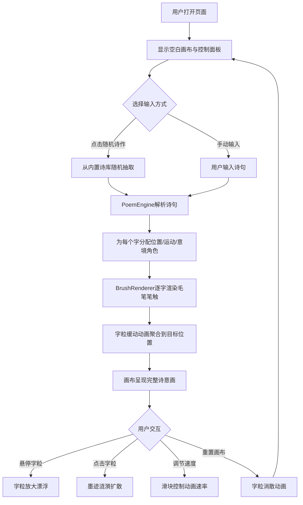

## 1. 产品概述

「千影流光」是一款中文诗画交互展示工具，将古诗文字转化为动态水墨山水画布。每个字化作山峦、云雾或流水，随诗句意境变化而流动、聚合、消散，实现「诗中有画，画中有诗」的沉浸式体验。

- 目标用户：中国古典文学爱好者、书法爱好者、文化教育工作者及对东方美学感兴趣的用户
- 核心价值：以交互式视觉艺术重新诠释古诗，让文字成为可触摸的山水意境

## 2. 核心功能

### 2.1 功能模块

1. **主画布页面**：Canvas水墨画布、字粒动画、鼠标交互（悬停放大漂浮、点击墨迹涟漪）、诗句意境渲染
2. **控制面板**：随机诗作按钮、手动输入框、动画速度滑块、重置画布按钮
3. **诗作信息展示**：底部显示当前诗作标题与作者

### 2.2 页面详情

| 页面名称 | 模块名称 | 功能描述 |
|---------|---------|---------|
| 主画布 | Canvas渲染区 | 全屏水墨画布，诗句文字以毛笔笔触风格渲染，每个字作为独立粒子拥有位置、速度、生命周期 |
| 主画布 | 字粒动画系统 | 每个字根据诗句意境分配视觉角色（山峦/云雾/流水），执行缓动飘散和淡入淡出动画 |
| 主画布 | 鼠标交互 | 悬停时字微微放大并漂浮，点击任意字触发一圈墨迹涟漪扩散特效 |
| 控制面板 | 随机诗作 | 点击后从内置诗库随机抽取一首古诗，自动渲染到画布 |
| 控制面板 | 手动输入 | 用户可输入自定义诗句，提交后渲染到画布 |
| 控制面板 | 动画速度 | 滑块控制所有字粒动画的速率（0.5x~3x） |
| 控制面板 | 重置画布 | 清空当前画布，所有字粒执行消散动画后移除 |
| 诗作信息 | 标题与作者 | 底部居中显示当前诗作标题和作者，淡入淡出过渡 |

## 3. 核心流程

用户打开页面后看到宣纸米黄底色的空白画布和右侧控制面板。点击「随机诗作」按钮后，系统从内置诗库选取一首古诗，PoemEngine逐字解析并为每个字分配位置、运动状态和意境角色。BrushRenderer在Canvas上逐字绘制毛笔笔触纹理，字粒从随机位置以缓动动画聚合到目标位置。用户可悬停查看字粒放大漂浮效果，点击触发墨迹涟漪。用户也可通过手动输入框输入诗句。动画速度滑块实时调节所有动画速率。

## 4. 用户界面设计

### 4.1 设计风格

- **主色调**：宣纸米黄（#F5E6C8）为底色，墨黑（#2C2C2C）为主文字色，朱红（#C94043）和青绿（#4A9B7F）为点缀
- **字体风格**：毛笔笔触风格，通过Canvas绘制实现笔锋纹理效果
- **布局风格**：左侧全屏Canvas画布，右侧半透明毛玻璃控制面板浮层
- **动画风格**：缓动飘散、淡入淡出、涟漪扩散，帧率保持60fps

### 4.2 页面设计概述

| 页面名称 | 模块名称 | UI元素 |
|---------|---------|--------|
| 主画布 | Canvas渲染区 | 宣纸米黄底色，全屏Canvas，字粒以毛笔笔触风格绘制 |
| 主画布 | 鼠标交互反馈 | 悬停放大漂浮（1.2x缩放+Y轴上移）、点击涟漪（圆形墨迹扩散） |
| 控制面板 | 面板容器 | 半透明毛玻璃效果（backdrop-filter: blur），右侧固定定位 |
| 控制面板 | 随机诗作按钮 | 朱红色按钮，悬停时墨黑描边 |
| 控制面板 | 手动输入框 | 透明底墨黑边框输入框，placeholder提示 |
| 控制面板 | 动画速度滑块 | 自定义样式的range slider，青绿色轨道 |
| 控制面板 | 重置画布按钮 | 墨黑描边按钮，悬停时朱红填充 |
| 诗作信息 | 标题作者 | 底部居中，墨黑色半透明文字，淡入淡出过渡 |

### 4.3 响应式适配

- **桌面端**（≥1024px）：画布全屏，右侧毛玻璃控制面板，底部诗作信息
- **平板端**（768px~1023px）：画布全屏，控制面板收窄，底部诗作信息字号略小
- **交互优化**：Canvas使用requestAnimationFrame保持60fps，鼠标事件使用throttle避免重绘抖动

### 4.4 画布渲染指引

- **环境氛围**：宣纸米黄底色，模拟水墨画的留白与层次感
- **字粒形态**：每个字根据诗句意境分配角色——"山"类字（雄浑、厚重）化为山峦形态，"水"类字（流动、柔和）化为流水形态，其余化为云雾形态
- **动画节奏**：字粒从随机位置以ease-out缓动聚合到目标位置，停留后缓慢飘散（ease-in-out），淡入淡出过渡
- **涟漪特效**：点击字粒后，以该字为中心生成同心圆墨迹涟漪，半径递增、透明度递减
- **性能预算**：单次最多渲染约200个字粒，使用Canvas 2D API绘制，避免DOM操作瓶颈
