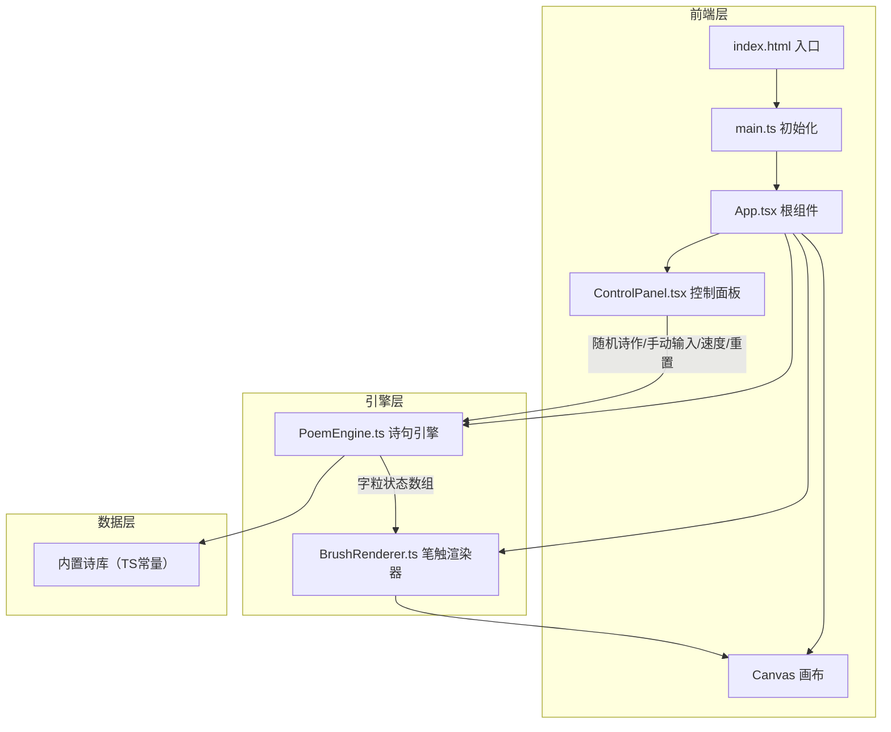

## 1. 架构设计



## 2. 技术说明

- **前端**：React@18 + TypeScript + Vite + Canvas 2D API
- **初始化工具**：vite-init（react-ts 模板）
- **后端**：无（纯前端项目）
- **数据库**：无（诗库内置于TS代码中）
- **状态管理**：React useState/useRef（无需全局状态库，组件树浅且状态集中）

## 3. 路由定义

本项目为单页面应用，无路由跳转需求。

| 路由 | 用途 |
|------|------|
| / | 主画布页面，包含Canvas渲染区、控制面板和诗作信息 |

## 4. 核心模块职责

### 4.1 PoemEngine.ts

诗句核心引擎，负责：
- 解析诗句文本，拆分为单字粒数组
- 为每个字粒分配：目标位置、当前位移、速度向量、透明度、缩放、意境角色（mountain/cloud/water）
- 管理 `requestAnimationFrame` 主循环，每帧更新所有字粒的运动状态
- 支持动画速度倍率调节
- 提供接口：`setPoem(text, title, author)`、`update(deltaTime)`、`reset()`、`setSpeed(multiplier)`

### 4.2 BrushRenderer.ts

笔触渲染器，负责：
- 在Canvas上绘制每个字粒的毛笔笔触纹理
- 根据字粒的意境角色选择不同绘制风格（山峦厚重/云雾轻柔/流水流动）
- 处理字粒的缓动动画（ease-out聚合、ease-in-out飘散、淡入淡出）
- 绘制鼠标交互反馈（悬停放大漂浮、点击涟漪扩散）
- 管理Canvas上下文状态，优化绘制性能

### 4.3 ControlPanel.tsx

React控制面板组件，包含：
- 「随机诗作」按钮：从内置诗库随机选取
- 「手动输入」输入框：用户自定义诗句
- 「动画速度」滑块：0.5x~3x倍率
- 「重置画布」按钮：清空画布

### 4.4 App.tsx

根组件，负责：
- 组合Canvas画布和ControlPanel
- 持有PoemEngine和BrushRenderer实例
- 管理诗作状态（标题、作者、内容）
- 处理Canvas尺寸响应式调整
- 底部诗作信息展示

### 4.5 main.ts

入口文件，负责：
- 初始化React应用挂载到DOM
- 配置Canvas初始尺寸（window.innerWidth/innerHeight）

## 5. 数据模型

### 5.1 字粒数据结构

```typescript
interface CharacterParticle {
  char: string;
  targetX: number;
  targetY: number;
  currentX: number;
  currentY: number;
  velocityX: number;
  velocityY: number;
  opacity: number;
  scale: number;
  rotation: number;
  role: 'mountain' | 'cloud' | 'water';
  phase: 'gathering' | 'stable' | 'dispersing' | 'fading';
  age: number;
  lifetime: number;
  isHovered: boolean;
  rippleTime: number;
}
```

### 5.2 诗作数据结构

```typescript
interface Poem {
  title: string;
  author: string;
  content: string[];
}
```

### 5.3 内置诗库

内置10~15首经典古诗，涵盖五言绝句、七言绝句、五言律诗等体裁。
