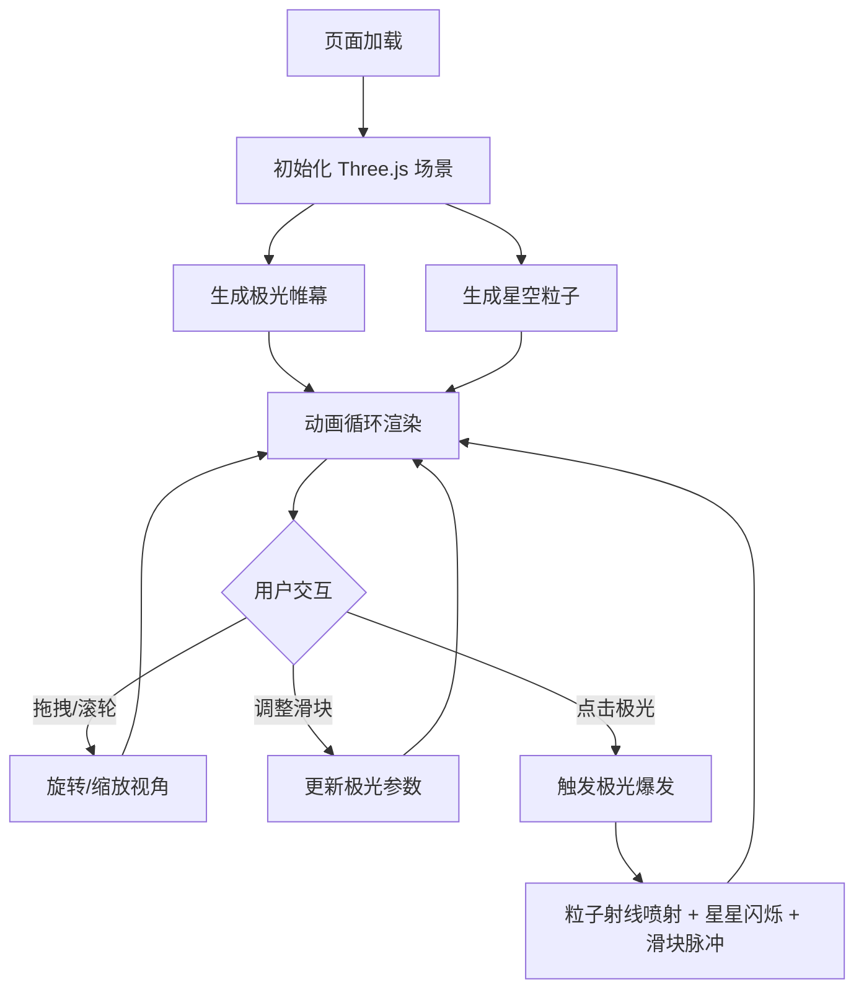

## 1. 产品概述

「极光幻境」是一个基于 Three.js 的 3D 交互可视化项目，模拟极地夜空中动态变化的极光帷幕。用户可以通过交互控制极光的颜色主题、波纹速度和粒子密度，创造独特的极光体验。

- 目标用户：视觉艺术爱好者、交互设计从业者、3D 可视化学习者
- 核心价值：提供沉浸式极光观赏与创作体验，展现 WebGL 技术在自然现象模拟中的表现力

## 2. 核心功能

### 2.1 功能模块

1. **主场景页**：极光帷幕渲染、星空粒子背景、鼠标交互、控制面板

### 2.2 页面详情

| 页面名称 | 模块名称 | 功能描述 |
|----------|----------|----------|
| 主场景页 | 极光帷幕 | 多层半透明波浪面组成，每层颜色渐变并随时间上下波动，形成流动弧形光幕 |
| 主场景页 | 星空粒子 | 背景星空粒子系统，随极光强度改变密度和闪烁速度，带呼吸光晕 |
| 主场景页 | 极光爆发 | 点击极光任意位置触发彩色粒子射线喷射，持续2秒后消散 |
| 主场景页 | 视角控制 | 鼠标拖拽旋转视角，滚轮缩放，视角移动带缓动效果 |
| 主场景页 | 控制面板 | 毛玻璃面板包含颜色主题滑块、波纹速度滑块、粒子密度滑块、重置视角按钮 |
| 主场景页 | 交互反馈 | 极光爆发时星星短暂增亮闪烁，滑块脉冲动画反馈 |
| 主场景页 | 响应式适配 | 窄屏下控制面板自动折叠为汉堡菜单 |

## 3. 核心流程

用户打开页面后进入极夜场景，可自由旋转/缩放观赏极光，通过左侧面板调整参数，点击极光触发爆发效果。

## 4. 用户界面设计

### 4.1 设计风格

- **主色调**：黑色到深蓝的背景渐变，极光为半透明发光材质带柔和渐变
- **配色方案**：
  - 绿紫主题：#00ff88 → #9b59b6
  - 蓝粉主题：#00b4d8 → #ff6b9d
  - 橙青主题：#ff8c42 → #00e5ff
- **面板风格**：半透明毛玻璃，模糊背景，虹彩渐变边框
- **字体**：控制面板使用等宽科技感字体（JetBrains Mono），标题使用 Orbitron
- **布局**：全屏3D场景，左侧浮动控制面板
- **光标**：鼠标悬停时变为十字光标
- **粒子**：星星带呼吸光晕效果

### 4.2 页面设计概述

| 页面名称 | 模块名称 | UI 元素 |
|----------|----------|---------|
| 主场景页 | 3D画布 | 全屏Three.js渲染区域，十字光标 |
| 主场景页 | 控制面板 | 毛玻璃卡片，虹彩边框，三个自定义滑块，重置按钮 |
| 主场景页 | 汉堡菜单 | 窄屏下替代面板的折叠按钮和抽屉 |

### 4.3 响应式设计

- 桌面端（≥768px）：左侧固定毛玻璃面板，完整滑块和按钮
- 平板端（<768px）：面板折叠为左上角汉堡按钮，点击展开抽屉式面板
- 所有尺寸：全屏3D画布，触控支持旋转和缩放

### 4.4 3D 场景指引

- **环境/氛围**：极夜天空，黑到深蓝渐变背景，无 HDRI
- **灯光设置**：无直接光源，极光自发光 + 微弱环境光
- **相机设置**：透视相机，FOV 60°，初始位置(0, 5, 30)，缓动跟随鼠标
- **构图与焦点**：极光帷幕位于场景中央偏上方，星空粒子铺满整个视野
- **交互与动画**：
  - 极光：多层面片，顶点着色器驱动波浪形变，片段着色器实现颜色渐变和透明度
  - 粒子：点精灵材质，大小和亮度随时间正弦变化
  - 爆发：射线粒子从点击点发射，2秒衰减
- **后处理效果**：可选辉光（UnrealBloomPass）
- **性能预算**：目标 60fps，极光面片顶点数 ≤ 10000，星空粒子 ≤ 5000
