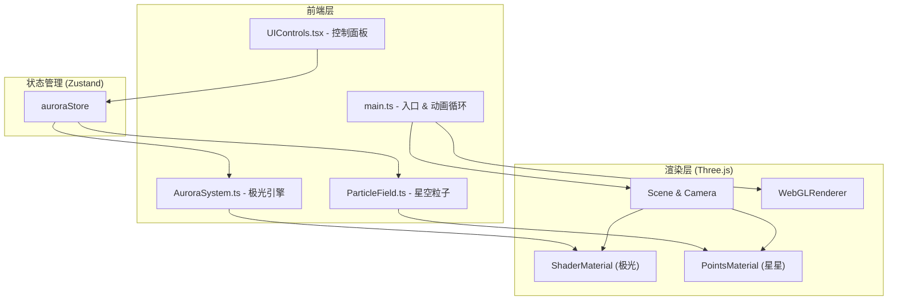

## 1. 架构设计



## 2. 技术说明

- **前端**：React 18 + TypeScript + Three.js + Vite
- **初始化工具**：vite-init (react-ts 模板)
- **3D渲染**：Three.js 原生 API（不用 R3F，以便精确控制着色器和性能）
- **状态管理**：Zustand（管理极光参数、爆发状态）
- **后端**：无
- **数据库**：无

## 3. 路由定义

| 路由 | 用途 |
|------|------|
| / | 主场景页，包含极光渲染和控制面板 |

## 4. 文件结构

```
├── index.html
├── package.json
├── tsconfig.json
├── vite.config.js
└── src/
    ├── main.ts          # 入口：初始化场景、相机、渲染器、动画循环
    ├── AuroraSystem.ts   # 极光引擎：帷幕生成、波浪形变、颜色插值
    ├── ParticleField.ts  # 粒子系统：星空粒子、闪烁、爆发粒子
    ├── UIControls.tsx    # React组件：控制面板UI
    └── store.ts          # Zustand状态管理
```

## 5. 核心模块设计

### 5.1 AuroraSystem.ts

- 创建多层 PlaneGeometry（5-7层），每层宽度100，高度40，细分100×40
- 自定义 ShaderMaterial：
  - 顶点着色器：基于时间和层级偏移，对顶点 Y 坐标施加正弦波位移
  - 片段着色器：基于 UV 和时间实现颜色渐变，Alpha 从底部到顶部渐隐
- Uniforms：`uTime`、`uSpeed`、`uColor1`、`uColor2`
- 每层略微不同的 Y 偏移和波形参数，形成深度感
- 弧形弯曲：通过顶点着色器中施加 XZ 平面的弧形变换

### 5.2 ParticleField.ts

- 背景星星：BufferGeometry + Points，5000个随机分布的粒子
- 每个粒子有位置、大小、闪烁相位属性
- 自定义 ShaderMaterial：大小和亮度随时间正弦变化（呼吸效果）
- 极光爆发时：所有粒子亮度短暂增加
- 爆发粒子：独立的粒子系统，从点击点发射，2秒生命周期

### 5.3 main.ts

- 初始化 Scene、PerspectiveCamera、WebGLRenderer
- 添加 OrbitControls（带缓动）
- 创建 AuroraSystem 和 ParticleField 实例
- 将 React UIControls 挂载到 DOM
- 动画循环：更新 uniforms、粒子状态，渲染场景
- Raycaster 处理点击检测

### 5.4 UIControls.tsx

- 毛玻璃面板：`backdrop-filter: blur(20px)`，虹彩渐变边框
- 三个自定义滑块：颜色主题（离散三档）、波纹速度（0.1-2.0连续）、粒子密度（低/中/高三档）
- 重置视角按钮
- 极光爆发时滑块脉冲动画（CSS animation）
- 响应式：窄屏下折叠为汉堡菜单

### 5.5 store.ts (Zustand)

```typescript
interface AuroraState {
  colorTheme: 'greenViolet' | 'bluePink' | 'orangeCyan'
  waveSpeed: number
  particleDensity: 'low' | 'medium' | 'high'
  burstActive: boolean
  burstPosition: { x: number; y: number; z: number } | null
  setColorTheme: (theme: AuroraState['colorTheme']) => void
  setWaveSpeed: (speed: number) => void
  setParticleDensity: (density: AuroraState['particleDensity']) => void
  triggerBurst: (position: { x: number; y: number; z: number }) => void
  resetBurst: () => void
}
```

## 6. 着色器设计

### 极光顶点着色器
- 输入：position, uv
- Uniforms：uTime, uSpeed, uLayerOffset
- 输出：沿Y轴正弦波位移 + XZ弧形弯曲

### 极光片段着色器
- 输入：vUv, vPosition
- Uniforms：uColor1, uColor2, uTime
- 输出：基于UV和时间的颜色渐变，底部Alpha=1到顶部Alpha=0

### 星星顶点着色器
- 输入：position, aSize, aPhase
- Uniforms：uTime, uBurstIntensity
- 输出：gl_PointSize 随时间和相位正弦变化

### 星星片段着色器
- 输出：圆形点精灵，中心亮边缘暗，带光晕
