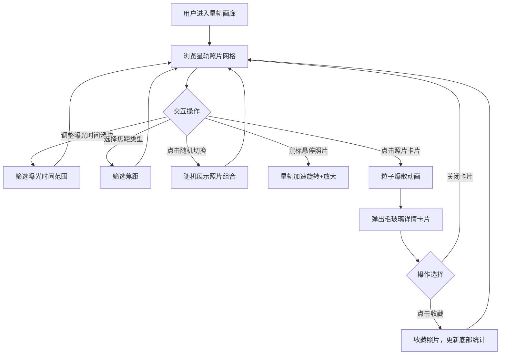

## 1. 产品概述

「星轨画廊」是一款交互式天文摄影展示工具，将星轨照片以动态光绘效果呈现，让用户在深空般的沉浸式界面中浏览、筛选和收藏星轨摄影作品。
- 目标用户：天文摄影爱好者、视觉艺术爱好者、天文科普受众
- 核心价值：将静态星轨照片转化为动态交互体验，通过拍摄参数驱动的可视化动画，让用户直观感受不同曝光条件下的星轨差异

## 2. 核心功能

### 2.1 功能模块
1. **星轨画廊主页**: 星轨照片网格展示、动态星轨动画、筛选导航栏、底部统计栏
2. **照片详情弹窗**: 毛玻璃卡片展示完整照片、拍摄参数、收藏按钮

### 2.2 页面详情
| 页面名称 | 模块名称 | 功能描述 |
|----------|----------|----------|
| 星轨画廊主页 | 深空背景 | 深蓝到深紫渐变背景，营造深空氛围 |
| 星轨画廊主页 | 星轨画廊网格 | 响应式网格展示星轨照片，每张照片配有动态星轨动画 |
| 星轨画廊主页 | 毛玻璃导航栏（左侧） | 曝光时间范围滑块（1秒~30分钟）、焦距下拉菜单（广角/标准/长焦）、随机切换按钮 |
| 星轨画廊主页 | 底部统计栏 | 显示当前筛选后的照片数和已收藏数 |
| 照片详情弹窗 | 毛玻璃卡片 | 展示完整照片图像、拍摄参数（曝光时间、光圈、ISO）、收藏按钮 |
| 星轨画廊主页 | 星轨动画 | Canvas绘制的半透明发光线条，根据拍摄参数旋转延伸，暖色/冷色渐变 |
| 星轨画廊主页 | 交互效果 | 鼠标悬停加速旋转+放大，点击触发粒子爆散动画 |

## 3. 核心流程

用户打开页面后，进入深空氛围的星轨画廊，左侧导航栏默认显示全部照片。用户可通过滑块筛选曝光时间范围、通过下拉菜单选择焦距类型、或点击随机切换按钮获取随机照片组合。鼠标悬停在照片卡片上时，星轨线条加速旋转并放大。点击照片卡片后，触发粒子爆散动画并弹出毛玻璃详情卡片，展示完整照片和拍摄参数。用户可在详情卡片中点击收藏按钮收藏照片，底部统计栏实时更新收藏数。

## 4. 用户界面设计

### 4.1 设计风格
- 主色调：深蓝（#0a0e27）到深紫（#1a0a2e）渐变背景
- 强调色：星轨暖色（#ff6b35→#ffd700）对应日落/城市光污染，星轨冷色（#00d4ff→#7b2ff7）对应纯净夜空
- 按钮风格：圆角半透明毛玻璃按钮，hover时增加亮度和模糊度
- 字体：标题使用 Orbitron（未来感几何字体），正文使用 Noto Sans SC
- 布局风格：左侧固定导航栏 + 右侧自适应网格 + 底部固定统计栏
- 图标风格：Lucide线性图标，半透明白色
- 动效：星轨线条使用Canvas逐帧绘制发光轨迹，粒子爆散使用requestAnimationFrame驱动

### 4.2 页面设计概述
| 页面名称 | 模块名称 | UI元素 |
|----------|----------|--------|
| 星轨画廊主页 | 深空背景 | 深蓝-深紫线性渐变，叠加微弱星点装饰 |
| 星轨画廊主页 | 毛玻璃导航栏 | 左侧固定，宽240px，backdrop-filter:blur(20px)，半透明深蓝底色，包含标题、滑块、下拉菜单、随机按钮 |
| 星轨画廊主页 | 星轨照片网格 | 响应式网格（桌面3-4列，平板2列），每张卡片含Canvas星轨动画层 + 照片缩略图 |
| 星轨画廊主页 | 底部统计栏 | 固定底部，毛玻璃效果，显示「当前 N 张照片 · 已收藏 M 张」 |
| 照片详情弹窗 | 毛玻璃卡片 | 居中弹窗，backdrop-filter:blur(30px)，含大尺寸照片、拍摄参数列表、收藏按钮 |

### 4.3 响应式设计
- 桌面端（≥1024px）：左侧导航栏固定 + 3-4列网格
- 平板端（768px-1023px）：导航栏折叠为顶部汉堡菜单 + 2列网格
- 交互优化：Canvas动画使用requestAnimationFrame，保持60fps；hover和click事件使用被动监听

### 4.4 3D/Canvas场景指引
- 背景：深空渐变，可选叠加静态星点（Canvas粒子）
- 星轨渲染：Canvas 2D绘制弧线，使用globalCompositeOperation实现发光效果
- 粒子爆散：点击时从照片中心向外扩散粒子，粒子沿星轨切线方向运动，逐渐淡出
- 性能预算：每个卡片Canvas独立渲染，仅可视区域内卡片执行动画循环
